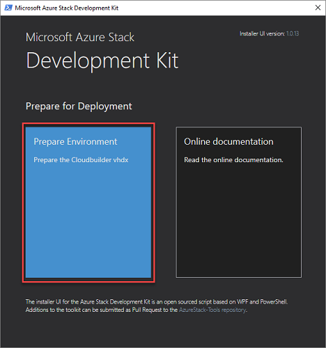
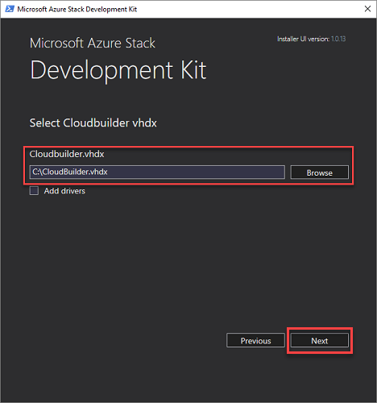
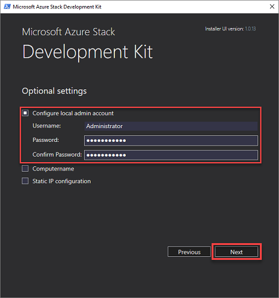
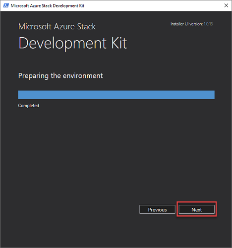

# Prepare the ASDK host computer
Before you can install the ASDK on the host computer, the ASDK environment must be prepared for installation. When the development kit host computer has been prepared, it will boot from the CloudBuilder.vhdx virtual machine hard drive to begin ASDK deployment.

## Prepare the development kit host computer
Before you can install the ASDK on the host computer, the ASDK host computer environment must be prepared.
1. Sign in as a Local Administrator to your development kit host computer.
2. Ensure that the CloudBuilder.vhdx file has been moved to the root of the C:\ drive (C:\CloudBuilder.vhdx).
3. Run the following script to download the development kit installer file (asdk-installer.ps1) from the [Azure Stack GitHub tools repository](https://github.com/Azure/AzureStack-Tools) to the **C:\AzureStack_Installer** folder on your development kit host computer:

  ```powershell
  # Variables
  $Uri = 'https://raw.githubusercontent.com/Azure/AzureStack-Tools/master/Deployment/asdk-installer.ps1'
  $LocalPath = 'C:\AzureStack_Installer'
  # Create folder
  New-Item $LocalPath -Type directory
  # Download file
  Invoke-WebRequest $uri -OutFile ($LocalPath + '\' + 'asdk-installer.ps1')
  ```

4. From an elevated PowerShell console, start the **C:\AzureStack_Installer\asdk-installer.ps1** script, and then click **Prepare Environment**.

     

5. On the **Select Cloudbuilder vhdx** page of the installer, browse to and select the **cloudbuilder.vhdx** file that you downloaded and extracted in [the previous steps](asdk-download.md). On this page you can also, optionally, enable the **Add drivers** check box if you need to add additional drivers to the development kit host computer. Click **Next**.  

    

6. On the **Optional settings** page, provide the local administrator account information for the development kit host computer and then click **Next**. You can also provide values for the following optional settings:
  - **Computername**: This option sets the name for the development kit host. The name must comply with FQDN requirements and must be 15 characters or less in length. The default is a random computer name generated by Windows.
  - **Time zone**: Sets the time zone for the development kit host. The default is (UTC-8:00) Pacific Time (US & Canada).
  - **Static IP configuration**: Sets your deployment to use a static IP address. Otherwise, when the installer reboots into the cloudbuilder.vhx, the network interfaces are configured with DHCP.

    

  > [!IMPORTANT]
  > If you don't provide the local administrator credentials in this step, you'll need direct or KVM access to the host after the computer restarts as part of setting up the development kit.

7. If you chose a static IP configuration in the previous step, you must now:
    - Select a network adapter. Make sure you can connect to the adapter before you click **Next**.
    - Make sure that the **IP address**, **Gateway**, and **DNS** values are correct and then click **Next**.
13. Click **Next** to start the preparation process.
14. When the preparation indicates **Completed**, click **Next**.
15. Click **Reboot now** to boot the development kit host computer into the cloudbuilder.vhdx and [continue the deployment process](asdk-install.md).

    


## Next steps
[Install the ASDK](asdk-install.md)