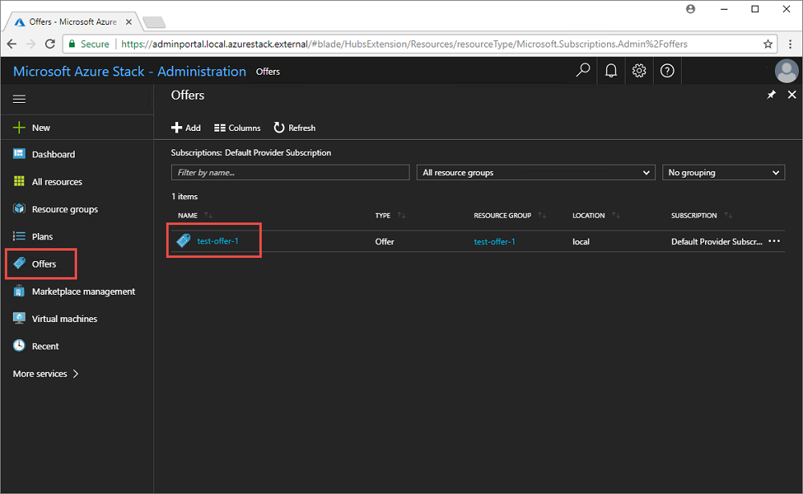
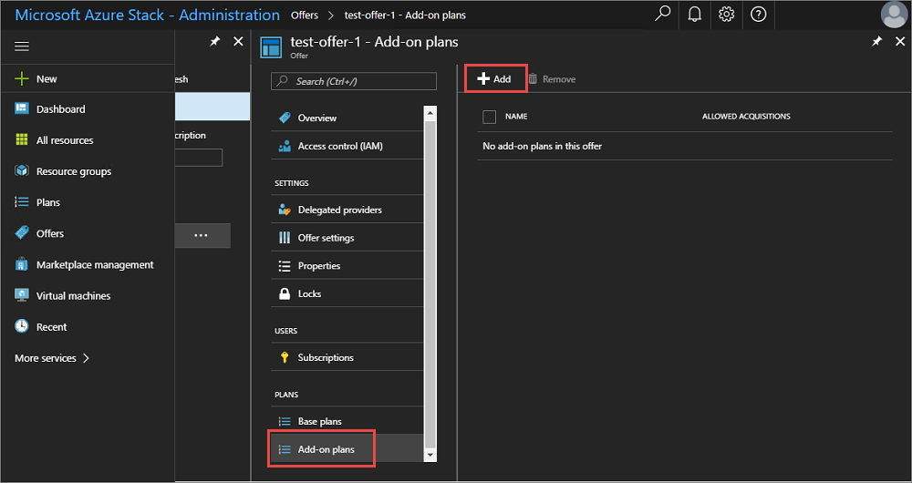

# Update offers and plans
As an Azure Stack operator, you create plans that contain the desired services and applicable quotas for your users to subscribe to. These *base plans* contain the core services to be offered to your users and you can only have one base plan per offer. If you need to modify your offer, you can use *add-on plans* that allow you to modify the plan to extend computer, storage, or network quotas initially offered with the base plan. 

Although combining everything in a single plan may be optimal in some cases, you may want to have a base plan, and offer additional services using add-on plans. For instance, you could decide to offer IaaS services as part of a base plan, with all PaaS services treated as add-on plans. Plans can also be used to control consumption of resources in your limited ASDK environment. For example, if you want your users to be mindful of their resource usage, you could have a relatively small base plan (depending on the services required) and as users reach capacity, they would be alerted that they have already consumed the allocation of resources based on their assigned plan. From there, the users may select an available add-on plan for additional resources. 

> [!NOTE]
> When a user adds an add-on plan to an existing offer subscription, the additional resources could take up to an hour to appear. 

In this tutorial, you learn how to:

> [!div class="checklist"]
> * Create an add-on plan 
> * Subscribe to the add-on plan

## Create an add-on plan
**Add-on plans** are created by modifying an existing offer.

1. Sign in to the [Azure Stack portal](https://adminportal.local.azurestack.external) as a cloud administrator.
2. Follow the same steps used previously to [create a base plan](asdk-offer-services.md) to create a new plan offering services that were not previously offered. In this example, Key Vault (Microsoft.KeyVault) services will be included in the plan.
3. In the administrator portal, click **Offers** and then select the offer to be updated with an add-on plan.

   

4.  Scroll to the bottom of the offer properties and select **Add-on plans**. Click **Add**.
   
    

5. Select the plan to add. In this example, the plan is called **Key vault plan**, and then click **Select** to add the plan to the offer. You should receive a notification that the plan was added to the offer successfully.
   
    

6. Review the list of add-on plans included with the offer to verify that the new add-on plan listed.
   
    

## Subscribe to the add-on plan
You need to login to the Azure Stack user portal to extend an existing Azure Stack subscription with an add-on plan.

Use these steps to discover additional resources that have been offered by the Azure Stack operator and add an add-on plan to an offer you have previously subscribed to.

1. Log in to the [user portal](https://portal.local.azurestack.external).
2. To find the subscription to extend with add-on plan, click **More services**, click **Subscriptions**, then select your subscription.
   
    

3.  In the subscription overview, click **Add plan**.
   
    

4. In the Add plan blade, select the add-on plan to add to the subscription. In this example, **Key vault plan** is selected. You should then receive a notification that the add-on plan was successfull acquired and that you need to refresh the portal to access the updated subscription.
   
    

5. Finally, review the add-on plans associated with the subcription to ensure that the add-on plan was successfully added.
   
    

## Next steps

In this tutorial, you learned how to:

> [!div class="checklist"]
> * Create an add-on plan 
> * Subscribe to the add-on plan

> [!div class="nextstepaction"]
> [Create a virtual machine from a template](asdk-create-vm-template.md)

