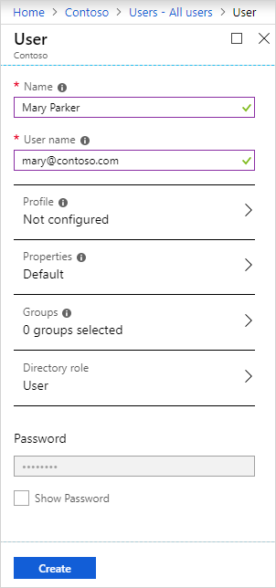

# Add a new Azure Stack tenant account in Azure Active Directory

After [deploying the Azure Stack Development Kit](../asdk/asdk-install), you'll need a tenant user account so you can explore the tenant portal and test your offers and plans. You can create a tenant account by [using the Azure portal](#create-an-azure-stack-tenant-account-using-the-azure-portal) or by using PowerShell.

## Create an Azure Stack tenant account using the Azure portal

You must have an Azure subscription to use the Azure portal.

1. Sign in to [Azure](https://portal.azure.com).
2. In the left navigation bar, select **Active Directory** and switch to the directory that you want to use for Azure Stack, or create a new one.
3. Select **Azure Active Directory** > **Users** > **New user**.

    

4. On the **User** page, fill out the required information.

    

   - **Name (required).** The first and last name of the new user. For example, Mary Parker.
   - **User name (required).** The user name of the new user. For example, mary@contoso.com.
       The domain part of the user name must use either the initial default domain name, <_yourdomainname_>.onmicrosoft.com, or a custom domain name, such as contoso.com. For more information about how to create a custom domain name, see [How to add a custom domain name to Azure Active Directory](../active-directory/fundamentals/add-custom-domain.md).
   - **Profile.** Optionally, you can add more information about the user. You can also add user information at a later time. For more information about adding user info, see [How to add or change user profile information](../active-directory/fundamentals/active-directory-users-profile-azure-portal.md).
   - **Directory role.**  choose **User**.

5. Check **Show Password** and copy the auto-generated password provided in the **Password** box. You'll need this password for the initial sign-in process.

6. Select **Create**.

    The user is created and added to your Azure AD tenant.

7. Sign in to Microsoft Azure portal with the new account. Change the password when prompted.
8. Sign in to `https://portal.local.azurestack.external` with the new account to see the tenant portal.

## Create an Azure Stack user account using PowerShell

If you don't have an Azure subscription, you can't use the Azure portal to add a tenant user account. In this case, you can use the Azure Active Directory Module for Windows PowerShell instead.

> [!NOTE]
> If you are using Microsoft Account (Live ID) to deploy Azure Stack Development Kit, you can't use AAD PowerShell to create tenant account. 

1. Install the [Microsoft Online Services Sign-In Assistant for IT Professionals RTW](https://www.microsoft.com/en-us/download/details.aspx?id=41950).
2. Install the [Azure Active Directory Module for Windows PowerShell (64-bit version)](https://go.microsoft.com/fwlink/p/?linkid=236297) and open it.
3. Run the following cmdlets:

    ```powershell
    # Provide the AAD credential you use to deploy Azure Stack Development Kit

            $msolcred = get-credential

    # Add a tenant account "Tenant Admin <username>@<yourdomainname>" with the initial password "<password>".

            connect-msolservice -credential $msolcred
            $user = new-msoluser -DisplayName "Tenant Admin" -UserPrincipalName <username>@<yourdomainname> -Password <password>
            Add-MsolRoleMember -RoleName "Company Administrator" -RoleMemberType User -RoleMemberObjectId $user.ObjectId

    ```

1. Sign in to Microsoft Azure with the new account. Change the password when prompted.
2. Sign in to `https://portal.local.azurestack.external` with the new account to see the tenant portal.

## Next steps

[Add Azure Stack users in AD FS](azure-stack-add-users-adfs.md)
