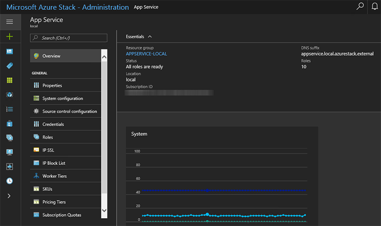
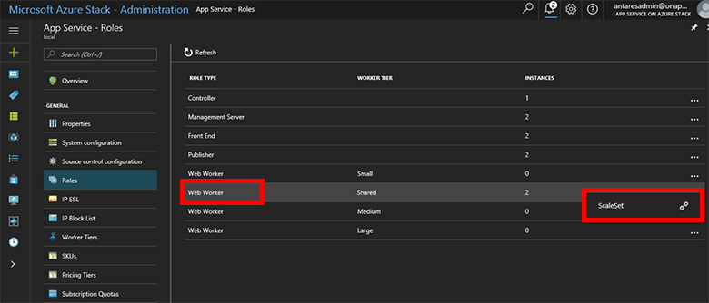
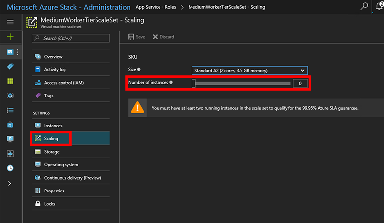
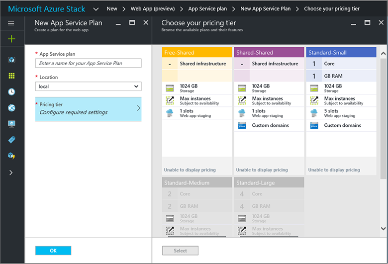

# App Service on Azure Stack: Add more worker roles

This document provides instructions about how to scale App Service on Azure Stack worker roles. It contains steps for creating additional worker roles to support applications of any size.

> [!NOTE]
> If your Azure Stack POC Environment does not have more than 96-GB RAM you may have difficulties adding additional capacity.

App Service on Azure Stack, by default, supports free and shared worker tiers. To add other worker tiers, you need to add more worker roles.

If you are not sure what was deployed with the default App Service on Azure Stack installation, you can review additional information in the [App Service on Azure Stack overview](azure-stack-app-service-overview.md).

Azure App Service on Azure Stack deploys all roles using Virtual Machine Scale Sets and as such takes advantage of the scaling capabilities of this workload. Therefore, all scaling of the worker tiers is done via the App Service Admin.

Add additional workers directly within the App Service Resource Provider Admin.

1. Log in to the Azure Stack administration portal as the service administrator.
2. Browse to **App Services**.

  
3. Click **Roles**. Here you see the breakdown of all App Service roles deployed.
4. Click **Scale Instances**.

  
5. Under **Scale Instances**:
    1. Select the **Role Type**. In this preview, this option is limited to Web Worker.
    2. Select the **Worker Tier** you would like to deploy this worker into, default choices are Small, Medium, Large, or Shared. If, you have created your own worker tiers, your worker tiers will also be available for selection.
    3. Choose how many additional **Role Instances** you want to add.
    4. Click **OK** to deploy the additional workers.
    
6. App Service on Azure Stack will now add the additional VMs, configure them, install all the required software, and mark them as ready when this process is complete. This process can take approximately 80 minutes.
7. You can monitor the progress of the readiness of the new workers by viewing the workers in the **Roles** blade.

After they are fully deployed and ready, the workers become available for users to deploy their workload onto them. The following shows an example of the multiple pricing tiers available by default. If there are no available workers for a particular worker tier, the option to choose the corresponding pricing tier is unavailable.

>[!NOTE]
> To scale out Management, Front End or Publisher roles add you must scale out the corresponding VM Scale set. We will add the ability to scale out these roles via the App Service management in a future release.

## Next steps

[Configure deployment sources](azure-stack-app-service-configure-deployment-sources.md)
