# Add an App Service resource provider to Azure Stack

As an Azure Stack cloud operator, you can give your users the ability to create web and API applications. To do this, you must first add the [App Service resource provider](azure-stack-app-service-overview.md) to your Azure Stack deployment as described in this article. After you have installed the App Service resource provider, you can include it in your offers and plans. Users can then subscribe to get the service and start creating applications.

> [!IMPORTANT]
> Prior to running the installer, make sure that you have followed the guidance in [Before you get started](azure-stack-app-service-before-you-get-started.md).
> 
>

## Run the App Service resource provider installer

Installing the App Service resource provider into your Azure Stack environment can take up to an hour. During this process, the installer will:

* Create a blob container in the specified Azure Stack storage account.
* Create a DNS zone and entries for App Service.
* Register the App Service resource provider.
* Register the App Service gallery items.

To deploy App Service resource provider, follow these steps:

1. Run appservice.exe as an administrator (azurestack\AzureStackAdmin).

2. Click **Deploy App Service on your Azure Stack cloud**.

    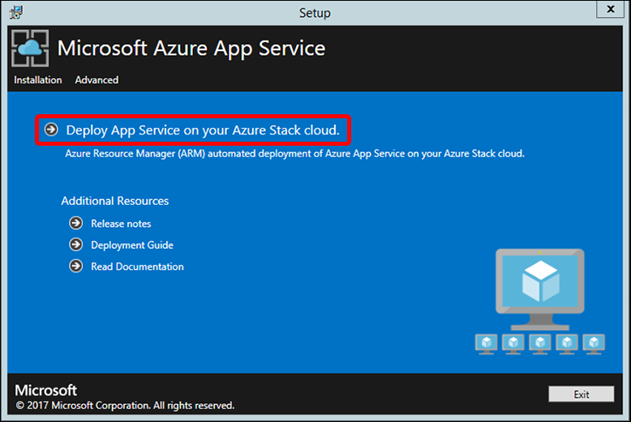

3. Review and accept the Microsoft Software License Terms and then click **Next**.

4. Review and accept the third-party license terms and then click **Next**.

5. Make sure that the App Service cloud configuration information is correct. If you used the default settings during Azure Stack Development Kit deployment, you can accept the default values here. However, if you customized the options when you deployed Azure Stack, you must edit the values in this window to reflect that. For example, if you use the domain suffix mycloud.com, your endpoint must change to management.mycloud.com. After you confirm your information, click **Next**.

    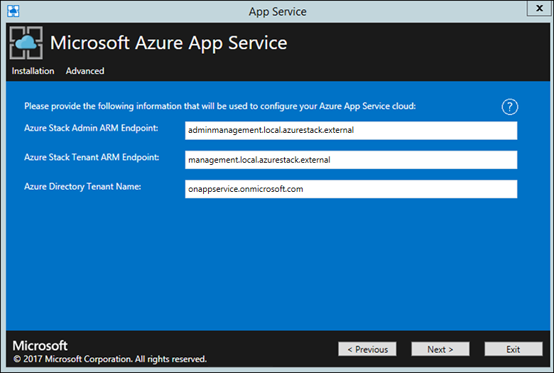

6. On the next page:
    1. Click the **Connect** button next to the **Azure Stack Subscriptions** box.
        - If you're using Azure Active Directory (Azure AD), enter the Azure AD admin account and password that you provided when you deployed Azure Stack. Click **Sign In**.
        - If you're using Active Directory Federation Services (AD FS), provide your admin account. For example, azurestackadmin@azurestack.local. Enter your password, and click **Sign In**.
    2. In the **Azure Stack Subscriptions** box, select your subscription.
    3. In the **Azure Stack Locations** box, select the location that corresponds to the region you're deploying to. For example, select **local** if your deploying to the Azure Stack Development Kit.
    4. Enter a **Resource Group Name** for your App Service deployment. By default, it's set to **APPSERVICE\<REGION\>**.
    5. Enter the **Storage Account Name** that you want App Service to create as part of the installation. By default, it's set to **appsvclocalstor**.
    6. Click **Next**.

    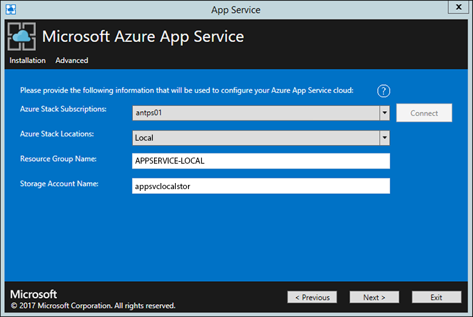

7. Enter the information for your file share and then click **Next**.

    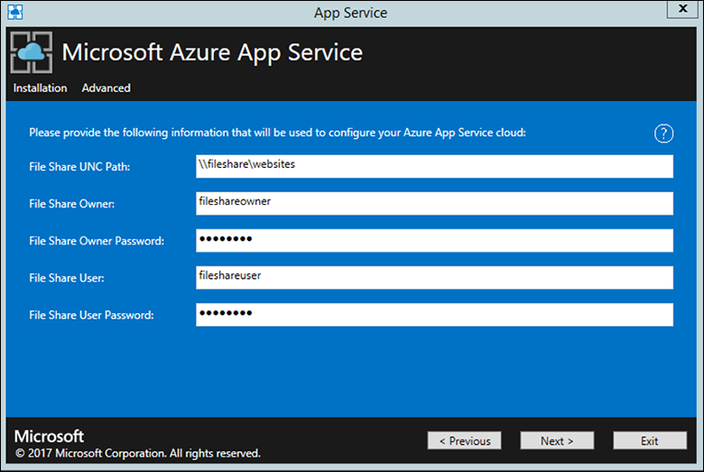

8. On the next page:
    1. In the **Identity Application ID** box, enter the GUID for the application you’re using for identity.
    2. In the **Identity Application certificate file** box, enter (or browse to) the location of the certificate file.
    3. In the **Identity Application certificate password** box, enter the password for the certificate. This password is the one that you made note of when you used the script to create the certificates.
    4. In the **Azure Resource Manager root certificate file** box, enter (or browse to) the location of the certificate file.
    5. Click **Next**.

    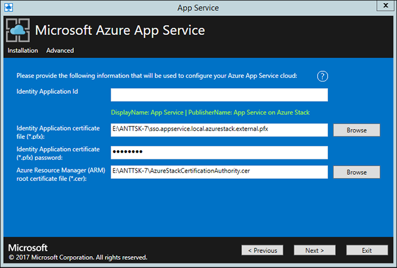

9. For each of the three certificate file boxes, click **Browse** and navigate to the appropriate certificate file. You must also provide the password for each certificate. These certificates are the ones that you created in the [Create required certificates step](azure-stack-app-service-deploy.md#create-the-required-certificates). Click **Next** after entering all the information.

    | Box | Certificate file name example |
    | --- | --- |
    | **App Service default SSL certificate file** | \_.appservice.local.AzureStack.external.pfx |
    | **App Service API SSL certificate file** | api.appservice.local.AzureStack.external.pfx |
    | **App Service Publisher SSL certificate file** | ftp.appservice.local.AzureStack.external.pfx |

    If you used a different domain suffix when you created the certificates, your certificate file names don’t use *local.AzureStack.external*. Instead, use your custom domain information.

    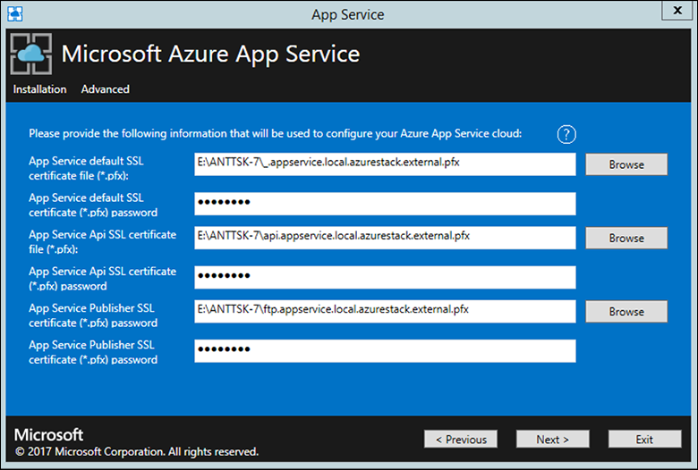    

10. Enter the SQL Server details for the server instance used to host the App Service resource provider databases and then click **Next**. The installer validates the SQL connection properties.

    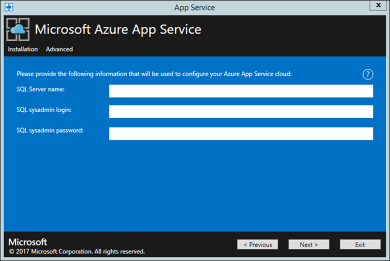    

11. Review the role instance and SKU options. The defaults are populated with the minimum recommended instance SKUs for each role. A summary of core and memory requirements is provided to help plan your deployment. After you make your selections, click **Next**.

> [!NOTE]
> For production deployments, following the guidance in [Capacity planning for Azure App Service server roles in Azure Stack](azure-stack-app-service-capacity-planning.md).
> 
>

    | Role | Recommended minimum instances | Recommended minimum SKU | Notes |
    | --- | --- | --- | --- |
    | Controller | 1 | Standard_A1 - (1 Core, 1792 MB) | Manages and maintains the health of the App Service cloud. |
    | Management | 1 | Standard_A2 - (2 Cores, 3584 MB) | Manages the App Service Azure Resource Manager and API endpoints, portal extensions (admin, tenant, Functions portal), and the data service. To support failover, increased the recommended instances to 2. |
    | Publisher | 1 | Standard_A1 - (1 Core, 1792 MB) | Publishes content via FTP and web deployment. |
    | FrontEnd | 1 | Standard_A1 - (1 Core, 1792 MB) | Routes requests to App Service applications. |
    | Shared Worker | 1 | Standard_A1 - (1 Core, 1792 MB) | Hosts web or API applications and Azure Functions apps. TYou might want to add more instances. As an operator, you can define your offering and choose any SKU tier. The tiers must have a minimum of one core. |

    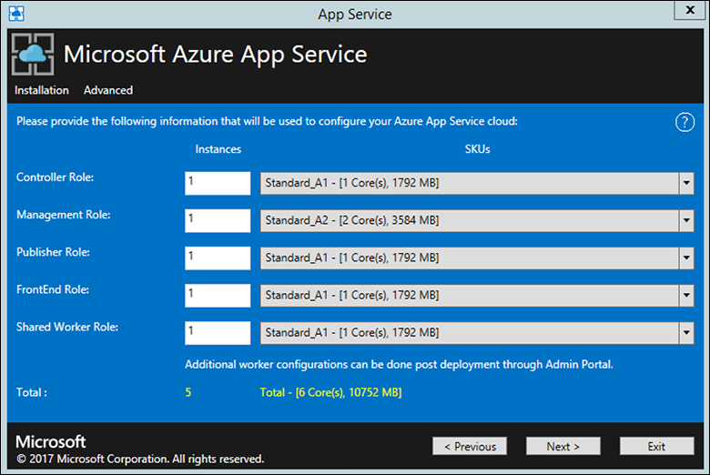    

12. In the **Select Platform Image** box, choose your deployment Windows Server 2016 virtual machine image from those available in the compute resource provider for the App Service cloud. Click **Next**.

13. On the next page:
     1. Enter the Worker Role virtual machine administrator user name and password.
     2. Enter the Other Roles virtual machine administrator user name and password.
     3. Click **Next**.

    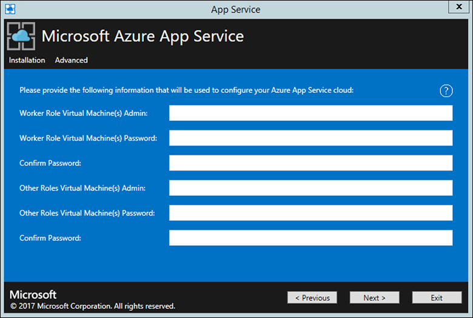    

14. On the summary page:
    1. Verify the selections you made. To make changes, use the **Previous** buttons to visit previous pages.
    2. If the configurations are correct, select the check box.
    3. To start the deployment, click **Next**.

    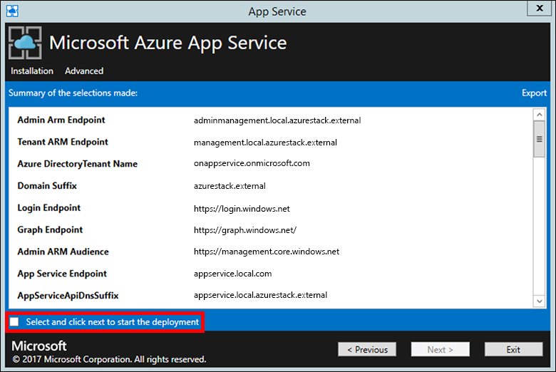    

15. On the next page:
    1. Track the installation progress. App Service on Azure Stack takes about 60 minutes to deploy based on the default selections.
    2. After the installer successfully finishes, click **Exit**.

    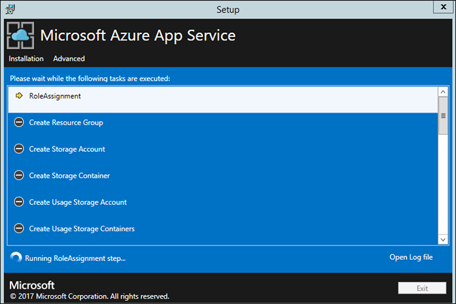    

## Validate the App Service on Azure Stack installation

1. In the Azure Stack admin portal, go to **Administration - App Service**.

2. In the overview under status, check to see that the **Status** shows **All roles are ready**.

        

## Test drive App Service on Azure Stack

After you deploy and register the App Service resource provider, test it to make sure that users can deploy web and API apps.

> [!NOTE]
> You need to create an offer that has the Microsoft.Web namespace within the plan. Then you need to have a tenant subscription that subscribes to this offer. For more information, see [Create offer](azure-stack-create-offer.md) and [Create plan](azure-stack-create-plan.md).
>
You *must* have a tenant subscription to create applications that use App Service on Azure Stack. The only capabilities that a service admin can complete within the admin portal are related to the resource provider administration of App Service. These capabilities include adding capacity, configuring deployment sources, and adding Worker tiers and SKUs.
>
As of the third technical preview, to create web, API, and Azure Functions apps, you must use the tenant portal and have a tenant subscription.

1. In the Azure Stack tenant portal, click **New** > **Web + Mobile** > **Web App**.

2. On the **Web App** blade, type a name in the **Web app** box.

3. Under **Resource Group**, click **New**. Type a name in the **Resource Group** box.

4. Click **App Service plan/Location** > **Create New**.

5. On the **App Service plan** blade, type a name in the **App Service plan** box.

6. Click **Pricing tier** > **Free-Shared** or **Shared-Shared** > **Select** > **OK** > **Create**.

7. In under a minute, a tile for the new web app appears on the dashboard. Click the tile.

8. On the **Web App** blade, click **Browse** to view the default website for this app.

## Deploy a WordPress, DNN, or Django website (optional)

1. In the Azure Stack tenant portal, click **+**, go to the Azure Marketplace, deploy a Django website, and wait for successful completion. The Django web platform uses a file system-based database. It doesn’t require any additional resource providers, such as SQL or MySQL.

2. If you also deployed a MySQL resource provider, you can deploy a WordPress website from the Marketplace. When you're prompted for database parameters, enter the user name as *User1@Server1*, with the user name and server name of your choice.

3. If you also deployed a SQL Server resource provider, you can deploy a DNN website from the Marketplace. When you're prompted for database parameters, choose a database in the computer running SQL Server that's connected to your resource provider.

## Next steps

You can also try out other [platform as a service (PaaS) services](azure-stack-tools-paas-services.md).

- [SQL Server resource provider](azure-stack-sql-resource-provider-deploy.md)
- [MySQL resource provider](azure-stack-mysql-resource-provider-deploy.md)

<!--Links-->
[Azure_Stack_App_Service_preview_installer]: http://go.microsoft.com/fwlink/?LinkID=717531
[App_Service_Deployment]: http://go.microsoft.com/fwlink/?LinkId=723982
[AppServiceHelperScripts]: http://go.microsoft.com/fwlink/?LinkId=733525
