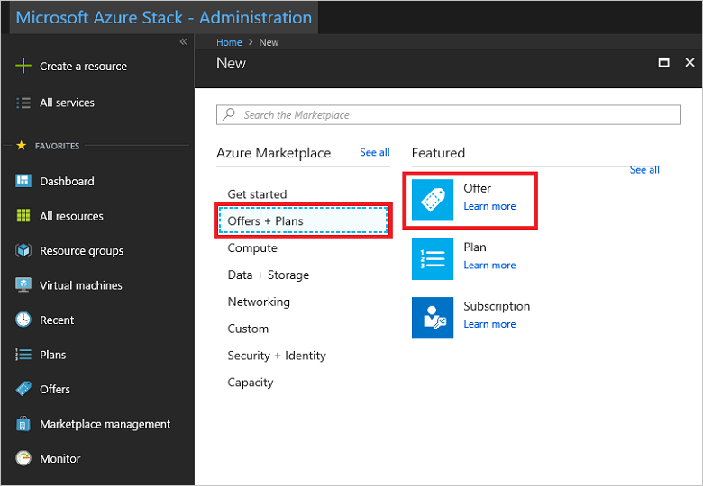
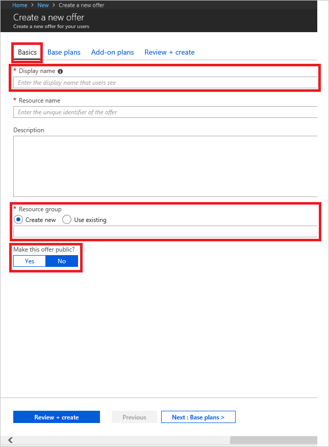
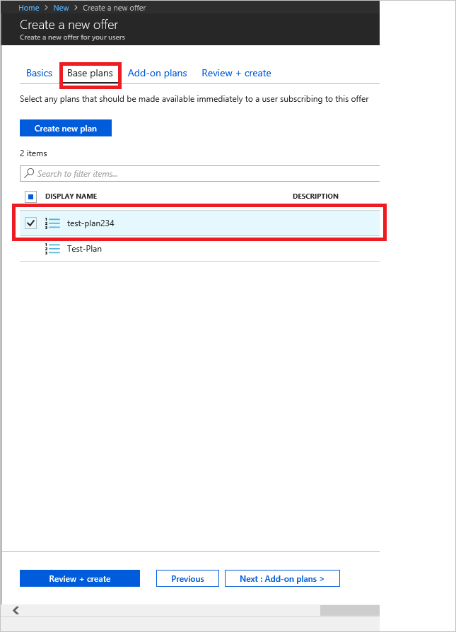
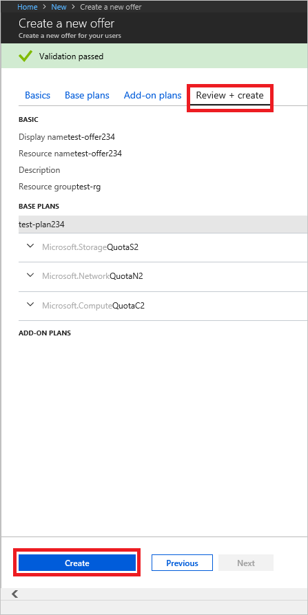
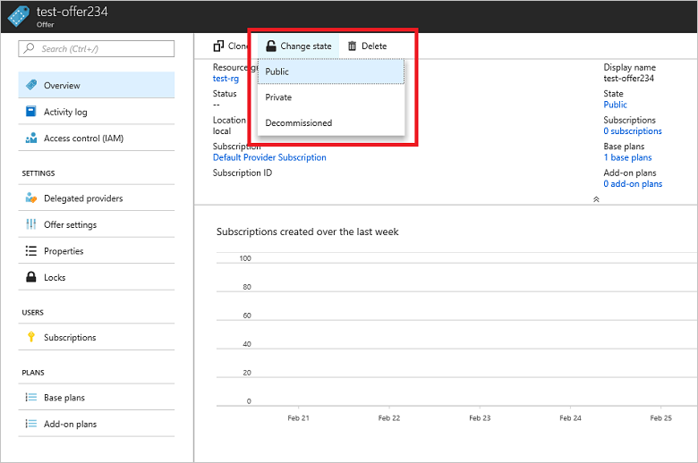
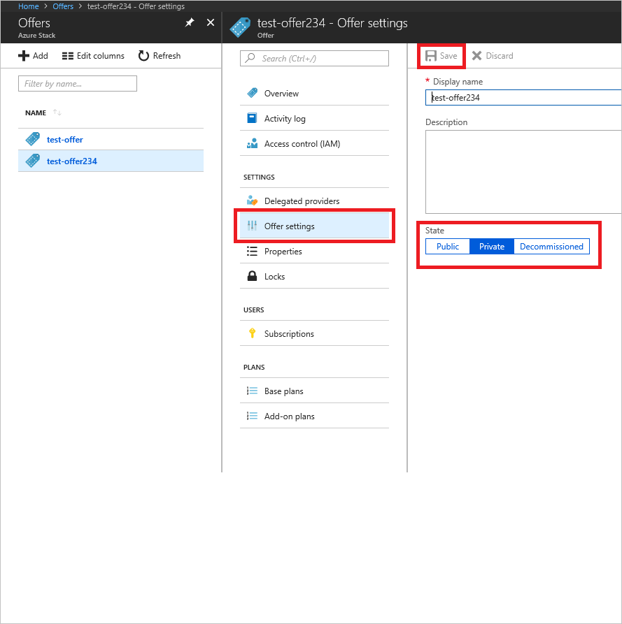

# Create an offer in Azure Stack

[Offers](azure-stack-key-features.md) are groups of one or more plans that providers present to users, which those users can buy or subscribe to. This article describes how to create an offer that includes the [plan that you created](azure-stack-create-plan.md). This offer gives subscribers the ability to set up virtual machines (VMs).

1. Sign in to the [Azure Stack administrator portal](https://adminportal.local.azurestack.external) and select **+ Create a resource**, then **Tenant Offers + Plans**, and then **Offer**.

   

2. You are presented with a tabbed user interface that enables you to define the offer name, and add existing or create new base plans and add-on plans. Most importantly, you can review the details of the offer you create, before you decide to create it.

   In the **Basics** tab, under **New Offer**, enter a **Display Name** and a **Resource Name**, and then under **Resource Group**, select **Create new** or **Use existing**. The display name is the friendly name for the offer. This friendly name is the only information about the offer that users see when they subscribe to an offer in the user portal. Use an intuitive name that helps users understand what comes with the offer. Only the admin can see the resource name. It's the name that admins use to work with the offer as an Azure Resource Manager resource. In this tab, you can also choose to make this offer public or keep it private, which is the default. You can [change the public or private state of the offer](#change-the-state-of-an-offer) later, as well.

   
  
3. Select the **Base plans** tab. Select the plan(s) you want to include in the offer.

   

4. At this point you can create an add-on plan to modify the base plan, but skip that step for now. We will create an add-on plan in the next article, [Azure Stack add-on plans](create-add-on-plan.md).

5. Select the **Review + create** tab. Review the offer summary to ensure that all values are correct. Note that you are now able to expand the quotas in the chosen plans, one at a time, to view the details of each quota in a plan, and go back to make any necessary edits.

6. Select **Create** to create the offer.

   
  
## Change the state of an offer

After creating the offer, you can change its state. Offers must be made **Public** for users to get the full view when they subscribe. Offers can be:

   - **Public**: Visible to users.
   - **Private**: Only visible to cloud administrators. This setting is useful while drafting the plan or offer, or if the cloud administrator wants to [create each subscription for users](azure-stack-subscribe-plan-provision-vm.md#create-a-subscription-as-a-cloud-operator).
   - **Decommissioned**: Closed to new subscribers. The cloud administrator can decommission offers to prevent future subscriptions, but leave current subscribers unaffected.

   > [!TIP]  
   > Changes to the offer are not immediately visible to the user. To see the changes, users might have to sign out and sign in again to the user portal to see the new offer.

There are two ways to change the state of an offer:

1. In **All resources**, select the name of the offer. On the **Overview** screen for the offer, select **Change state**. Choose the state you want to use (for example, **Public**).

   

2. In **All resources**, select the name of the offer. Then select **Offer settings**. Choose the state you want to use (for example, **Public**), then select **Save**.

   

> [!NOTE]
> You can also use PowerShell to create default offers, plans, and quotas. For more information, see [Azure Stack PowerShell Module 1.4.0](/powershell/azure/azure-stack/overview?view=azurestackps-1.4.0).

## Next steps

- [Create subscriptions](azure-stack-subscribe-plan-provision-vm.md)
- [Provision a virtual machine](azure-stack-provision-vm.md)
