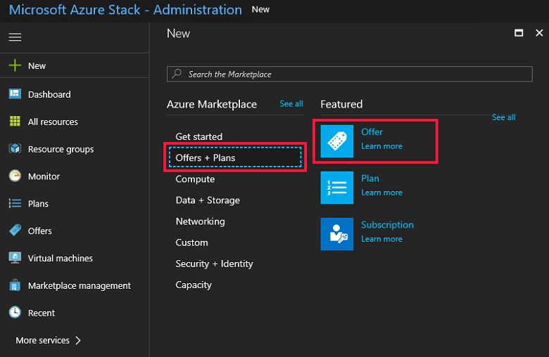
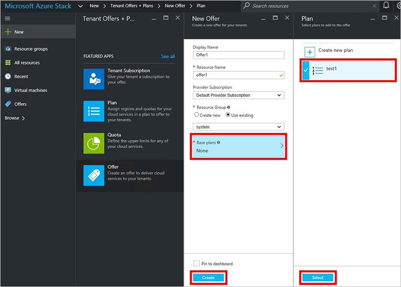
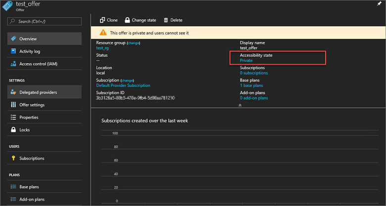
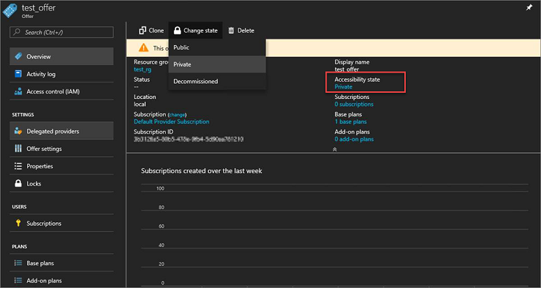

# Create an offer in Azure Stack

[Offers](azure-stack-key-features.md) are groups of one or more plans that providers present to users to buy or subscribe to. This document shows you how to create an offer that includes the [plan that you created](azure-stack-create-plan.md). This offer gives subscribers the ability to set up virtual machines.

1. Sign in to the Azure Stack administrator portal (https://adminportal.local.azurestack.external) and select **New** > **Tenant Offers + Plans** > **Offer**.

   
  
2. Under **New Offer**, enter a **Display Name** and a **Resource Name**, and then under **Resource Group**, select **Create new** or **Use existing**. The Display Name is the friendly name for the offer. This friendly name is the only information about the offer that the users see when they subscribe to an offer. Use an intuitive name that helps users understand what comes with the offer. Only the admin can see the Resource Name. It's the name that admins use to work with the offer as an Azure Resource Manager resource.

   
  
3. Select **Base plans** to open the **Plan**. Select the plans you want to include in the offer, and then choose **Select**. To create the offer select **Create**.

   
  
4. After creating the offer, you can change its state. Offers must be made *public* for users to get the full view when they subscribe. Offers can be:

   - **Public**: Visible to users.
   - **Private**: Only visible to cloud administrators. This setting is useful while drafting the plan or offer, or if the cloud administrator wants to [create each subscription for users](azure-stack-subscribe-plan-provision-vm.md#create-a-subscription-as-a-cloud-operator).
   - **Decommissioned**: Closed to new subscribers. The cloud administrator can use decommissioned to prevent future subscriptions, but leave current subscribers unaffected.

   > [!TIP]  
   > Changes to the offer aren't immediately visible to user. To see the changes, users might have to sign out and sign in again to the user portal to see the new offer.

   On the Overview for the offer, select **Accessibility state**. Choose the state you want to use (for example, **Public**) and then select **Save**.
 
     

     As an alternative, select **Change state** and then choose a state.

    

   > [!NOTE]
   > You can also use PowerShell to create default offers, plans, and quotas. For more information, see [Azure Stack PowerShell Module 1.3.0](https://docs.microsoft.com/powershell/azure/azure-stack/overview?view=azurestackps-1.3.0).

## Next steps

- [Create subscriptions](azure-stack-subscribe-plan-provision-vm.md)
- [Provision a virtual machine](azure-stack-provision-vm.md)
