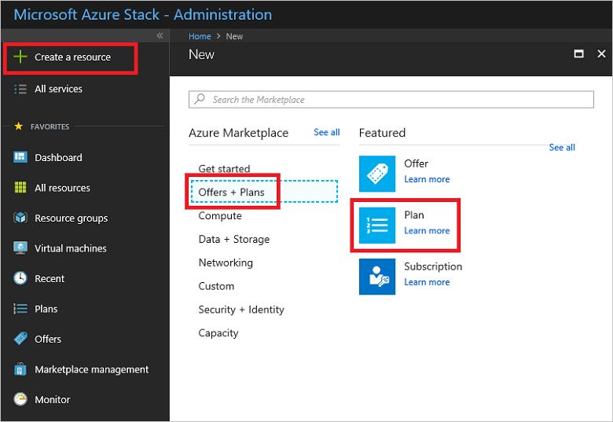
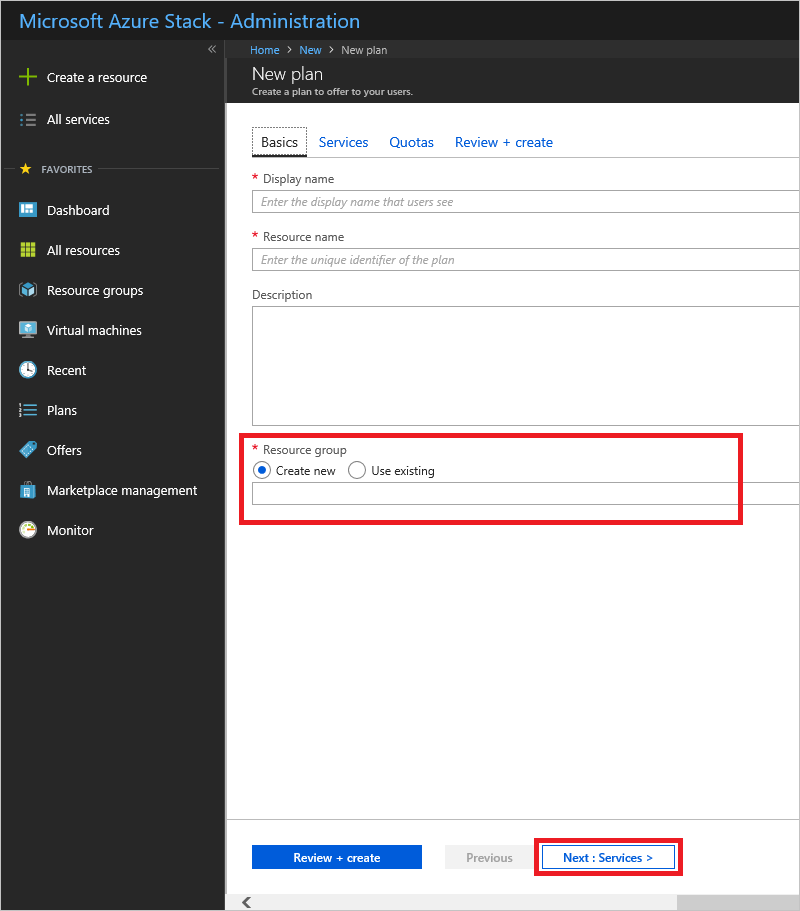
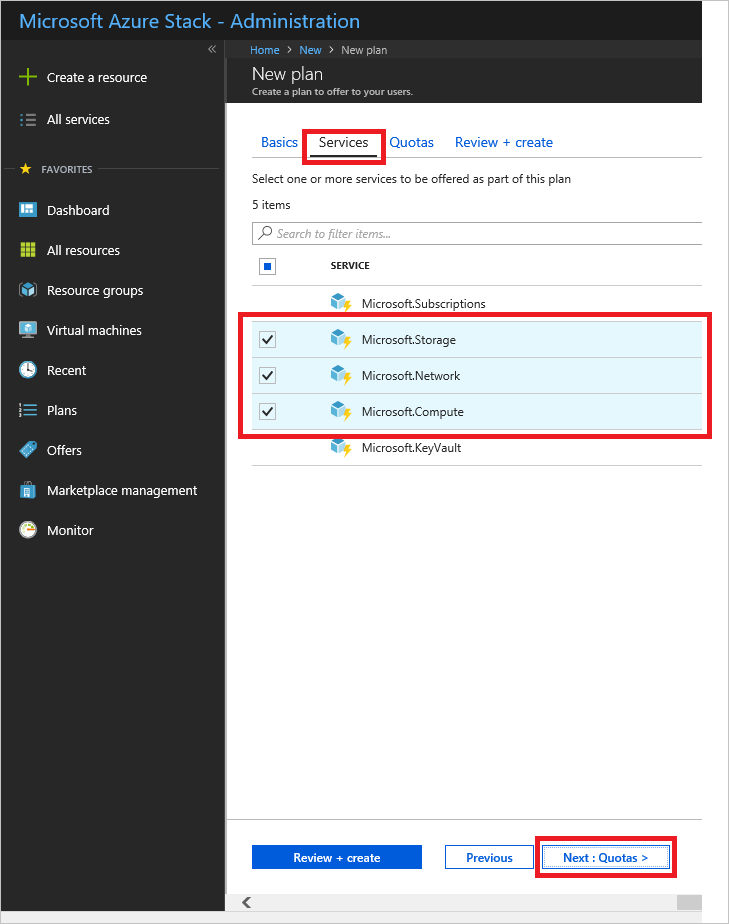
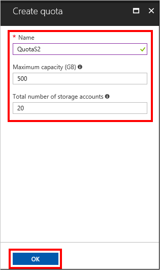
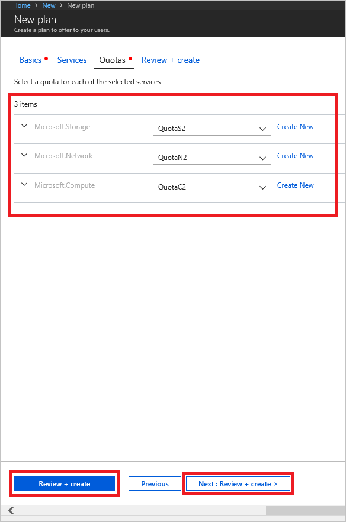
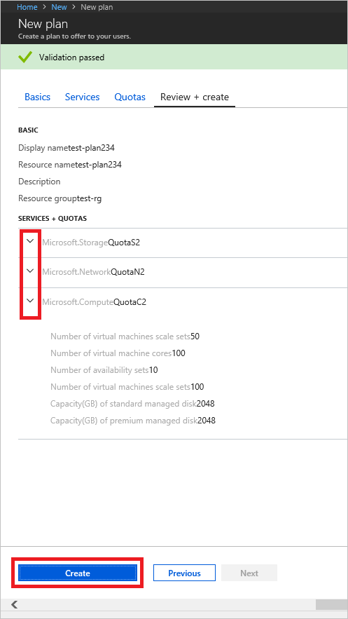

# Create a plan in Azure Stack

*Applies to: Azure Stack integrated systems and Azure Stack Development Kit*

[Plans](azure-stack-key-features.md) are groupings of one or more services. As a provider, you can create plans to offer to your users. In turn, your users subscribe to your offers to use the plans and services they include. This example shows you how to create a plan that includes the compute, network, and storage resource providers. This plan gives subscribers the ability to provision virtual machines.

1. Sign in to the [Azure Stack administrator portal](https://adminportal.local.azurestack.external).

2. To create a plan and offer that users can subscribe to, select **+ Create a resource**, then **Offers + Plans**, then **Plan**.
  
   

3. Under the **Basics** tab of the **New plan** window, enter a **Display name** and a **Resource name**. The display name is the plan's friendly name that users can see. Only the administrator can see the resource name, which is used to work with the plan as an Azure Resource Manager resource.

   

4. Create a new **Resource Group**, or select an existing one, as a container for the plan.

   

5. Select the **Services** tab, and then select the checkbox for **Microsoft.Compute**, **Microsoft.Network**, and **Microsoft.Storage**.
  
   

6. Select the **Quotas** tab. Next to **Microsoft.Storage (local)**, choose either the default quota or select **Create New** to create a customized quota.
  
   

7. If you're creating a new quota, enter a **Name** for the quota, and then specify the quota values. Select **OK** to create the quota.

   

8. Repeat steps 6 and 7 to create and assign quotas for **Microsoft.Network (local)** and **Microsoft.Compute (local)**. When all three services have quotas assigned, they'll look like the next example.

   

9. Select **Review + create** to review the plan. Review all values and quotas to ensure they are correct.

   

10. When you are ready, select **Create** to create the plan.

11. To see the new plan, select **All resources**, then search for the plan and select its name. If your list of resources is long, use **Search** to locate your plan by name.

   

## Next steps

* [Create an offer](azure-stack-create-offer.md)
