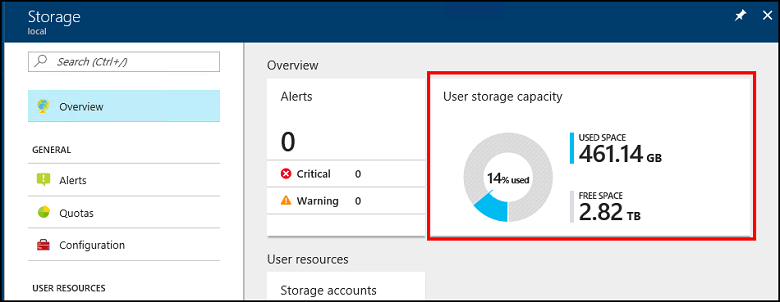
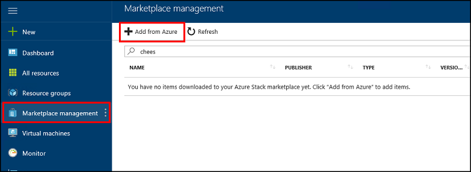
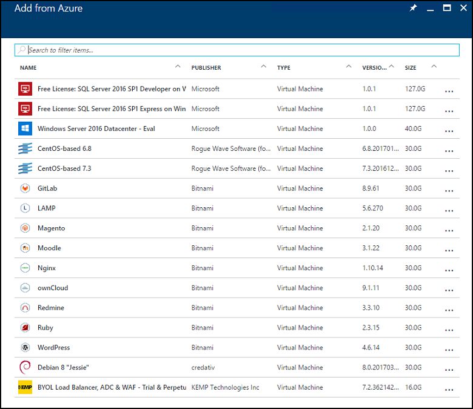

# Download marketplace items from Azure to Azure Stack

*Applies to: Azure Stack integrated systems and Azure Stack Development Kit*

As a cloud operator, you can download items from the Azure Marketplace and make them available in Azure Stack. The items you can choose are from a curated list of Azure Marketplace items that are pre-tested and supported to work with Azure Stack. Additional items are frequently added to this list, so continue to check back for new content. 

There are two scenarios for connecting to the Azure Marketplace: 

- **A connected scenario** - that requires your Azure Stack environment to be connected to the internet. You use the Azure Stack portal to locate and download items. 
- **A disconnected or partially connected scenario** - that requires you to access the Internet using the marketplace syndication tool to download marketplace items. Then, you transfer your downloads to your disconnected Azure Stack installation. This scenario uses PowerShell.

See [Azure Marketplace items for Azure Stack](azure-stack-marketplace-azure-items.md) for a list of the marketplace items you can download.


## Connected scenario
If Azure Stack connects to the internet, you can use the admin portal to download marketplace items.

### Prerequisites
Your Azure Stack deployment must have internet connectivity, and be [registered with Azure](azure-stack-register.md).

### Use the portal to download marketplace items  
1. Sign in to the Azure Stack administrator portal.

2.	Review the available storage space before downloading marketplace items. Later, when you select items for download, you can compare the download size to your available storage capacity. If capacity is limited, consider options for [managing available space](azure-stack-manage-storage-shares.md#manage-available-space). 

    To review available space, in **Region management** select the region you want to explore, and then go to **Resource Providers** > **Storage**.

    [  ](media/azure-stack-download-azure-marketplace-item/storage.png#lightbox)

    
3. Open the Azure Stack Marketplace and connect to Azure. To do so, select **Marketplace management**, and then select **Add from Azure**.

    [  ](media/azure-stack-download-azure-marketplace-item/marketplace.png#lightbox)

    The portal displays the list of items available for download from the Azure Marketplace. You can click on each item to view its description and additional information about it, including its download size. 

    [  ](media/azure-stack-download-azure-marketplace-item/image03.png#lightbox)

4. Select the item you want, and then select **Download**. Download times vary.

    [  ](media/azure-stack-download-azure-marketplace-item/image04.png#lightbox)

    After the download completes, you can deploy the new marketplace item as either an Azure Stack operator or user.

5. To deploy the downloaded item, select **+ Create a resource**, and then search among the categories for the new marketplace item. Next select the item to begin the deployment process. The process varies for different marketplace items. 

## Disconnected or a partially connected scenario

If Azure Stack is in a disconnected mode and without internet connectivity, you use PowerShell and the *marketplace syndication tool* to download the marketplace items to a machine with internet connectivity. You then transfer the items to your Azure Stack environment. In a disconnected environment, you cannot download marketplace items by using the Azure Stack portal. 

The marketplace syndication tool can also be used in a connected scenario. 

There are two parts to this scenario:
- **Part 1:** Download from Azure Marketplace. On the computer with internet access you configure PowerShell, download the syndication tool, and then download items form the Azure Marketplace.  
- **Part 2:** Upload and publish to the Azure Stack Marketplace. You move the files you downloaded to your Azure Stack environment, import them to Azure Stack, and then publish them to the Azure Stack Marketplace.  


### Prerequisites
- Your Azure Stack deployment must be [registered with Azure](azure-stack-register.md).  

- The computer that has internet connectivity must have **Azure Stack PowerShell Module version 1.2.11** or higher. If not already present, [install Azure Stack specific PowerShell modules](azure-stack-powershell-install.md).  

- To enable import of a downloaded marketplace item, the [PowerShell environment for the Azure Stack operator](azure-stack-powershell-configure-admin.md) must be configured.  

- You must have a [storage account](azure-stack-manage-storage-accounts.md) in Azure Stack that has a publicly accessible container (which is a storage blob). You use the container as temporary storage for the marketplace items gallery files. If you are not familiar with storage accounts and containers, see [Work with blobs - Azure portal](https://docs.microsoft.com/azure/storage/blobs/storage-quickstart-blobs-portal) in the Azure documentation.

- The marketplace syndication tool is downloaded during the first procedure. 

### Use the marketplace syndication tool to download marketplace items

1. On a computer with an Internet connection, open a PowerShell console as an administrator.

2. Add the Azure account that you have used to register Azure Stack. To add the account, in PowerShell run `Add-AzureRmAccount` without any parameters. You are prompted to enter your Azure account credentials and you might have to use 2-factor authentication based on your account’s configuration.

3. If you have multiple subscriptions, run the following command to select the one you have used for registration:  

   ```PowerShell  
   Get-AzureRmSubscription -SubscriptionID '<Your Azure Subscription GUID>' | Select-AzureRmSubscription
   $AzureContext = Get-AzureRmContext
   ```

4. Download the latest version of the marketplace syndication tool by using the following script:  

   ```PowerShell
   # Download the tools archive.
   [Net.ServicePointManager]::SecurityProtocol = [Net.SecurityProtocolType]::Tls12 
   invoke-webrequest https://github.com/Azure/AzureStack-Tools/archive/master.zip `
     -OutFile master.zip

   # Expand the downloaded files.
   expand-archive master.zip `
     -DestinationPath . `
     -Force

   # Change to the tools directory.
   cd .\AzureStack-Tools-master

   ```

5. Import the syndication module and then launch the tool by running the following commands. Replace `Destination folder path` with a location to store the files you download from the Azure Marketplace.   

   ```PowerShell  
   Import-Module .\Syndication\AzureStack.MarketplaceSyndication.psm1

   Export-AzSOfflineMarketplaceItem -Destination "Destination folder path in quotes" 
   ```

6. When the tool runs, you should see a screen similar to the following image, with the list of available marketplace items:

   [  ](media/azure-stack-download-azure-marketplace-item/image05.png#lightbox)

7. Select the item that you want to download and make a note of the *version*. You can hold the *Ctrl* key to select multiple images. You reference the *version* when you import the item in the next procedure. 
   
   You can also filter the list of images by using the **Add criteria** option.

8. Select **OK**, and then review and accept the legal terms. 

9. The time that the download takes depends on the size of the item. After the download completes, the item is available in the folder that you specified in the script. The download includes a VHD file (for virtual machines) or a .zip file (for virtual machine extensions). It might also include a gallery package in the *.azpkg* format, which is simply a .zip file.

### Import the download and publish to Azure Stack Marketplace

1. The files for virtual machine images or solution templates that you have [previously downloaded](#use-the-marketplace-syndication-tool-to-download-marketplace-items) must be made locally available to your Azure Stack environment.  

2. Use the admin portal to upload the marketplace item package (the .azpkg file) and the virtual hard disk image (the .vhd file) to Azure Stack Blob storage. Upload of the package and disk files makes them available to Azure Stack so you can later publish the item to the Azure Stack Marketplace.

   Upload requires you to have a storage account with a publicly accessible container (see the prerequisites for this scenario).  
   1. In the Azure Stack admin portal, go to **All services** and then under the **DATA + STORAGE** category, select **Storage accounts**.  
   
   2. Select a storage account from your subscription, and then under **BLOB SERVICE**, select **Containers**.  
      [  ](media/azure-stack-download-azure-marketplace-item/blob-service.png#lightbox)  
   
   3. Select the container you want to use and then select **Upload** to open the **Upload blob** pane.  
      [  ](media/azure-stack-download-azure-marketplace-item/container.png#lightbox)  
   
   4. On the Upload blob pane, browse to the package and disk files to load into storage and then select **Upload**:
      [  ](media/azure-stack-download-azure-marketplace-item/upload.png#lightbox)  

   5. Files that you upload appear in the container pane. Select a file and then copy the URL from the **Blob properties** pane. You'll use this URL in the next step when you import the marketplace item to Azure Stack.  In the following image, the container is *blob-test-storage* and the file is *Microsoft.WindowsServer2016DatacenterServerCore-ARM.1.0.801.azpkg*.  The file URL is *https://testblobstorage1.blob.local.azurestack.external/blob-test-storage/Microsoft.WindowsServer2016DatacenterServerCore-ARM.1.0.801.azpkg*.  
      [  ](media/azure-stack-download-azure-marketplace-item/blob-storage.png#lightbox)  

3. Import the VHD image to Azure Stack by using the **Add-AzsPlatformimage** cmdlet. When you use this cmdlet, replace the *publisher*, *offer*, and other parameter values with the values of the image that you are importing. 

   You can get the *publisher*, *offer*, and *sku* values of the image from the text file that downloads with the AZPKG file. The text file is stored in the destination location. The *version* value is the version noted when downloading the item from Azure in the previous procedure. 
 
   In the following example script, values for the Windows Server 2016 Datacenter - Server Core virtual machine are used. The value for *-Osuri* is an example path to the blob storage location for the item.

   ```PowerShell  
   Add-AzsPlatformimage `
    -publisher "MicrosoftWindowsServer" `
    -offer "WindowsServer" `
    -sku "2016-Datacenter-Server-Core" `
    -osType Windows `
    -Version "2016.127.20171215" `
    -OsUri "https://mystorageaccount.blob.local.azurestack.external/cont1/Microsoft.WindowsServer2016DatacenterServerCore-ARM.1.0.801.vhd"  
   ```
   **About solution templates:**
   Some templates can include a small 3 MB .VHD file with the name **fixed3.vhd**. You don't need to import that file to Azure Stack. Fixed3.vhd.  This file is included with some solution templates to meet publishing requirements for the Azure Marketplace.

   Review the templates description and download and then import additional requirements like VHDs that are required to work with the solution template.  
   
   **About extensions:** When you work with virtual machine image extensions, use the following parameters:
   - *Publisher*
   - *Type*
   - *Version*  

   You do not use *Offer* for extensions.   


4.  Use PowerShell to publish the marketplace item to Azure Stack by using the **Add-AzsGalleryItem** cmdlet. For example:  
    ```PowerShell  
    Add-AzsGalleryItem `
     -GalleryItemUri "https://mystorageaccount.blob.local.azurestack.external/cont1/Microsoft.WindowsServer2016DatacenterServerCore-ARM.1.0.801.azpkg" `
     –Verbose
    ```
5. After you publish a gallery item, it is now available to use. To confirm the gallery item is published, go to **All services**, and then under the **GENERAL** category, select **Marketplace**.  If your download is a solution template, make sure you add any dependent VHD image for that solution template.  
  [  ](media/azure-stack-download-azure-marketplace-item/view-marketplace.png#lightbox)  

With the release of Azure Stack PowerShell 1.3.0 you can now add Virtual Machine Extensions. For example:

````PowerShell
Add-AzsVMExtension -Publisher "Microsoft" -Type "MicroExtension" -Version "0.1.0" -ComputeRole "IaaS" -SourceBlob "https://github.com/Microsoft/PowerShell-DSC-for-Linux/archive/v1.1.1-294.zip" -SupportMultipleExtensions -VmOsType "Linux"
````

### Import the download and publish to Azure Stack Marketplace (1811 and higher)

1. The files that you have [previously downloaded](#use-the-marketplace-syndication-tool-to-download-marketplace-items) must be made locally available to your Azure Stack environment.

   The following image shows a folder structure example. `D:\downloadfolder` contains all the downloaded marketplace items. Each sub-folder is a marketplace item (for example, `microsoft.custom-script-linux-arm-2.0.3`), named by the product ID. Inside each sub-folder is the marketplace item's downloaded content.

   [  ](media/azure-stack-download-azure-marketplace-item/mp1.png#lightbox)

2. Follow the instructions in [this article](azure-stack-powershell-configure-admin.md) to configure the Azure Stack Operator PowerShell session. 

3. Import the syndication module and then launch the marketplace syndication tool by running the following script:

   ```PowerShell
   $credential = Get-Credential -Message "Enter the azure stack operator credential:"
   Import-AzSOfflineMarketplaceItem -origin "marketplace content folder" -armendpoint "Environment Arm Endpoint" -AzsCredential $credential
   ```
   The `-AzsCredential` parameter is optional. It is used to renew the access token, if it has expired. If the `-AzsCredential` parameter is not specified and the token expires, you receive a prompt to enter the operator credentials.

4. After the script successfully completes, the item should be available in the Azure Stack Marketplace.

## Next steps

[Create and publish a Marketplace item](azure-stack-create-and-publish-marketplace-item.md)