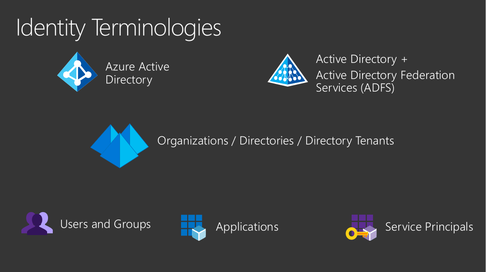
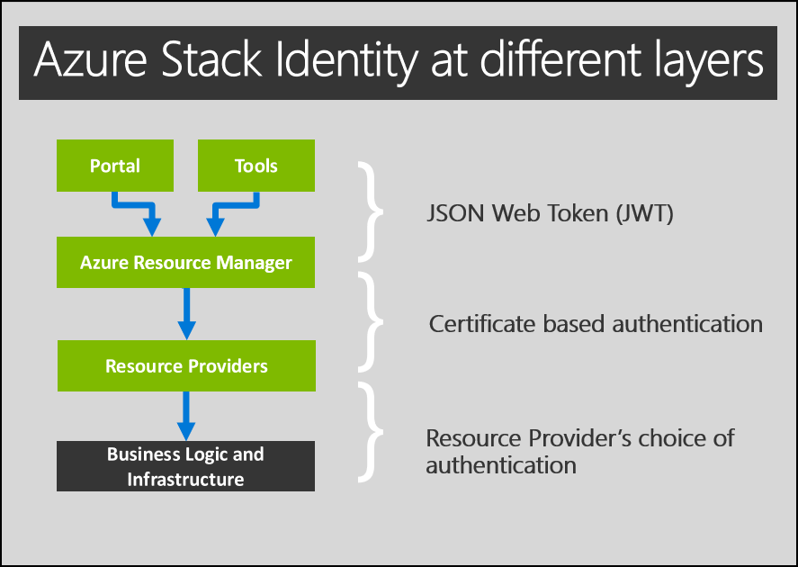
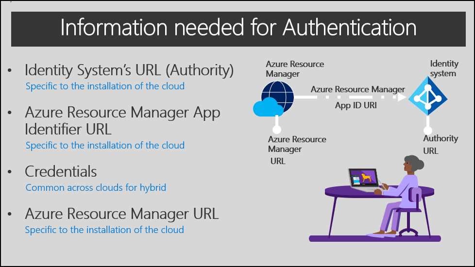
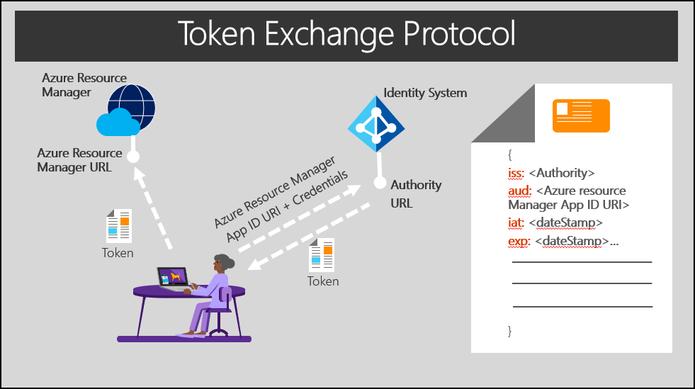

# Overview of Identity for Azure Stack

Azure Stack requires Azure AD or Active Directory Federated Services (AD FS) backed by Active Directory (AD) as an identity provider. The following concepts and authorization details can help you make the choice between identity providers. The choice of a provider is a one-time decision you make when you first deploy Azure Stack.  

Your choice between Azure AD and AD FS might be limited by the mode in which you deploy Azure Stack: 
- When you deploy in a connected mode, you can use Azure AD or AD FS. 
- When you deploy in a disconnected mode without a connection to the Internet, only AD FS is supported.

For more information about these choices, view the following articles depending on your Azure Stack environment:
- Azure Stack Deployment Kit, see [Identity considerations](azure-stack-datacenter-integration.md#identity-considerations).
- Azure Stack integrated systems, see [Deployment planning decisions for Azure Stack integrated systems](azure-stack-deployment-decisions.md).

 
## Common concepts for Identity
The following sections discuss common concepts for identity providers and their use in Azure Stack.

### Directories, tenants, and organizations.
A directory is a container that holds information about *users*, *applications*, *groups*, and *service principals*.
 
A directory tenant is an *organization*, like Microsoft or your own company. 
- Azure AD supports multiple tenants and can support multiple organizations, each in their own directory. If you use Azure AD and have multiple tenants, you can grant applications and users from one tenant access to other tenants of that same directory.
- AD FS supports only a single tenant, and therefore a single organization. 

### Users and Groups
User accounts (identities) are standard accounts that authenticate individuals using a user ID and password. Groups can include users or other groups. 

How you create and manage users and groups depends on the identity solution you use. 

In Azure Stack, user accounts: 
- Are created in the *&lt;username>@&lt;domain>* format. Although AD FS maps user accounts to an Active Directory, AD FS does not support use of the *&lt;domain>\<alias>* format. 
- Can be set up to use multi-factor authentication. 
- Are restricted to the directory where they first register, which is their organizations directory.
- Can be imported from your on-premises directories. For more information, see  [Integrate your on-premises directories with Azure Active Directory](/azure/active-directory/connect/active-directory-aadconnect) in the Azure documentation.  

When you log into your organizations tenant portal, you use https://portal.local.azurestack.external. 

### Guest users
Guest users are user accounts from other directory tenants that have been granted access to resources in your directory. To support guest user, you must use Azure AD and enable support for multi-tenancy. When supported, you can invite a guest user to access resources in your directory tenant, which enables collaboration with outside organizations. 

To invite guest users, cloud operators and users can use [Azure AD B2B collaboration](/azure/active-directory/active-directory-b2b-what-is-azure-ad-b2b). Invited users get access to documents, resources, and applications from your directory while you maintain control over your own resources and data. 

As a guest user, you can log into another organizations directory tenant. To do so, you must append that organizations directory name to the portal URL.  For example if you belong to contoso.com but want to log into the Fabrikam directory, you use https://portal.local.azurestack.external/fabrikam.onmicrosoft.com.

### Applications
You can register applications to Azure AD or AD FS, and then offer them to users in your organization. 

Applications include:
- **Web application** – Examples include the Azure portal and the Azure Resource Manager.  They support Web API calls. 
- **Native client** – Examples include Azure PowerShell, Visual Studio, and Azure command-line interface (CLI).

Applications can support two types of tenancy: 
- **Single-tenant** applications support users and services only from the same directory where the application is registered. 
  > [!NOTE]    
  > Because AD FS supports only a single directory, applications you create in an AD FS topology are by design, single-tenant applications.
- **Multi-tenant** applications support use by users and services from both the directory where the application is registered, and from additional tenant directories.  With multi-tenant applications, users of another tenant directory (another Azure AD tenant) can sign in to your application.     

  For more information about multi-tenancy, see [Enable multi-tenancy](azure-stack-enable-multitenancy.md).  

  For more information about developing a multi-tenant app, see [Multi-tenant apps](/azure/active-directory/develop/active-directory-devhowto-multi-tenant-overview).

When you register an application, two objects are created:
- **Application object** – The application object is the global representation of the application across all tenants. This relationship is one-to-one with the software application and exists only in the directory where the application is first registers.

 
   
- **Service principal object** – A service principal is a credential that is created for an application in the directory where the application is first registered. A service principal is also created in the directory of each additional tenant where that application is used. This relationship can be a one-to-many with the software application.   

To learn more about application and service principal objects, see [Application and service principal objects in Azure Active Directory (Azure AD)](azure/active-directory/develop/active-directory-application-objects). 

### Service principals 
A service principal is a set of *credentials* for an application or service that grant access to resources in Azure Stack. Use of a service principal separates the application permissions from the permissions of the user that uses the application.

A service principal is created in each tenant where the application is used. The service principal establishes an identity for sign-in and access to resources (like users) that are secured by that tenant.   

- A single-tenant application has only one service principal, in the directory where it is first created.  This service principal is created and consents to use during registration of the application. 
- A multi-tenant Web application or API has a service principal created in each tenant where a user from that tenant consents to use of the application.  

Credentials for service principals can either be Key (generated through the Azure portal) or a certificate.  Use of a certificate is suited for automation because certificates are considered more secure than the use of Keys. 

> [!NOTE]    
> When you use AD FS with Azure Stack, only the administrator can create service principals. With AD FS, service principals require certificates and are created through the privileged endpoint (PEP). For more information, see, [Provide applications access to Azure Stack](azure-stack-create-service-principals.md).

To learn about service principals for Azure Stack, see [Create service principals](azure-stack-create-service-principals.md).
).

### Services
Services in Azure Stack that interact with the Identity provider, are registered as applications with the identity provider. Like applications, registration enables a service to authenticate with the identity system. 

All Azure services use [OpenID Connect](azure/active-directory/develop/active-directory-protocols-openid-connect-code) protocols and [JSON Web Tokens](/azure/active-directory/develop/active-directory-token-and-claims) (JWT) to establish their identity. Due to consistent use of protocols by Azure AD and AD FS, you can use Azure [Active Directory Authentication Library](azure/active-directory/develop/active-directory-authentication-libraries) (ADAL) to authenticate on-premises or to Azure (in a connected scenario). ADAL also enables you to use tools like Azure PowerShell and CLI for cross-cloud and on-premises resource management. 

### Identities and your identity system 
Identities for Azure Stack include user accounts, groups, and service principals. 
When you install Azure Stack, several built-in applications and services automatically register with your identity provider in the directory tenant. Some services that register are used for administration. Other services are available for users. The default registrations give core services identities that can interact with each other, and with identities you add later.
If you set up Azure AD with multi-tenancy, some applications propagate to the new directories.  

## Authentication and Authorization
 

### Authentication by applications and users
  

For applications and users, the architecture of Azure Stack is described by four layers. Interactions between each of these layers can use different types of authentication.

|Layer    |Authentication between layers  |
|---------|---------|
|Tools and clients, like the Admin portal     | To access or modify a resource in Azure Stack, tools and clients use a [JSON Web Tokens](/azure/active-directory/develop/active-directory-token-and-claims) (JWT) to place a call to the Azure Resource Manage.     Azure Resource Manager validates the JWT and peeks at the *claims* in the issued token to estimate the level of authorization that user or service principal has in Azure Stack.        |
|Azure Resource Manager and its core services     |Azure Resource Manager communicates with Resource Providers to transfer communication from users.    Transfers use *direct imperative* calls or *declarative* calls via [Azure Resource Manager templates](/azure/azure-stack/user/azure-stack-arm-templates.md).|
|Resource Providers     |Calls passed to the Resource Providers are secured with certificate-based authentication.   Azure Resource Manager and the Resource Provider then stay in communication through an API. For every call received from Azure Resource Manager, the Resource Provider validates the call with that certificate.|
|Infrastructure and Business Logic     |Resource Providers communicate with business logic and infrastructure by using an authentication mode of their choice. The default Resource Providers that ship with Azure Stack use Windows Authentication to secure this communication.|

### Authenticate to Azure Resource Manager:
To authenticate with the identity provider and receive a JWT, you must have the following information: 
1.	**URL for the identity system (Authority)** – The URL at which your identity provider can be reached. For example, *&lt;https://login.windows.net>*. 
2.	**App ID URI for Azure Resource Manager** –  The unique identifier for the Azure Resource Manager that is registered with your identity provider, and unique to each Azure Stack installation.
3.	**Credentials** –This the credential you’re using to authenticate with the identity provider.  
4.	**URL for Azure Resource Manager** – The URL is the location of the Azure Resource Manager service. For example, *&lt;https://management.azure.com>* or *&lt;https://management.local.azurestack.external>*.

When a principal (a client, application, or user) makes an authentication request to access a resource, that request must include:
- The principal’s credentials.
- The App ID URI of the resource they want to access.  

The credentials are validated by the identity provider. The identity provider also validates that the App ID URI is for a registered application, and that the principal has the correct privileges to get a token for that resource. If the request is valid, a JSON Web Token is granted. 

The token must then pass in the header of a request to the Azure Resource Manager. The Azure Resource Manager does the following validations in no specific order:
- Validate the *issuer* (iss) claim to confirm that the token is from the correct identity provider. 
- Validate the *audience* (aud) claim to confirm that the token was issued to the Azure Resource Manager. 
- Validate that the JWT is signed with a certificate that is configured through OpenID, and that is known to Azure Resource Manager. 
- Review the *issued at* (iat) and *expiry* (exp) claims to confirm that the token is active and can be accepted. 

When all validations are complete, Azure Resource Manager uses the *objected* (oid)  and the *groups* claims to make a list of resources that the principal can access. 

### Use Role-Based Access Control  
Role-Based Access Control (RBAC) in Azure Stack is consistent with the implementation in Microsoft Azure.  You can manage access to resources by assigning the appropriate RBAC role to users, groups, and applications. 
For information about how to use RBAC with Azure Stack, review the following articles:
- [Get started with Role-Based Access Control in the Azure portal](/azure/active-directory/role-based-access-control-what-is).
- [Use Role-Based Access Control to manage access to your Azure subscription resources](/azure/active-directory/role-based-access-control-configure).
- [Create custom roles for Azure Role-Based Access Control](/azure/active-directory/role-based-access-control-custom-roles).
- [Manage Role-Based Access Control](azure-stack-manage-permissions.md) in Azure Stack.

### Authenticate with Azure PowerShell  
Details about using Azure PowerShell to authenticate with Azure Stack can be found at [Configure the Azure Stack user's PowerShell environment](azure-stack-powershell-configure-user.md).

### Authenticate with Azure CLI
Details about using Azure PowerShell to authenticate with Azure Stack can be found at [Install and configure CLI for use with Azure Stack](/azure/azure-stack/user/azure-stack-connect-cli.md).

## Next Steps:
- [Identity architecture](azure-stack-identity-architecture.md)   
- [Datacenter integration - Identity](azure-stack-integrate-identity.md)

