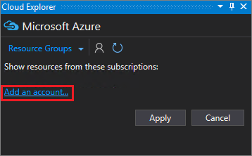

# Install Visual Studio and connect to Azure Stack

*Applies to: Azure Stack integrated systems and Azure Stack Development Kit*

You can use Visual Studio to author and deploy Azure Resource Manager [*templates*](https://docs.microsoft.com/azure/azure-stack/user/azure-stack-arm-templates) in Azure Stack. You can use the steps described in this article to install Visual Studio and connect to [*Azure Stack Development Kit*](https://docs.microsoft.com/azure/azure-stack/user/azure-stack-connect-azure-stack#connect-to-azure-stack-with-remote-desktop) or an Azure Stack integrated system. These steps in this article are for a new installation of Visual Studio 2017 Community Edition. Read more about [*coexistence*](https://msdn.microsoft.com/library/ms246609.aspx) with other Visual Studio versions.

## Install Visual Studio

1.  [Download](https://www.visualstudio.com/free-developer-offers/) and install Visual Studio.

2.  Uninstall the **Microsoft Azure PowerShell** that's installed as part of the Azure SDK.

    

1.  [*Install PowerShell for Azure Stack*](https://docs.microsoft.com/azure/azure-stack/user/azure-stack-powershell-install)

2.  Restart the operating system after the installation completes.

## Connect to Azure Stack

1.  Launch Visual Studio.

2.  From the **View** menu, select **Cloud Explorer**.

3.  In the new pane, select **Add Account** and sign in with your Azure Active Directory credentials.

    

4.  Once logged in, you can [*deploy templates*](https://docs.microsoft.com/azure/azure-stack/user/azure-stack-deploy-template-visual-studio) or browse available resource types and resource groups to create your own templates.

## Connect to Azure Stack with AD FS

1.  Launch Visual Studio.

2.  From the **Tools** menu, select **Options**

3.  In the Navigation Pane, expand **Environment**, select **Accounts**

4.  Select **Add,** and enter the User ARM endpoint. For Azure Stack integrated systems the URL is: **https://management.\[Region}.\[External FQDN\]**

    

5.  Next select **Add,** Visual Studio will call ARM and discover all endpoints including the authentication endpoint for AD FS.

    

6.  From the **View** menu, select **Cloud Explorer**.

7.  In the new pane, select **Add Account** and sign in with your AD FS credentials.

      

8.  Once signed in, Cloud Explorer does queries all available subscriptions and you can select them to manage.

      

9.  Finally you can start browsing your existing resources and resource groups or [deploy templates](https://docs.microsoft.com/azure/azure-stack/user/azure-stack-deploy-template-visual-studio).

### Next steps

-   [*Develop templates for Azure Stack*](https://docs.microsoft.com/azure/azure-stack/user/azure-stack-develop-templates)
