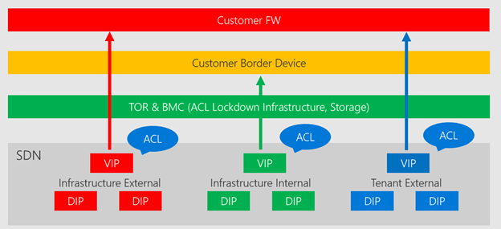

# Azure Stack datacenter integration - Publish endpoints

Azure Stack sets up virtual IP addresses (VIPs) for its infrastructure roles. These VIPs are allocated from the public IP address pool. Each VIP is secured with an access control list (ACL) in the software-defined network layer. ACLs are also used across the physical switches (TORs and BMC) to further harden the solution. A DNS entry is created for each endpoint in the external DNS zone that specified at deployment time.

The following architectural diagram shows the different network layers and ACLs:

## Ports and protocols (inbound)

A set of infrastructure VIPs is required for publishing Azure Stack endpoints to external networks. The *Endpoint (VIP)* table shows each endpoint, the required port, and protocol. Refer to the specific resource provider deployment documentation for endpoints that require additional resource providers, such as the SQL resource provider.

Internal infrastructure VIPs aren't listed because they’re not required for publishing Azure Stack.

> [!Note]  
> User VIPs are dynamic, defined by the users themselves with no control by the Azure Stack operator.

|Endpoint (VIP)|DNS host A record|Protocol|Ports|
|---------|---------|---------|---------|
|AD FS|Adfs.*&lt;region>.&lt;fqdn>*|HTTPS|443|
|Portal (administrator)|Adminportal.*&lt;region>.&lt;fqdn>*|HTTPS|443|
|Adminhosting | *.adminhosting.\<region>.\<fqdn> | HTTPS | 443 |
|Azure Resource Manager (administrator)|Adminmanagement.*&lt;region>.&lt;fqdn>*|HTTPS|443|
|Portal (user)|Portal.*&lt;region>.&lt;fqdn>*|HTTPS|443|
|Azure Resource Manager (user)|Management.*&lt;region>.&lt;fqdn>*|HTTPS|443|
|Graph|Graph.*&lt;region>.&lt;fqdn>*|HTTPS|443|
|Certificate revocation list|Crl.*&lt;region>.&lt;fqdn>*|HTTP|80|
|DNS|&#42;.*&lt;region>.&lt;fqdn>*|TCP & UDP|53|
|Hosting | *.hosting.\<region>.\<fqdn> | HTTPS | 443 |
|Key Vault (user)|&#42;.vault.*&lt;region>.&lt;fqdn>*|HTTPS|443|
|Key Vault (administrator)|&#42;.adminvault.*&lt;region>.&lt;fqdn>*|HTTPS|443|
|Storage Queue|&#42;.queue.*&lt;region>.&lt;fqdn>*|HTTP HTTPS|80 443|
|Storage Table|&#42;.table.*&lt;region>.&lt;fqdn>*|HTTP HTTPS|80 443|
|Storage Blob|&#42;.blob.*&lt;region>.&lt;fqdn>*|HTTP HTTPS|80 443|
|SQL Resource Provider|sqladapter.dbadapter.*&lt;region>.&lt;fqdn>*|HTTPS|44300-44304|
|MySQL Resource Provider|mysqladapter.dbadapter.*&lt;region>.&lt;fqdn>*|HTTPS|44300-44304|
|App Service|&#42;.appservice.*&lt;region>.&lt;fqdn>*|TCP|80 (HTTP) 443 (HTTPS) 8172 (MSDeploy)|
|  |&#42;.scm.appservice.*&lt;region>.&lt;fqdn>*|TCP|443 (HTTPS)|
|  |api.appservice.*&lt;region>.&lt;fqdn>*|TCP|443 (HTTPS) 44300 (Azure Resource Manager)|
|  |ftp.appservice.*&lt;region>.&lt;fqdn>*|TCP, UDP|21, 1021, 10001-10100 (FTP) 990 (FTPS)|
|VPN Gateways|     |     |[See the VPN gateway FAQ](https://docs.microsoft.com/azure/vpn-gateway/vpn-gateway-vpn-faq#can-i-traverse-proxies-and-firewalls-using-point-to-site-capability).|
|     |     |     |     |

## Ports and URLs (outbound)

Azure Stack supports only transparent proxy servers. In a deployment where a transparent proxy uplinks to a traditional proxy server, you must allow the following ports and URLs for outbound communication:

> [!Note]  
> Azure Stack does not support using Express Route to reach the Azure services listed in the following table.

|Purpose|URL|Protocol|Ports|
|---------|---------|---------|---------|
|Identity|login.windows.net login.microsoftonline.com graph.windows.net https://secure.aadcdn.microsoftonline-p.com office.com|HTTP HTTPS|80 443|
|Marketplace syndication|https://management.azure.com https://&#42;.blob.core.windows.net https://*.azureedge.net https://&#42;.microsoftazurestack.com|HTTPS|443|
|Patch & Update|https://&#42;.azureedge.net|HTTPS|443|
|Registration|https://management.azure.com|HTTPS|443|
|Usage|https://&#42;.microsoftazurestack.com https://*.trafficmanager.net|HTTPS|443|
|Windows Defender|.wdcp.microsoft.com .wdcpalt.microsoft.com *.updates.microsoft.com *.download.microsoft.com https://msdl.microsoft.com/download/symbols `https://www.microsoft.com/pkiops/crl` `https://www.microsoft.com/pkiops/certs` `https://crl.microsoft.com/pki/crl/products` `https://www.microsoft.com/pki/certs` https://secure.aadcdn.microsoftonline-p.com |HTTPS|80 443|
|NTP|(IP of NTP server provided for deployment)|UDP|123|
|DNS|(IP of DNS server provided for deployment)|TCP UDP|53|
|CRL|(URL under CRL Distribution Points on your certificate)|HTTP|80|
|Infrastructure Backup|(IP or FQDN of external target file server)|SMB|445|
|     |     |     |     |

> [!Note]  
> Outbound URLs are load balanced using Azure traffic manager to provide the best possible connectivity based on geographical location. With load balanced URLs, Microsoft can update and change backend endpoints without impacting customers. Microsoft does not share the list of IP addresses for the load balanced URLs. You should use a device that supports filtering by URL rather than by IP.

> [!Note]  
> In 1809, the infrastructure backup service communicates to the external file server from the public VIP network. Before 1809, the service communicated over the public infrastructure network. If your environment does not allow access to infrastructure resources from the public VIP network, apply the latest [1809 hotfix](azure-stack-update-1809.md#post-update-steps) for Azure Stack. This hotfix will move the infrastructure backup service back to the public infrastructure network. In 1811, if you apply the 1809 hotfix, the infrastructure backup service remains on the public infrastructure network. If you do not apply the hotfix, the update moves the service back to the public infrastructure network.

## Next steps

[Azure Stack PKI requirements](azure-stack-pki-certs.md)
