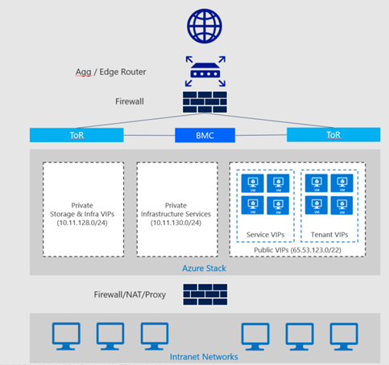
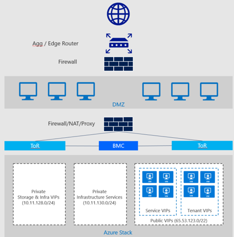

# Azure Stack datacenter integration - publish endpoints
Azure Stack sets up various endpoints (VIPs - virtual IP addresses) for its infrastructure roles. These VIPs are allocated from the public IP address pool. Each VIP is secured with an access control list (ACL) in the software-defined network layer. ACLs are also used across the physical switches (TORs and BMC) to further harden the solution. A DNS entry is created for each endpoint in the external DNS zone that was specified at deployment time.

The following architectural diagram shows the different network layers and ACLs:

## Ports and protocols (inbound)

The infrastructure VIPs that are required for publishing Azure Stack endpoints to external networks are listed in the following table. The list shows each endpoint, the required port, and protocol. Endpoints required for additional resource providers, like the SQL resource provider and others, are covered in the specific resource provider deployment documentation.

Internal infrastructure VIPs are not listed because they’re not required for publishing Azure Stack.

> [!NOTE]
> User VIPs are dynamic, defined by the users themselves with no control by the Azure Stack operator.

|Endpoint (VIP)|DNS host A record|Protocol|Ports|
|---------|---------|---------|---------|
|AD FS|`Adfs.[Region].[External FQDN]`|HTTPS|443|
|Portal (administrator)|`Adminportal.[Region].[External FQDN]`|HTTPS|443|
|Azure Resource Manager (administrator)|`Adminmanagement.[Region].[External FQDN]`|HTTPS|443 30024|
|Portal (user)|`Portal. [Region].[External FQDN]`|HTTPS|443 12495 12649 13001 13010 13011 13020 13021 30015 13003|
|Azure Resource Manager (user)|`Management.[Region].[External FQDN]`|HTTPS|443 30024|
|Graph|`Graph.[Region].[External FQDN]`|HTTPS|443|
|Certificate revocation list|`Crl.[Region].[External FQDN]`|HTTP|80|
|DNS|`*.[Region].[External FQDN]`|TCP & UDP|53|
|Key Vault (user)|`*.vault.[Region].[External FQDN]`|TCP TCP|443 12490|
|Key Vault (administrator)|`*.adminvault.[Region].[External FQDN]`|TCP TCP|443 12492|
|Storage Queue|`*.queue.[Region].[External FQDN]`|HTTP HTTPS|80 443|
|Storage Table|`*.table.[Region].[External FQDN]`|HTTP HTTPS|80 443|
|Storage Blob|`*.blob.[Region].[External FQDN]`|HTTP HTTPS|80 443|

## Ports and URLs (outbound)

Azure Stack supports only transparent proxy servers. In a deployment where a transparent proxy uplinks to a traditional proxy server, you must allow the following ports and URLs for outbound communication:

|Purpose|URL|Protocol|Ports|
|---------|---------|---------|---------|
|Identity|`login.windows.net` `login.microsoftonline.com` `graph.windows.net`|HTTP HTTPS|80 443|
|Marketplace syndication|`https://management.azure.com` `https://*.blob.core.windows.net` `https://*.azureedge.net` `https://*.microsoftazurestack.com`|HTTPS|443|
|Patch & Update|`https://*.azureedge.net`|HTTPS|443|
|Registration|`https://management.azure.com`|HTTPS|443|
|Usage|`https://*.microsoftazurestack.com` `https://*.trafficmanager.com`|HTTPS|443|

## Firewall publishing

The ports listed in the previous section apply to inbound communication when publishing Azure Stack Services through an existing firewall.

We recommend that you use a firewall device to help secure Azure Stack. However, it’s not a strict requirement. Although firewalls can help with things like distributed denial-of-service (DDOS) attacks, and content inspection, they can also become a throughput bottleneck for Azure storage services like blobs, tables, and queues.

Based on the Identity model (Azure AD or AD FS), it may or may not be required to publish the AD FS endpoint. If a disconnected deployment mode is used, you must publish the AD FS endpoint. (For more information, see the Datacenter integration identity topic.)

The Azure Resource Manager (administrator), administrator portal, and Key Vault (administrator) endpoints do not necessarily require external publishing. It depends on the scenario. For example, as a service provider, you may want to limit the attack surface and only administer Azure Stack from inside your network, and not from the Internet.

For an enterprise organization, the external network can be the existing corporate network. In such a scenario, you must publish those endpoints to operate Azure Stack from the corporate network.

## Edge firewall scenario

In an edge deployment, Azure Stack is deployed directly behind the edge router (provided by the ISP) with or without a firewall in front of it.

Typically, public routable IP addresses are specified for the public VIP pool at deployment time in an edge deployment. This scenario enables a user to experience the full self-controlled cloud experience like in a public cloud like Azure.

Although not recommended because of the overhead, you could use Network Address Translation (NAT) for publishing endpoints. For endpoint publishing that is fully controlled by users, this requires a NAT rule per user VIP that contains all ports a user might use.

Be aware that Azure does not support setting up a VPN tunnel to an endpoint using NAT in a hybrid cloud scenario with Azure.

## Enterprise/intranet/perimeter network firewall scenario

In an enterprise/intranet/perimeter deployment, Azure Stack is deployed beyond a second firewall, which is typically part of a perimeter network (also known as a DMZ).

If public routable IP addresses have been specified for the public VIP pool of Azure Stack, these addresses logically belong to the perimeter network and require publishing rules at the primary firewall.

If non-public routable IP addresses are used for the public VIP pool of Azure Stack, NAT is used at the secondary firewall to publish Azure Stack endpoints. In this scenario, you need to configure the publishing rules on the primary firewall beyond the edge, and on the secondary firewall. Consider the following points if you want to use NAT:

- NAT adds overhead when managing firewall rules because users control their own endpoints and their own publishing rules in the software-defined networking (SDN) stack. Users must contact the Azure Stack operator to get their VIPs published, and to update the port list.
- While NAT usage limits the user experience, it gives full control to the operator over publishing requests.
- For hybrid cloud scenarios with Azure, understand that Azure does not support setting up a VPN tunnel to an endpoint using NAT.

## Next steps

Azure Stack datacenter integration - IT service management