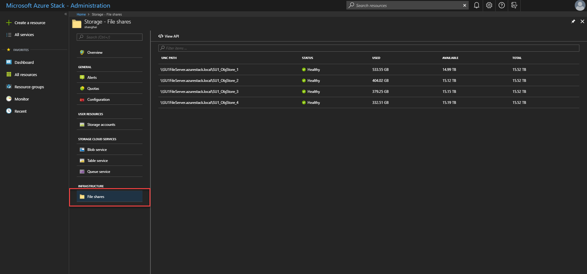
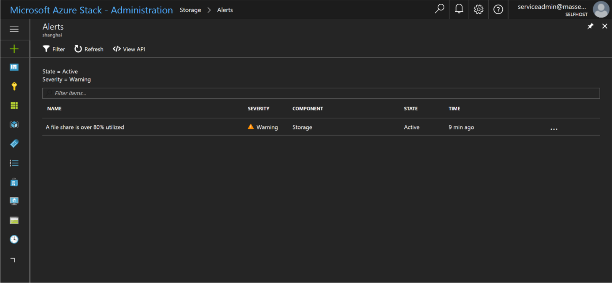
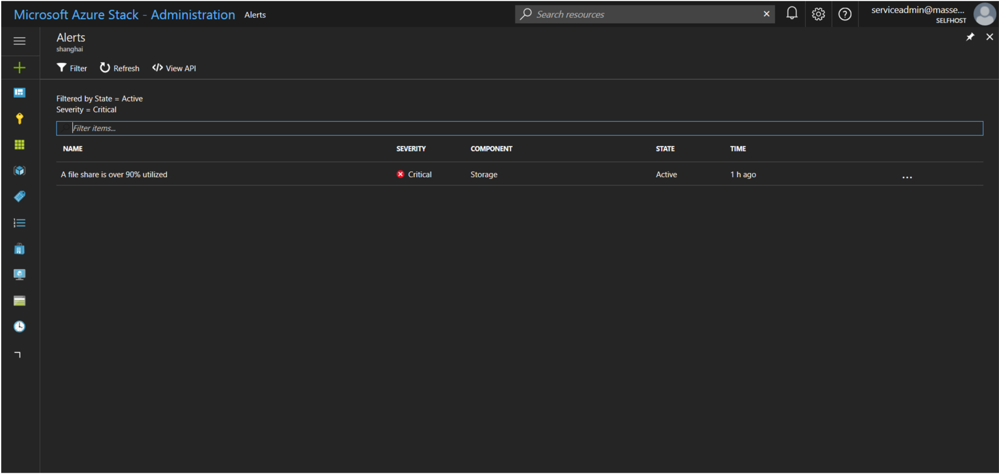
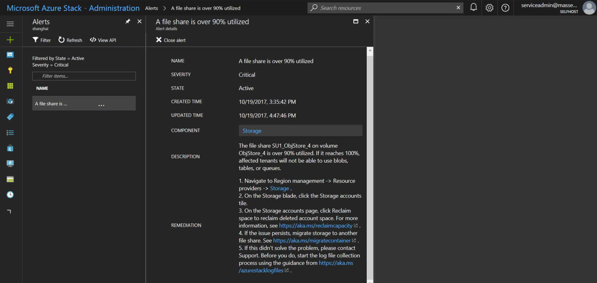
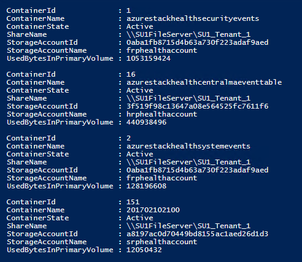
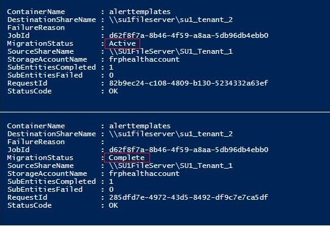
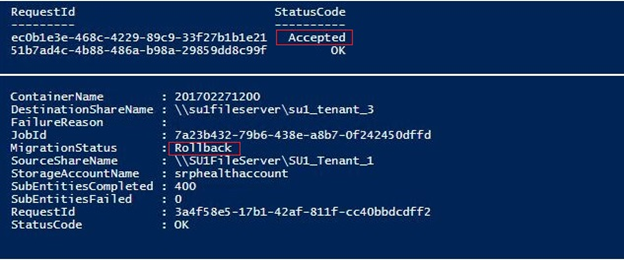
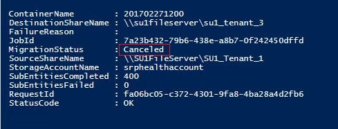

# Manage storage capacity for Azure Stack

*Applies to: Azure Stack integrated systems and Azure Stack Development Kit*

The information in this article helps the Azure Stack cloud operator monitor and manage the storage capacity of their Azure Stack deployment. The Azure Stack storage infrastructure allocates a subset of the total storage capacity of the Azure Stack deployment, to be used for **storage services**. The storage services store a tenant’s data in shares on volumes that correspond to the nodes of the deployment.

As a cloud operator, you have a limited amount of storage to work with. The amount of storage is defined by the solution you implement. Your solution is provided by your OEM vendor when you use a multi-node solution, or by the hardware on which you install the Azure Stack Development Kit.

Because Azure Stack does not support expansion of the storage capacity, it is important to [monitor](#monitor-shares) the available storage to ensure efficient operations are maintained.  

When the remaining free capacity of a share becomes limited, plan to [manage space](#manage-available-space) to prevent the shares from running out of capacity.

Options to manage capacity include:
- Reclaim capacity
- Migrate a container

When a share is 100% utilized, the storage service no longer functions for that share. To get assistance in restoring operations for the share, contact Microsoft support.

## Understand volumes and shares, containers, and disks
### Volumes and shares
The *storage service* partitions the available storage into separate and equal volumes that are allocated to hold tenant data. The number of volumes is equal to the number of the nodes in the Azure Stack deployment:

- On a four-node deployment, there are four volumes. Each volume has a single share. On a multi-node deployment, the number of shares is not reduced if a node is removed or malfunctioning.
- If you use the Azure Stack Developer Kit, there is a single volume with a single share.

Because the storage service shares are for the exclusive use of storage services, you must not directly modify, add, or remove any files on the shares. Only storage services should work on the files stored in these volumes.

Shares on volumes hold tenant data. Tenant data includes page blobs, block blobs, append blobs, tables, queues, databases, and related metadata stores. Because the storage objects (blobs, etc.) are individually contained within a single share, the maximum size of each object cannot exceed the size of a share. The maximum size of new objects depends on the capacity that remains in a share as unused space when that new object is created.

When a share is low on free space and actions to [reclaim](#reclaim-capacity) space are not successful or available, the Azure Stack cloud operator can [migrate](#migrate-a-container-between) the blob containers from one share to another.

- For more information about containers and blobs, see [Blob storage](azure-stack-key-features.md#blob-storage) in Key features and concepts in Azure Stack.
- For information about how tenant users work with blog storage in Azure Stack, see [Azure Stack Storage services](/azure/azure-stack/user/azure-stack-storage-overview#azure-stack-storage-services).


### Containers
Tenant users create containers that are then used to store blob data. While the user decides in which container to place blobs, the storage service uses an algorithm to determine on which volume to put the container. The algorithm typically chooses the volume with the most available space.  

After a blob is placed in a container, that blob can grow to use more space. As you add new blobs and existing blobs grow, the available space in the volume that holds that container shrinks.  

Containers are not limited to a single share. When the combined blob data in a container grows  use 80% or more of the available space, the container enters *overflow* mode. When in overflow mode, any new blobs that are created in that container are allocated to a different volume that has sufficient space. Over time, a container in overflow mode can have blobs that are distributed across multiple volumes.

When 80%, and then 90% of the available space in a volume is used, the system raises alerts in the Azure Stack administrator portal. Cloud operators should review available storage capacity, and plan to rebalance the content. The storage service stops working when a disk is 100% used, and there are no additional alerts are raised.

### Disks
VM disks are added to containers by tenants and include an operating system disk. VMs can also have one or more data disks. Both types of disks are stored as page blobs. The guidance to tenants is to place each disk into a separate container to improve performance of the VM.
- Each container that holds a disk (page blob) from a VM is considered an attached container to the VM that owns the disk.
- A container that does not hold any disk from a VM is considered a free container.

The options to free up space on an attached container [are limited](#move-vm-disks).
> [!TIP]  
> Cloud operators do not directly manage disks, which are attached to virtual machines (VMs) that tenants might add to a container. However, when planning to manage space on storage shares, it can be of use to understand how disks relate to containers and shares.

## Monitor shares
Use PowerShell or the admin portal to monitor shares so you can understand when free space is limited. When you use the portal, you receive alerts about shares that are low on space.    

### Use PowerShell
As a cloud operator, you can monitor the storage capacity of a share using the PowerShell **Get-AzsStorageShare** cmdlet. The Get-AzsStorageShare cmdlet returns the total, allocated, and free space in bytes on each of the shares.   


- **Total capacity** is the total space in bytes that are available on the share. This space is used for data and metadata that is maintained by the storage services.
- **Used capacity** is the amount of data in bytes that is used by the all the extents from the files that store the tenant data and associated metadata.

### Use the administrator portal
As a cloud operator, you can use the admin portal to view the storage capacity of all shares. **Go to Storage** > **File Shares** to open the file share list where you can view the usage information.

- **TOTAL** is the total space in bytes that are available on the share. This space is used for data and metadata that is maintained by the storage services.
- **USED** is the amount of data in bytes that is used by the all the extents from the files that store the tenant data and associated metadata.

### Storage space alerts
When you use the admin portal, you receive alerts about shares that are low on space.

> [!IMPORTANT]
> As a cloud operator, keep shares from reaching full usage. When a share is 100% utilized, the storage service no longer functions for that share. To recover free space and restore operations on a share that is 100% utilized, you must contact Microsoft support.

**Warning**:
When a file share is over 80% utilized, you receive a *Warning* alert in the admin portal:



**Critical**:
When a file share is over 90% utilized, you receive a *Critical* alert in the admin portal:


**View details**:
In the admin portal you can open the details for an alert to view mitigation options:



## Manage available space
When it's necessary to free space on a share, use the least invasive methods first. For example, try to reclaim space before you choose to migrate a container.  

### Reclaim capacity
*This option applies to both multi-node deployments and the Azure Stack Development Kit.*

You can reclaim the capacity used by tenant accounts that have been deleted. This capacity is automatically reclaimed when the data [retention period](azure-stack-manage-storage-accounts.md#set-the-retention-period) is reached, or you can act to reclaim it immediately.

For more information, see [Reclaim capacity](azure-stack-manage-storage-accounts.md#reclaim) in Manage storage resources.

### Migrate a container between volumes
*This option applies only to multi-node deployments.*

Due to tenant usage patterns, some tenant shares use more space than others. The result can be a share that runs low on space before other shares that are relatively unused.

You can try to free up space on an overused share by manually migrating some blob containers to a different share. You can migrate several smaller containers to a single share that has capacity to hold them all. You can use migration to move *free* containers. Free containers are containers that do not contain a disk for a VM.   

Migration consolidates all a containers blob on the new share.

- If a container has entered overflow mode and has placed blobs on additional volumes, the new share must have sufficient capacity to hold all of the blobs for the container you migrate. This includes the blogs that are located on additional shares.

- The PowerShell cmdlet *Get-AzsStorageContainer* identifies only the space in use on the initial volume for a container. The cmdlet does not identify space that is used by blobs put on additional volumes. Therefore, the full size of a container might not be evident. It is possible that consolidation of a container on a new share can send that new share into an overflow condition where it places data onto additional shares. As a result, you might need to rebalance shares again.

- If you lack permissions to a resource group and cannot use PowerShell to query the additional volumes for overflow data, work with the owner of those resource groups and containers to understand the total size of data to migrate before migrating that data.  

> [!IMPORTANT]
> Migration of blobs for a container is an offline operation that requires the use of PowerShell. Until migration completes, all blobs for the container you are migrating remain offline and cannot be used.

#### To migrate containers using PowerShell
1. Confirm that you have [Azure PowerShell installed and configured](http://azure.microsoft.com/documentation/articles/powershell-install-configure/). For more information, see [Using Azure PowerShell with Azure Resource Manager](http://go.microsoft.com/fwlink/?LinkId=394767).
2.	Examine the container to understand what data is on the share that you plan to migrate. To identify the best candidate containers for migration in a volume, use the **Get-AzsStorageContainer** cmdlet:

    ```
    $shares = Get-AzsStorageShare
    $containers = Get-AzsStorageContainer -ShareName $shares[0].ShareName -Intent Migration
    ```
    Then examine $containers:
    ```
    $containers
    ```
    

3.	Identify the best destination shares to hold the container you migrate:
    ```
    $destinationshares = Get-AzsStorageShare -SourceShareName
    $shares[0].ShareName -Intent ContainerMigration
    ```
    Then examine $destinationshares:
    ```
    $destinationshares
    ```    
    

4. Start migration for a container. Migration is asynchronous. If you start migration of additional containers before the first migration completes, use the job id to track the status of each.
  ```
  $jobId = Start-AzsStorageContainerMigration -ContainerToMigrate $containers[1] -DestinationShareUncPath $destinationshares[0].UncPath
  ```
  Then examine $jobId. In the following example, replace *d62f8f7a-8b46-4f59-a8aa-5db96db4ebb0* with the job id you want to examine:
  ```
  $jobId
  d62f8f7a-8b46-4f59-a8aa-5db96db4ebb0
  ```
5. Use the job id to check on the status of the migration job. When the container migration is complete, **MigrationStatus** is set to **Complete**.
  ```
  Get-AzsStorageContainerMigrationStatus -JobId $jobId
  ```
  

6.	You can cancel an in-progress migration job. Canceled migration jobs are processed asynchronously. You can track cancellation by using $jobid:

  ```
  Stop-AzsStorageContainerMigration -JobId $jobId
  ```
  

7. You can run the command from step 6 again, until the status confirms the migration job is **Canceled**:  
    

### Move VM disks
*This option applies only to multi-node deployments.*

The most extreme method to manage space involves the move of virtual machine disks. Because moving an attached container (one that contains a VM disk) is complex, contact Microsoft Support to accomplish this action.

## Next Steps
Learn more about [offering virtual machines to users](azure-stack-tutorial-tenant-vm.md).
