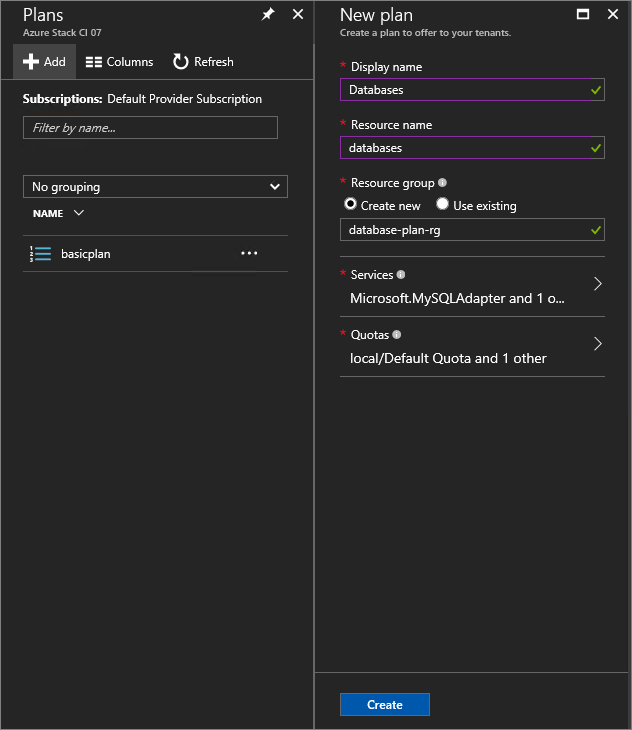

---
title: MySQL Hosting Servers on Azure Stack | Microsoft Docs
description: How to add MySQL instances for provisioning through the MySQL Adapter Resource Provider
services: azure-stack 
documentationCenter: '' 
author: jeffgilb 
manager: femila 
editor: '' 
ms.service: azure-stack 
ms.workload: na 
ms.tgt_pltfrm: na 
ms.devlang: na 
ms.topic: article 
ms.date: 06/14/2018 
ms.author: jeffgilb 
ms.reviewer: jeffgo 
--- 

# Add hosting servers for the MySQL resource provider
You can use MySQL instances on VMs inside of your [Azure Stack](azure-stack-poc.md), or an instance outside of your Azure Stack environment, provided the resource provider can connect to it. 

## Provide capacity by connecting to a MySQL hosting server 
1. Sign in to the Azure Stack portal as a service admin. 
2. Select **ADMINISTRATIVE RESOURCES** > **MySQL Hosting Servers** > **+Add**. 
On the **MySQL Hosting Servers** blade, you can connect the MySQL Server resource provider to actual instances of MySQL Server that serve as the resource provider’s back end. 

 

3. Provide the connection details of your MySQL Server instance. Be sure to provide the fully qualified domain name (FQDN) or a valid IPv4 address, and not the short VM name. This installation no longer provides a default MySQL instance. The size that's provided helps the resource provider manage the database capacity. It should be close to the physical capacity of the database server. 

    > [!NOTE] 
    > If the MySQL instance can be accessed by the tenant and admin Azure Resource Manager, it can be placed under control of the resource provider. The MySQL instance *must* be allocated exclusively to the resource provider. 

4. As you add servers, you must assign them to a new or existing SKU to allow differentiation of service offerings. For example, you can have an enterprise instance providing: 
    - Database capacity
    - Automatic backup
    - Reserve high-performance servers for individual departments 

    > [!IMPORTANT] 
    > You cannot mix standalone servers with Always On instances in the same SKU. Attempting to mix types after adding the first hosting server results in an error. 

    The SKU name should reflect the properties so that tenants can place their databases appropriately. All hosting servers in a SKU should have the same capabilities. 

     

## Add capacity 
Add capacity by adding additional MySQL servers in the Azure Stack portal. Additional servers can be added to a new or existing SKU. Make sure the server characteristics are the same. 
 
## Make MySQL databases available to tenants 
Create plans and offers to make MySQL databases available for tenants. For example, add the Microsoft.MySqlAdapter service, add a quota, and so on. 

 

## Next steps
[Create a MySQL database](azure-stack-mysql-resource-provider-databases.md)
