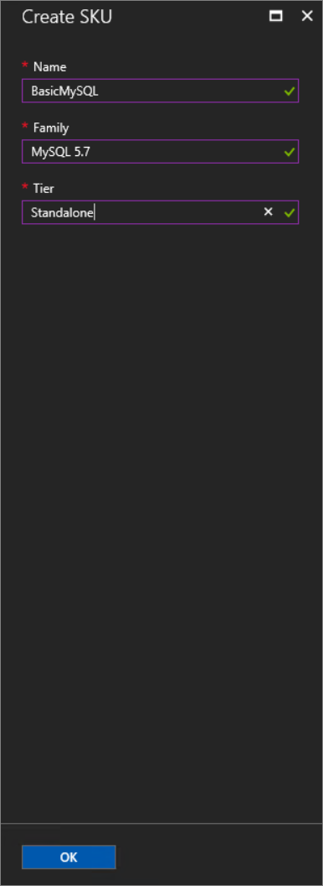

# Add hosting servers for the MySQL resource provider

You can host a MySQL instance on a virtual machine (VM) in [Azure Stack](azure-stack-poc.md), or on a VM outside your Azure Stack environment, as long as the MySQL resource provider can connect to the instance.

> [!NOTE]
> MySQL databases should be be created on the MySQL resource provider server. The MySQL resource provider should be created in the default provider subscription while MySQL hosting servers should be created in a billable, user subscription. The resource provider server should not be used to host user databases.

MySQL versions 5.6, 5.7 and 8.0 may be used for your hosting servers. The MySQL RP does not support caching_sha2_password authentication; that will be added in the next release. MySQL 8.0 servers must be configured to use mysql_native_password. MariaDB is also supported.

## Connect to a MySQL hosting server

Make sure you have the credentials for an account with system admin privileges. To add a hosting server, follow these steps:

1. Sign in to the Azure Stack operator portal as a service admin.
2. Select **All services**.
3. Under the  **ADMINISTRATIVE RESOURCES** category select **MySQL Hosting Servers** > **+Add**. This opens the **Add a MySQL Hosting Server** dialog, shown in the following screen capture.

   

4. Provide the connection details of your MySQL Server instance.

   * For **MySQL Hosting Server Name**, provide the fully qualified domain name (FQDN) or a valid IPv4 address. Don't use the short VM name.
   * A default MySQL instance isn't provided, so you have to specify the **Size of Hosting Server in GB**. Enter a size that's close to the capacity of the database server.
   * Keep the default setting for **Subscription**.
   * For **Resource group**, create a new one, or use an existing group.

   > [!NOTE]
   > If the MySQL instance can be accessed by the tenant and the admin Azure Resource Manager, you can put it under the control of the resource provider. But, the MySQL instance **must** be allocated exclusively to the resource provider.

5. Select **SKUs** to open the **Create SKU** dialog.

   

   The SKU **Name** should reflect the properties of the SKU so users can deploy their databases to the appropriate SKU.

6. Select **OK** to create the SKU.
> [!NOTE]
> SKUs can take up to an hour to be visible in the portal. You can't create a database until the SKU is deployed and running.

7. Under **Add a MySQL Hosting Server**, select **Create**.

As you add servers, assign them to a new or existing SKU to differentiate service offerings. For example, you can have a MySQL enterprise instance that provides increased database and automatic backups. You can reserve this high-performance server for different departments in your organization.

## Security considerations for MySQL

The following information applies to the RP and MySQL hosting servers:

* Ensure that all hosting servers are configured for communication using TLS 1.2. See [Configuring MySQL to Use Encrypted Connections](https://dev.mysql.com/doc/refman/5.7/en/using-encrypted-connections.html).
* Employ [Transparent Data Encryption](https://dev.mysql.com/doc/mysql-secure-deployment-guide/5.7/en/secure-deployment-data-encryption.html).
* The MySQL RP does not support caching_sha2_password authentication.

## Increase backend database capacity

You can increase backend database capacity by deploying more MySQL servers in the Azure Stack portal. Add these servers to a new or existing SKU. If you add a server to an existing SKU, make sure that the server characteristics are the same as the other servers in the SKU.

## Make MySQL database servers available to your users

Create plans and offers to make MySQL database servers available to users. Add the Microsoft.MySqlAdapter service to the plan and create a new quota. MySQL does not allow limiting the size of databases.

## Next steps

[Create a MySQL database](azure-stack-mysql-resource-provider-databases.md)