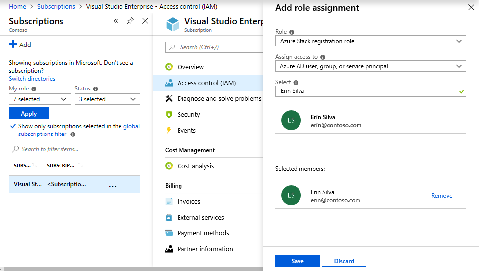

# Create a registration role for Azure Stack

*Applies to: Azure Stack integrated systems and Azure Stack Development Kit*

For scenarios where you don’t want to give owner permissions in the Azure subscription, you can create a custom role to assign permissions to a user account to register your Azure Stack.

> [!WARNING]
> This is not a security posture feature. Use it in scenarios where you want constraints to prevent accidental changes to the Azure Subscription. When a user is delegated rights to this custom role, the user has rights to edit permissions and elevate rights. Only assign users you trust to the custom role.

When registering Azure Stack, the registration account requires the following Azure Active Directory permissions and Azure Subscription permissions:

* **Application registration permissions in your Azure Active Directory tenant:** Administrators have application registration permissions. The permission for users is a global setting for all users in the tenant. To view or change the setting, see [create an Azure AD application and service principal that can access resources]((/azure/active-directory/develop/howto-create-service-principal-portal#required-permissions).

    The *user can register applications* setting must be set to **Yes** for you to enable a user account to register Azure Stack. If the app registrations setting is set to **No**, you can't use a user account and must use a global administrator account to register Azure Stack.

* **A set of sufficient Azure Subscription permissions:** Users in the Owners group have sufficient permissions. For other accounts, you can assign the permission set by assigning a custom role as outlined in the following sections.

## Create a custom role using PowerShell

To create a custom role, you must have the `Microsoft.Authorization/roleDefinitions/write` permission on all `AssignableScopes`, such as [Owner]((/azure/role-based-access-control/built-in-roles#owner) or [User Access Administrator]((/azure/role-based-access-control/built-in-roles#user-access-administrator). Use the following JSON template to simplify defining the custom role. The template creates a custom role that allows the required read and write access for Azure Stack registration.

1. Create a JSON file. For example,  `C:\CustomRoles\registrationrole.json`
2. Add the following JSON to the file. Replace <SubscriptionID> with your Azure subscription ID.

    ```json
    {
      "Name": "Azure Stack registration role",
      "Id": null,
      "IsCustom": true,
      "Description": "Allows access to register Azure Stack",
      "Actions": [
        "Microsoft.Resources/subscriptions/resourceGroups/write",
        "Microsoft.Resources/subscriptions/resourceGroups/read",
        "Microsoft.AzureStack/registrations/*",
        "Microsoft.AzureStack/register/action",
        "Microsoft.Authorization/roleAssignments/read",
        "Microsoft.Authorization/roleAssignments/write",
        "Microsoft.Authorization/roleAssignments/delete",
        "Microsoft.Authorization/permissions/read"
      ],
      "NotActions": [
      ],
      "AssignableScopes": [
        "/subscriptions/<SubscriptionID>"
      ]
    }
    ```

3. In PowerShell, connect to Azure to use Azure Resource Manager. When prompted, authenticate using an account with sufficient permissions such as [Owner]((/azure/role-based-access-control/built-in-roles#owner) or [User Access Administrator]((/azure/role-based-access-control/built-in-roles#user-access-administrator).

    ```azurepowershell
    Connect-AzureRmAccount
    ```

4. To add the role to the subscription, use **New-AzureRmRoleDefinition** specifying the JSON template file.

    ``` azurepowershell
    New-AzureRmRoleDefinition -InputFile "C:\CustomRoles\registrationrole.json"
    ```

## Assign a user to registration role

After the registration custom role is created, assign the role users registering Azure Stack.

1. Sign in with the account with sufficient permission on the Azure subscription to delegate rights - such as [Owner]((/azure/role-based-access-control/built-in-roles#owner) or [User Access Administrator]((/azure/role-based-access-control/built-in-roles#user-access-administrator) .
2. In **Subscriptions**, select **Access control (IAM) > Add role assignment**.
3. In **Role**, choose the custom role you created *Azure Stack registration role*.
4. Select the users you want to assign to the role.
5. Select **Save** to assign the selected users to the role.

    

For more information on using custom roles, see [manage access using RBAC and the Azure portal]((/azure/role-based-access-control/role-assignments-portal).

## Next steps

[Register Azure Stack with Azure](azure-stack-registration.md)
