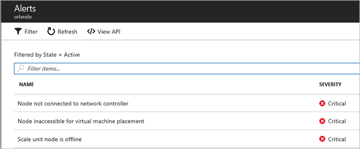

# Replace a scale unit node on an Azure Stack integrated system

*Applies to: Azure Stack integrated systems*

This article describes the general process to replace a physical computer (also referred to as a *scale unit node*) on an Azure Stack integrated system. Actual scale unit node replacement steps will vary based on your original equipment manufacturer (OEM) hardware vendor. See your vendor’s field replaceable unit (FRU) documentation for detailed steps that are specific to your system.

The following flow diagram shows the general FRU process to replace an entire scale unit node.

*This action may not be required based on the physical condition of the hardware.

## Review alert information

If a scale unit node is down, you’ll receive all the following critical alerts:

- Node not connected to network controller
- Node inaccessible for virtual machine placement
- Scale unit node is offline

If you open the "Scale unit node is offline" alert, the alert description contains the scale unit node that's inaccessible. You may also receive additional alerts in the OEM-specific monitoring solution that's running on the hardware lifecycle host.

## Scale unit node replacement process

The following steps are provided as a high-level overview of the scale unit node replacement process. See your OEM hardware vendor’s FRU documentation for detailed steps that are specific to your system. Do not follow these steps without referring to your OEM-provided documentation.

1. Use the [Drain](azure-stack-node-actions.md#scale-unit-node-actions) action to put the scale unit node into maintenance mode. This action may not be required based on the physical condition of the hardware.

   > [!NOTE]
   > Please note that in any case only one Node can be drained and powered off at the same time without breaking the SSD (Storage Spaces Direct)

2. If the node is still powered on, use the [Power off](azure-stack-node-actions.md#scale-unit-node-actions) action. This action may not be required based on the physical condition of the hardware.
 
   > [!NOTE]
   > In the unlikely case that the Power off action doesn't work, use the baseboard management controller (BMC) web interface instead.

1. Replace the physical computer. Typically, this is done by your OEM hardware vendor.
2. Use the [Repair](azure-stack-node-actions.md#scale-unit-node-actions) action to add the new physical computer to the scale unit.
3. Use the privileged endpoint to [check the status of virtual disk repair](azure-stack-replace-disk.md#check-the-status-of-virtual-disk-repair). With new data drives, a full storage repair job can take multiple hours depending on system load and consumed space.
4. After the repair action has finished, validate that all active alerts have been automatically closed.

## Next steps

- For information about replacing a hot-swappable physical disk, see [Replace a disk](azure-stack-replace-disk.md). 
- For information about replacing a non hot-swappable hardware component, see [Replace a hardware component](azure-stack-replace-component.md). 
