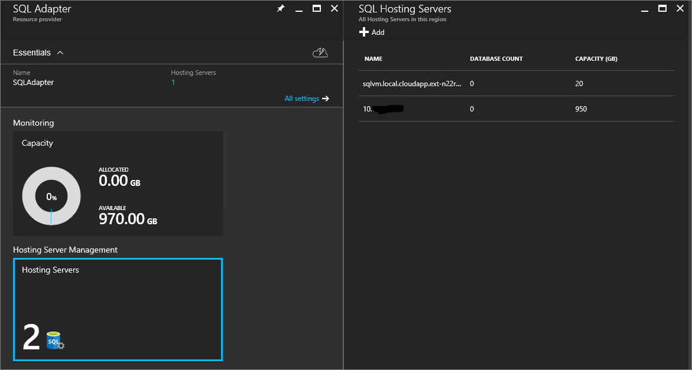
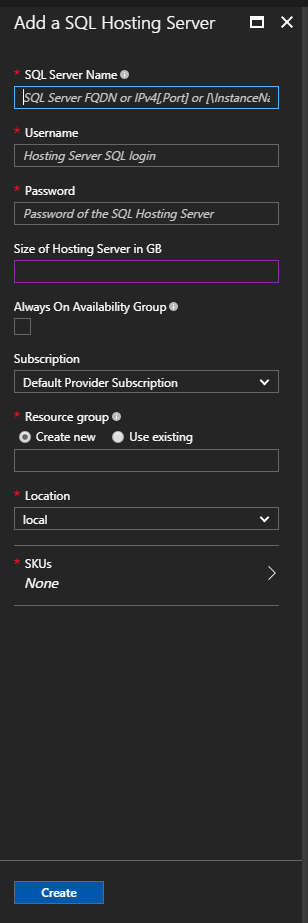

# Use SQL databases on Microsoft Azure Stack


Use the SQL Server resource provider adapter to expose SQL databases as a service of Azure Stack. After you install the resource provider and connect it to one or more SQL Server instances, you and your users can create databases for cloud-native apps, websites that are based on SQL, and workloads that are based on SQL without having to provision a virtual machine (VM) that hosts SQL Server each time.

The resource provider does not support all the database management capabilities of [Azure SQL Database](https://azure.microsoft.com/services/sql-database/). For example, elastic database pools and the ability to scale database performance aren't supported. The API is not compatible with SQL DB.


## SQL Server Resource Provider Adapter architecture
The resource provider is not based on, nor does it offer all the database management capabilities of Azure SQL Database. For example, elastic database pools and the ability to dial database performance up and down automatically aren't available. However, the resource provider does support similar create, read, update, and delete (CRUD) operations.

The resource provider is made up of three components:

- **The SQL resource provider adapter VM**, which is a Windows virtual machine running the provider services.
- **The resource provider itself**, which processes provisioning requests and exposes database resources.
- **Servers that host SQL Server**, which provide capacity for databases, called Hosting Servers. 

This release no longer creates a SQL instance. You will need to create one (or more) and/or provide access to external SQL instances. There are a number of options available to you including templates in the [Azure Stack Quickstart Gallery](https://github.com/Azure/AzureStack-QuickStart-Templates/tree/master/mysql-standalone-server-windows) and Marketplace items. 

>[!NOTE]
If you have downloaded any SQL Marketplace items, make sure you also download the SQL IaaS Extension or these will not deploy.


## Deploy the resource provider

1. If you have not already done so, register your POC and download the Windows Server 2016 EVAL image downloadable through Marketplace Management. You can also use a script to create a [Windows Server 2016 image](https://docs.microsoft.com/azure/azure-stack/azure-stack-add-default-image). The .NET 3.5 runtime is no longer required.

2. [Download the SQL resource provider binaries file](https://aka.ms/azurestacksqlrp) and extract it on the Console VM in your Azure Stack.

3. Sign in to the POC host and extract the SQL RP installer file to a temporary directory.

4. The Azure Stack root certificate will be retrieved and a self-signed certificate will be created as part of this process. 

__Optional:__ If you need to provide your own, prepare the certificates and copy to a local directory if you wish to customize the certificates (passed to the installation script). You will need the following:

a. A wildcard certificate for *.dbadapter.\<region\>.\<external fqdn\>. This must be a trusted certificate, such as would be issued by a certificate authority (i.e., the chain of trust must exist without requiring intermediate certificates.) (A single site certificate can be used with the explicit VM name you provide during install.)

b. The root certificate used by the Azure Resource Manager for your instance of Azure Stack. If it is not found, the root certificate will be retrieved.


5. Open a **new** elevated PowerShell console and change to the directory where you extracted the files. Use a new window to avoid problems that may arise from incorrect PowerShell modules already loaded on the system.

6. If you have installed any versions of the AzureRm or AzureStack PowerShell modules other than 1.2.9 or 1.2.10, you will be prompted to remove them or the install will not proceed. This includes versions 1.3 or greater.

7. Run the DeploySqlProvider.ps1 script with the parameters listed below.

The script performs these steps:

* If necessary, download a compatible version of Azure PowerShell.
* Upload the certificates and other artifacts to a storage account on your Azure Stack.
* Publish gallery packages so that you can deploy SQL databases through the gallery.
* Deploy a VM using the Windows Server 2016 image created in step 1 and use install the resource provider.
* Register a local DNS record that maps to your resource provider VM.
* Register your resource provider with the local Azure Resource Manager (Tenant and Admin).

> [!NOTE]
> If the installation takes more than 90 minutes, it may fail and you see a failure message on the screen and in the log file, but the deployment is retried from the failing step. Systems that do not meet the recommended memory and core specifications may not be able to deploy the SQL RP.
>

Here's an example you can run from the PowerShell prompt (but change the account information and portal endpoints as needed):

```
# Install the AzureRM.Bootstrapper module
Install-Module -Name AzureRm.BootStrapper -Force

# Installs and imports the API Version Profile required by Azure Stack into the current PowerShell session.
Use-AzureRmProfile -Profile 2017-03-09-profile
Install-Module -Name AzureStack -RequiredVersion 1.2.10 -Force

# Download the Azure Stack Tools from GitHub and set the environment
cd c:\
Invoke-Webrequest https://github.com/Azure/AzureStack-Tools/archive/master.zip -OutFile master.zip
Expand-Archive master.zip -DestinationPath . -Force

# This endpoint may be different for your installation
Import-Module C:\AzureStack-Tools-master\Connect\AzureStack.Connect.psm1
Add-AzureRmEnvironment -Name AzureStackAdmin -ArmEndpoint "https://adminmanagement.local.azurestack.external" 

# For AAD, use the following
$tenantID = Get-AzsDirectoryTenantID -AADTenantName "<your directory name>" -EnvironmentName AzureStackAdmin

# For ADFS, replace the previous line with
# $tenantID = Get-AzsDirectoryTenantID -ADFS -EnvironmentName AzureStackAdmin

$vmLocalAdminPass = ConvertTo-SecureString "P@ssw0rd1" -AsPlainText -Force
$vmLocalAdminCreds = New-Object System.Management.Automation.PSCredential ("sqlrpadmin", $vmLocalAdminPass)

$AdminPass = ConvertTo-SecureString "P@ssw0rd1" -AsPlainText -Force
$AdminCreds = New-Object System.Management.Automation.PSCredential ("admin@mydomain.onmicrosoft.com", $AdminPass)

# change this as appropriate
$PfxPass = ConvertTo-SecureString "P@ssw0rd1" -AsPlainText -Force

# Change directory to the folder where you extracted the installation files 
# and adjust the endpoints
<extracted file directory>\DeploySQLProvider.ps1 -DirectoryTenantID $tenantID -AzCredential $AdminCreds -VMLocalCredential $vmLocalAdminCreds -ResourceGroupName "SqlRPRG" -VmName "SqlVM" -ArmEndpoint "https://adminmanagement.local.azurestack.external" -TenantArmEndpoint "https://management.local.azurestack.external" -DefaultSSLCertificatePassword $PfxPass
 ```

### DeploySqlProvider.ps1 parameters
You can specify these parameters in the command line. If you do not, or any parameter validation fails, you are prompted to provide the required ones.

| Parameter Name | Description | Comment or Default Value |
| --- | --- | --- |
| **DirectoryTenantID** | The Azure or ADFS Directory ID (guid). | _required_ |
| **AzCredential** | Provide the credentials for the Azure Stack Service Admin account. You must use the same credentials as you used for deploying Azure Stack). | _required_ |
| **VMLocalCredential** | Define the credentials for the local administrator account of the SQL resource provider VM. This password will also be used for the SQL **sa** account. | _required_ |
| **ResourceGroupName** | Define a name for a Resource Group in which items created by this script will be stored. For example, *SqlRPRG*. |  _required_ |
| **VmName** | Define the name of the virtual machine on which to install the resource provider. For example, *SqlVM*. |  _required_ |
| **DependencyFilesLocalPath** | Your certificate files must be placed in this directory as well. | _optional_ |
| **DefaultSSLCertificatePassword** | The password for the .pfx certificate | _required_ |
| **MaxRetryCount** | Define how many times you want to retry each operation if there is a failure.| 2 |
| **RetryDuration** | Define the timeout between retries, in seconds. | 120 |
| **Uninstall** | Remove the resource provider and all associated resources (see notes below) | No |
| **DebugMode** | Prevents automatic cleanup on failure | No |


## Verify the deployment using the Azure Stack Portal

> [!NOTE]
>  After the installation script completes, you will need to refresh the portal to see the admin blade.


1. On the Console VM desktop, click **Microsoft Azure Stack Portal** and sign in to the portal as the service administrator.

2. Verify that the deployment succeeded. Click **Resource Groups** &gt; click the resource group you used and then make sure that the essentials part of the blade (upper half) reads **_date_ (Succeeded)**.

      


## Provide capacity by connecting to a hosting SQL server

1. Sign in to the Azure Stack admin portal as a service admin

2. Create a SQL virtual machine, unless you have one already available. Marketplace Management offers some options for deploying SQL VMs.

2. Click **Resource Providers** &gt; **SQLAdapter** &gt; **Hosting Servers** &gt; **+Add**.

	The **SQL Hosting Servers** blade is where you can connect the SQL Server Resource Provider to actual instances of SQL Server that serve as the resource provider’s backend.

	

3. Fill the form with the connection details of your SQL Server instance.

	

> [!NOTE]
> As long as the SQL instance can be accessed by the tenant and admin ARM, it can be placed under control of the the resource provider. The SQL instance __must__ be allocated exclusively to the RP.

4. 	As you add servers, you will need to assign them to a new or existing SKU. This allows differentiation of service offerings. For example, you could have a SQL Enterprise instance providing database capacity and automatic backup, reserve high performance servers for individual departments, etc. The SKU name should reflect the properties so that tenants can place their databases appropriately and all hosting servers in a SKU should have the same capabilities.

	An example:

	

>[!NOTE]
SKUs can take up to an hour to be visible in the portal. You cannot create a database until this completes.


## Create your first SQL database to test your deployment

1. Sign in to the Azure Stack admin portal as service admin.

2. Click **+ New** &gt;**Data + Storage"** &gt; **SQL Server Database (preview)** &gt; **Add**

3. Fill in the form with database details, including a **Database Name**, **Maximum Size**, and change the other parameters as necessary. Fill in the Login Settings: **Database login**, and **Password**. These is a SQL Authentication credential that will be created for your access to this database only. The login user name must be globally unique.

	


4. You are asked to pick a SKU for your database. As hosting servers are added, they are assigned a SKU and databases are created in that pool of hosting servers that make up the SKU.

	

5. Create or select a login. You can reuse login settings for other databases using the same SKU.


6. Submit the form and wait for the deployment to complete.

In the resulting blade, notice the “Connection string” field. You can use that string in any application that requires SQL Server access (for example, a web app) in your Azure Stack.


## Add capacity

Add capacity by adding additional SQL hosts	in the Azure Stack portal and associate them wtih an appropriate SKU. If you wish to use another instance of SQL instead of the one installed on the provider VM, click **Resource Providers** &gt; **SQLAdapter** &gt; **SQL Hosting Servers** &gt; **+Add**.

## Making SQL databases available to tenants

Create plans and offers to make SQL databases available for tenants. You will need to create a plan, add the Microsoft.SqlAdapter service to the plan, and add an existing Quota, or create a new one. If you create a quota, you can specify the capacity to allow the tenant.
	

## Tenant usage of the Resource Provider

Self-service databases are provided through the tenant portal experience.

## Removing the SQL Adapter Resource Provider

In order to remove the resource provider, it is essential to first remove any dependencies.

1. Ensure you have the original deployment package that you downloaded for this version of the Resource Provider.

2. All tenant databases must be deleted from the resource provider (this will not delete the data). This should be performed by the tenants themselves.

3. Tenants must unregister from the namespace.

4. Administrator must delete the hosting servers from the SQL Adapter

5. Administrator must delete any plans that reference the SQL Adapter.

6. Administrator must delete any SKUs and quotas associated to the SQL Adapter.

7. Rerun the deployment script with the -Uninstall parameter, Azure Resource Manager endpoints, DirectoryTenantID, and credentials for the service administrator account.


## Next steps


Try other [PaaS services](azure-stack-tools-paas-services.md) like the [MySQL Server resource provider](azure-stack-mysql-resource-provider-deploy.md) and the [App Services resource provider](azure-stack-app-service-overview.md).
