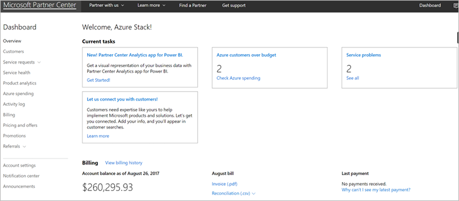
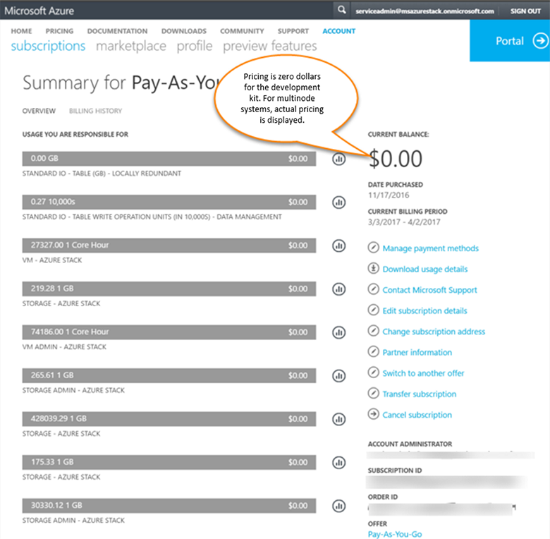

# Report Azure Stack usage data to Azure

Usage data, also called consumption data, represents the amount of resources used.

Azure Stack multi-node systems that use the consumption-based billing model should report usage data to Azure for billing purposes. Azure Stack operators should configure their Azure Stack instance to report usage data to Azure.

> [!IMPORTANT]
> All workloads [must be deployed under tenant subscriptions](#are-users-charged-for-the-infrastructure-vms) to comply with the licensing terms of Azure Stack.

Usage data reporting is required for the Azure Stack multi-node users who license under the Pay-as-you-use model. It is optional for customers who license under the Capacity model (see the [How to buy page](https://azure.microsoft.com/overview/azure-stack/how-to-buy/). For Azure Stack Development Kit users, Azure Stack operators can report usage data and test the feature. However, users will not be charged for any usage they incur.

Usage data is sent from Azure Stack to Azure through the Azure Bridge. In Azure, the commerce system processes the usage data and generates the bill. After the bill is generated, the Azure subscription owner can view and download it from the [Azure Account Center](https://account.windowsazure.com/Subscriptions). To learn about how Azure Stack is licensed, see the [Azure Stack packaging and pricing document](https://go.microsoft.com/fwlink/?LinkId=842847).

## Set up usage data reporting

To set up usage data reporting, you must [register your Azure Stack instance with Azure](azure-stack-registration.md ). As a part of the registration process, the Azure Bridge component of Azure Stack, which connects Azure Stack to Azure and sends the usage data, is configured. The following usage data is sent from Azure Stack to Azure:

- **Meter ID** – Unique ID for the resource that was consumed.
- **Quantity** – Amount of resource usage.
- **Location** – Location where the current Azure Stack resource is deployed.
- **Resource URI** – Fully qualified URI of the resource for which usage is being reported.
- **Subscription ID** – Subscription ID of the Azure Stack user, which is the local (Azure Stack) subscription.
- **Time** – Start and end time of the usage data. There is some delay between the time when these resources are consumed in Azure Stack and when the usage data is reported to commerce. Azure Stack aggregates usage data for every 24 hours and reporting usage data to the commerce pipeline in Azure takes another few hours. So, usage that occurs shortly before midnight may show up in Azure the following day.

## Generate usage data reporting

- To test usage data reporting, create a few resources in Azure Stack. For example, you can create a [storage account](azure-stack-provision-storage-account.md), [Windows Server VM](../user/azure-stack-create-vm-template) and a Linux VM with Basic and Standard SKUs to see how core usage is reported. The usage data for different types of resources are reported under different meters.

- Leave your resources running for few hours. Usage information is collected approximately once every hour. After collecting, this data is transmitted to Azure and processed into the Azure commerce system. This process can take up to a few hours.

## View usage - CSP subscriptions

If you registered your Azure Stack using a CSP subscription, you can view your usage and charges in the same way in which you view Azure consumption. Azure Stack usage will be included in your invoice and in the reconciliation file, available through the [Partner Center](https://partnercenter.microsoft.com/partner/home). The reconciliation file is updated monthly. If you need to access recent Azure Stack usage information, you can use the Partner Center APIs.

## View usage – Enterprise Agreement subscriptions

If you registered your Azure Stack using an Enterprise Agreement subscription, you can view your usage and charges in the [EA portal](https://ea.azure.com/). Azure Stack usage is included in the advanced downloads along with Azure usage under the reports section in this portal. 

## View usage – other subscriptions

If you registered your Azure Stack using any other subscription type; for example, a Pay As You Go subscription, you can view usage and charges in the Azure account center. Sign in to the [Azure Account Center](https://account.windowsazure.com/Subscriptions) as the Azure account administrator and select the Azure subscription that you used to register the Azure Stack. You can view the Azure Stack usage data, the amount charged for each of the used resources as shown in the following image:

For the Azure Stack Development Kit, Azure Stack resources are not charged, so the price is shown as $0.00.

## Which Azure Stack deployments are charged?

Resource usage is free for the Azure Stack Development Kit. Azure Stack multi-node systems, workload VMs, Storage services, and App Services, are charged.

## Are users charged for the infrastructure VMs?

No. Usage data for some Azure Stack resource provider VMs is reported to Azure, but there are no charges for these VMs, nor for the VMs created during deployment to enable the Azure Stack infrastructure.  

Users are only charged for VMs that run under tenant subscriptions. All workloads must be deployed under tenant subscriptions to comply with the licensing terms of Azure Stack.

## I have a Windows Server license I want to use on Azure Stack, how do I do it?

Using the existing licenses avoids generating usage meters. Existing Windows Server licenses can be used in Azure Stack, as described in the "Using existing software with Azure Stack" section of the [Azure Stack Licensing Guide](https://go.microsoft.com/fwlink/?LinkId=851536). Customers must deploy their Windows Server virtual machines as described in the [Hybrid benefit for Windows Server license](/azure/virtual-machines/windows/hybrid-use-benefit-licensing) article in order to use their existing licenses.

## Which subscription is charged for the resources consumed?

The subscription that is provided when [registering Azure Stack with Azure](azure-stack-registration.md ) is charged.

## What types of subscriptions are supported for usage data reporting?

For Azure Stack multi-node, Enterprise Agreement (EA) and CSP subscriptions are supported. For the Azure Stack Development Kit, Enterprise Agreement (EA), Pay-as-you-go, CSP, and MSDN subscriptions support usage data reporting.

## Does usage data reporting work in sovereign clouds?

In the Azure Stack Development Kit, usage data reporting requires subscriptions that are created in the global Azure system. Subscriptions created in one of the sovereign clouds (the Azure Government, Azure Germany, and Azure China clouds) cannot be registered with Azure, so they don't support usage data reporting.

## Why doesn’t the usage reported in Azure Stack match the report generated from Azure Account Center?

There is always a delay between the usage data reported by the Azure Stack usage APIs and the usage data reported  by the Azure Account Center. This delay is the time required to upload usage data from Azure Stack to Azure commerce. Due to this delay, usage that occurs shortly before midnight may show up in Azure the following day. If you use the [Azure Stack usage APIs](azure-stack-provider-resource-api.md), and compare the results to the usage reported in the Azure billing portal, you can see a difference.

## Next steps

* [Provider usage API](azure-stack-provider-resource-api.md)  
* [Tenant usage API](azure-stack-tenant-resource-usage-api.md)
* [Usage FAQ](azure-stack-usage-related-faq.md)
* [Manage usage and billing as a Cloud Service Provider](azure-stack-add-manage-billing-as-a-csp.md)
