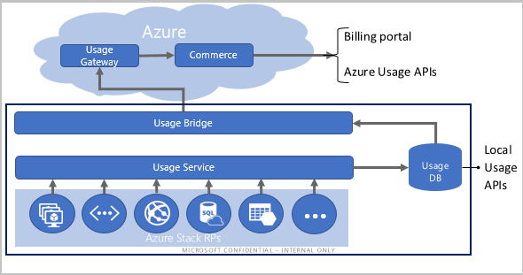
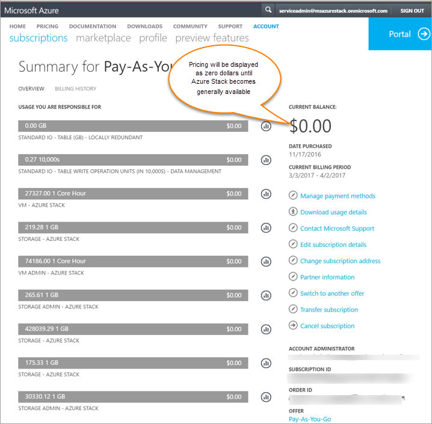

# Report Azure Stack usage data to Azure 

Usage data, also called consumption data, represents the amount of resources used. The Azure Stack integrated systems that use consumption-based billing model should report usage data to Azure. This usage data is used for billing purpose. It's the Azure Stack operator's responsibility to configure their Azure Stack environment with usage data reporting.

> [!NOTE]
> Usage data reporting is required for the Azure Stack integrated system users who license under the pay-as-you-use model. Whereas, it's optional for customers who license under the capacity model. For the Azure Stack Development Kit, cloud operators can report usage data and test the feature, however, users are not charged for any usage they incur. See the [How to buy Azure Stack](https://azure.microsoft.com/overview/azure-stack/how-to-buy/) page to learn more about pricing in Azure Stack.

## Usage data reporting flow

Usage data is sent from Azure Stack to Azure through the Azure Bridge. In Azure, the commerce system processes the usage data and generates the bill. After the bill is generated, the Azure subscription owner can view and download it from the [Azure Account Center](https://account.windowsazure.com/Subscriptions). To learn about how Azure Stack is licensed, refer to the [Azure Stack packaging and pricing document](https://go.microsoft.com/fwlink/?LinkId=842847&clcid=0x409). 

The following image is a graphical representation of usage data flow in Azure Stack:

## Set up usage data reporting

To set up usage data reporting in Azure Stack, you must [register your Azure Stack instance with Azure](azure-stack-register.md). As a part of the registration process, the Azure Bridge component of Azure Stack is configured to connect Azure Stack to Azure. After the Azure Bridge is configured, it sends the following usage data to Azure: 

* **Meter ID** – Unique ID for the resource that was consumed.
* **Quantity** – Amount of resource usage data.
* **Location** – Location where the current Azure Stack resource is deployed.
* **Resource URI** – fully qualified URI of the resource for which usage is being reported. 
* **Subscription ID** – The Azure Stack user's subscription ID.
* **Time** – Start and end time of the usage data. There is some delay between when these resources are consumed in Azure Stack Vs when the usage data is reported to commerce. Azure Stack aggregates usage data for every 24 hours and reporting usage data to commerce pipeline in Azure takes another few hours. So, usage that occurs shortly before midnight may show up in Azure the following day.

## Test usage data reporting 

1. To test usage data reporting, create a few resources in Azure Stack. For example, you can create a [storage account](azure-stack-provision-storage-account.md), [Windows Server VM](azure-stack-provision-vm.md) and a Linux VM with Basic and Standard SKUs to see how core usage is reported. The usage data for different types of resources are reported under different meters.  

2. Leave your resources running for few hours. Usage information is collected approximately once every hour. After collecting, this data is transmitted to Azure and processed into the Azure commerce system. This process can take up to a few hours.  

3. Sign in to the [Azure Account Center](https://account.windowsazure.com/Subscriptions) as the Azure account administrator and select the Azure subscription that you used to register the Azure Stack. You can view the Azure Stack usage data, the amount charged for each of the used resources as shown in the following image:  

   

For the Azure Stack Development Kit, resources are not charged so, the price is shown as $0.00. For the Azure Stack integrated systems, the actual cost of each of these resources is displayed.

## Are users charged for the infrastructure virtual machines?
No, usage data for some Azure Stack resource provider virtual machines and infrastructure virtual machines that are created during deployment is reported to Azure, but there are no charges for them. 

Users are only charged for virtual machines that are created under user subscriptions. So, all workloads must be deployed under user subscriptions to comply with the Azure Stack licensing terms.

## How do I use my existing Windows Server licenses in Azure Stack? 
Existing Windows Server licenses can be used in Azure Stack. Using the licenses that you already own avoids generating additional usage meters. To use your existing licenses, you need to deploy the Windows Server virtual machines as described in the [Hybrid benefit for Windows Server license topic](). 

## What Azure meters are used when reporting usage data in integrated systems?
* **Full price meters** – used for resources associated with user workloads.  
* **Admin meters** – used for infrastructure resources. These meters have a price of zero dollars.

## Which subscription is charged for the resources consumed?
The subscription that is provided when [registering Azure Stack with Azure](azure-stack-register.md) is charged.

## What types of subscriptions are supported for usage data reporting?
For Azure Stack integrated systems, Enterprise Agreement (EA) and CSP subscriptions are supported. 

For the Azure Stack Development Kit, Enterprise Agreement (EA), Pay-as-you-go, CSP, and MSDN subscriptions support usage data reporting.

## Which sovereign clouds support usage data reporting?
Usage data reporting in Azure Stack Development Kit, requires the subscriptions to be created in the global Azure system. Subscriptions created in one of the sovereign clouds (the Azure Government, Azure Germany, and Azure China clouds) cannot be registered with Azure, so they don’t support usage data reporting. 

## How can users identify Azure Stack usage data in the Azure billing portal?
Users can see the Azure Stack usage data in the usage details file. To know about how to get the usage details file, refer to the [download usage file from the Azure Account Center](../billing/billing-download-azure-invoice-daily-usage-date.md#download-usage-from-the-account-center-csv) article. The usage details file contains the Azure Stack meters that identify Azure Stack storage and VMs. All resources used in Azure Stack are reported under the region named “Azure Stack.”

## Why doesn’t the usage reported in Azure Stack match the report generated from Azure Account Center?
There is a delay between the usage data reported by the Azure Stack usage APIs and the usage data reported by the Azure Account Center. This delay is the time required to upload usage data from Azure Stack to Azure commerce. Due to this delay, usage that occurs shortly before midnight may show up in Azure the following day. You can see a difference if you use the [Azure Stack Usage APIs](azure-stack-provider-resource-api.md), and compare the results to the usage reported in the Azure billing portal.

## Next steps

* [Provider usage API](azure-stack-provider-resource-api.md)  
* [Tenant usage API](azure-stack-tenant-resource-usage-api.md)
* [Usage FAQ](azure-stack-usage-related-faq.md)