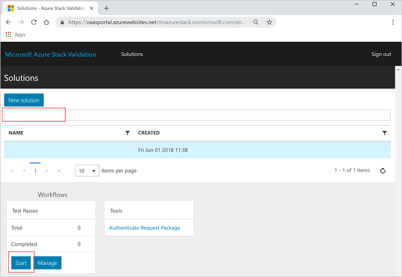

# Set up your validation as a service account

[!INCLUDE[Azure_Stack_Partner](./includes/azure-stack-partner-appliesto.md)]

Validation as a service (VaaS) is an Azure service that is made available to Microsoft Azure Stack partners who have a co-engineering agreement with Microsoft to design, develop, validate, sell, deploy, and support Azure Stack solutions in the market.

Learn how to get your system ready for validation as service. Set up the Azure Active Directory instance and perform other required tasks for getting ready to use VaaS. 

The tasks include:

- Create an Azure Storage blob to store logs
- Deploy the local agent
- Download test image virtual machines on the Azure Stack instance to be tested

## Create an Azure Active Directory tenant ID

1. Create an Azure Active Directory tenant in the [Azure portal](https://portal.azure.com) or use an existing tenant.

    It is recommended to create a tenant specifically for use with VaaS with a descriptive name, such as, ContosoVaaS@onmicrosoft.com. The Role-based access control (RBAC) features of the tenant will be used by the partner to manage who in the partner organization can use VaaS.  
    
    More information, see [Manage your Azure AD directory](https://docs.microsoft.com/azure/active-directory/active-directory-administer).

    > [!Note]  
    > For more information about creating new Azure Active Directory tenants, see [Get started with Azure AD](https://docs.microsoft.com/azure/active-directory/get-started-azure-ad).

2. Add members of your organization who will be responsible for using the service to the tenant. Assign each user in the tenant one of the following roles to control their access level to VaaS:

    | Role Name | Description |
    |---------------------|------------------------------------------|
    | Owner | Has full access to all resources. |
    | Reader | Can view all resources but not edit. |
    | Test Contributor | Can manage test resources. |
    | Catalog Contributor | Can manage solution publishing resources. |

## Set up your tenant

Set up your tenant in the **Azure Stack Validation Service** application. 

1. Send the following information about the tenant to Microsoft at vaashelp@microsoft.com.

    | Data | Description |
    |--------------------------------|---------------------------------------------------------------------------------------------|
    | Organization Name | Official organization name. |
    | Azure AD Tenant Directory Name | Azure AD Tenant Directory name being registered. |
    | Azure AD Tenant Directory Id | Azure AD Tenant Directory GUID associated with the directory.  For information on how to find your Azure AD Tenant Directory ID can be found, see "[Get tenant ID](https://docs.microsoft.com/azure/azure-resource-manager/resource-group-create-service-principal-portal#get-tenant-id)." |

    

2. The Azure Stack team provides confirmation that your tenant can use the VaaS portal.

3. Use the global admin credentials for the tenant to sign into the [VaaS portal](https://azurestackvalidation.com/
). Select **My Account**.

    

3. The site will prompted you to grant access for VaaS. Accept the terms to proceed.

## Assign user roles

To assign a user role:

1. Sign in to the [Azure portal](https://portal.azure.com).
2. Select **All Services** > **Azure Active Directory** in the **Identity** group.
3. Select **Enterprise Applications** > **Azure Stack Validation Service** application.
4. Select **Users and groups**. The **Azure Stack Validation Service - Users and group** blade lists the users with permission to use the application.
5. Select **+ Add user** to add an assignment.

## Create an Azure storage blob to store logs

VaaS creates diagnostic logs when running the validation tests. You need a location an Azure blob service SAS URL to store your logs. The storage account may also be used to the store the OEM customization packages.

These steps walk through how to set up and generate a storage-as-a-service (SAS) URI for an Azure storage account, and where to specify the storage account in the VaaS portal when starting tests in the portal.

### Create an Azure storage account

1. To create a storage account, follow the instructions, [Create a storage account](../storage/common/storage-quickstart-create-account.md).

2. When selecting the type of storage account, select the **Blob storage** account type.

### Generate a SAS URL for the storage account

1. Navigate to the storage account created above.

2. On the blade under **Settings**, select **Shared access signature**.

3. Check only **Blob** from **Allowed Services options** (uncheck the remaining).

4. Check **Service**, **Container, and **Object** from **Allowed resource types**.

5. Check **Read**, **Write**, **List**, **Add**, **Create** from **Allowed permissions** (uncheck the remaining).

6. Set **Start time** to the current time, and **End time** to three months from the current time.

7. Select **Generate SAS and connection string** and save the **Blob service SAS URL** string.

> [!Note]  
> The SAS URL expires at the end time set when the URL was generated. Ensure that the URL is sufficiently valid before sharing it with product team for debugging, or that the URL is valid for more than 30 days when scheduling tests.

## Next steps

- Use the VaaS local agent to check your hardware. For instruction, see [Deploy the local agent and test virtual machines](azure-stack-vaas-test-vm.md).
- To learn more about [Azure Stack validation as a service](https://docs.microsoft.com/azure/azure-stack/partner).