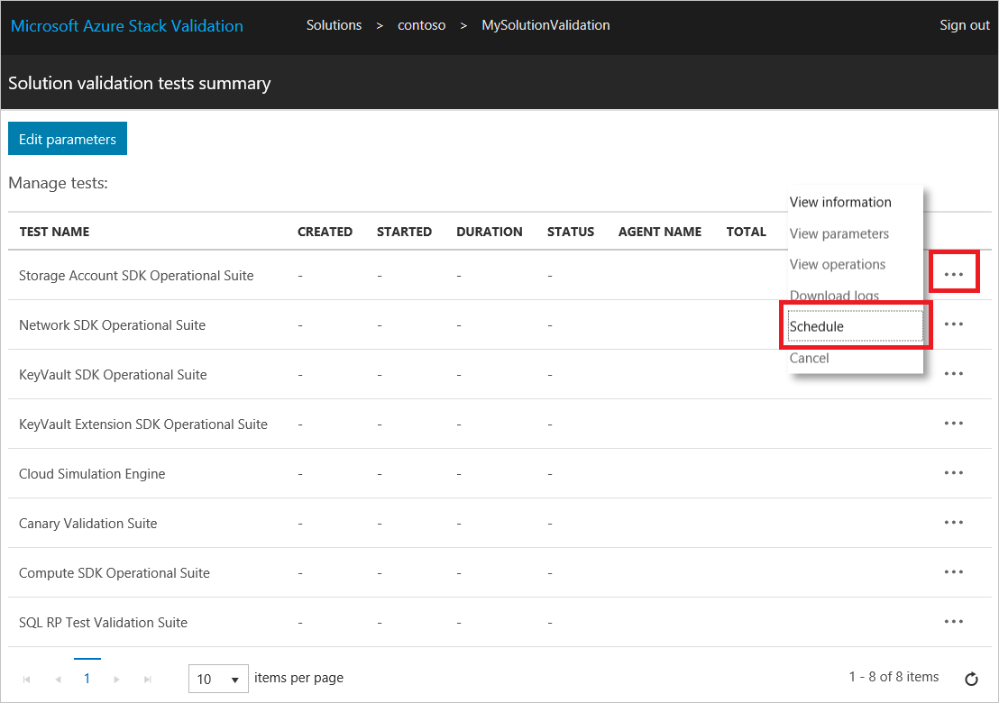

# Validate a new Azure Stack solution

[!INCLUDE[Azure_Stack_Partner](./includes/azure-stack-partner-appliesto.md)]

Learn how to use the **Solution Validation** workflow to certify new Azure Stack solutions.

An Azure Stack solution is a hardware bill of materials (BoM) that has been jointly agreed upon between Microsoft and the partner after meeting the Windows Server logo certification requirements. A solution must be recertified when there has been a change to the hardware BoM. For further questions about when to recertify solutions, contact the team at [vaashelp@microsoft.com](mailto:vaashelp@microsoft.com).

To certify your solution, run the Solution Validation workflow twice. Run it once for the *minimally* supported configuration. Run it a second time for the *maximally* supported configuration. Microsoft certifies the solution if both configurations pass all tests.

[!INCLUDE [azure-stack-vaas-create-solution](includes/azure-stack-vaas-create-solution.md)]

## Create a Solution Validation workflow

1. On the solutions dashboard, create or select an existing solution to certify. For instructions, see [Create a solution in the VaaS portal](azure-stack-vaas-key-concepts.md#create-a-solution-in-the-vaas-portal).
2. Click **Start** on the **Solution Validations** tile.

    

3. Enter a **name** for the workflow.
4. Select the **solution configuration**.
    - **Minimum**: the solution is configured with the minimum supported number of nodes.
    - **Maximum**: the solution is configured with the maximum supported number of nodes.
5. Click on **Upload** to upload your Azure Stack stamp information file. For instructions, see [Generate the stamp information file](azure-stack-vaas-parameters.md#generate-the-stamp-information-file).
    
6. Enter the test parameters. For additional details and instructions, see [Test parameters](azure-stack-vaas-parameters.md#test-parameters) and <TODO link diagnostics article>
7. Click **Submit** to create the workflow. You will be redirected to the tests summary page.

## Execute Solution Validation tests

In the **Solution validation tests summary** page, you will see a list of the tests required for completing validation.

1. Select the agent that will execute the test. For information about adding local test execution agents, see [Deploy the local agent and test virtual machines](azure-stack-vaas-test-vm.md).
2. Click on the context menu next to a test and select **Schedule**. In the window, review the test parameters and then click **Submit** to schedule the test for execution.
    

## Next steps
- [Monitor and manage tests in the VaaS portal](azure-stack-vaas-monitor-test.md)