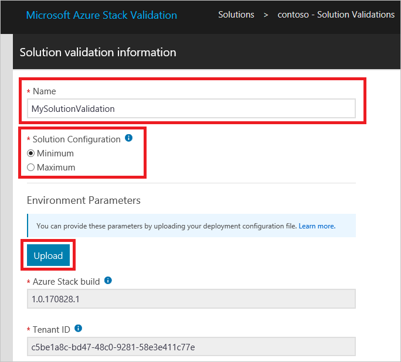

# Validate a new Azure Stack solution

[!INCLUDE [Azure_Stack_Partner](./includes/azure-stack-partner-appliesto.md)]

Learn how to use the **Solution Validation** workflow to certify new Azure Stack solutions.

An Azure Stack solution is a hardware bill of materials (BoM) that has been jointly agreed upon between Microsoft and the partner after meeting the Windows Server logo certification requirements. A solution must be recertified when there has been a change to the hardware BoM. For further questions about when to recertify solutions, contact the team at [vaashelp@microsoft.com](mailto:vaashelp@microsoft.com).

To certify your solution, run the Solution Validation workflow twice. Run it once for the *minimally* supported configuration. Run it a second time for the *maximally* supported configuration. Microsoft certifies the solution if both configurations pass all tests.

[!INCLUDE [azure-stack-vaas-workflow-validation-completion](includes/azure-stack-vaas-workflow-validation-completion.md)]

## Create a Solution Validation workflow

1. [!INCLUDE [azure-stack-vaas-workflow-step_select-solution](includes/azure-stack-vaas-workflow-step_select-solution.md)]

2. Select the following tests:
    - Cloud Simulation Engine
    - Compute SDK Operational Suite
    - Disk Identification Test
    - KeyVault Extension SDK Operational Suite
    - KeyVault SDK Operational Suite
    - Network SDK Operational Suite
    - Storage Account SDK Operational Suite

3. Select **Start** on the **Solution Validations** tile.

    

4. [!INCLUDE [azure-stack-vaas-workflow-step_naming](includes/azure-stack-vaas-workflow-step_naming.md)]

5. Select the **solution configuration**.
    - **Minimum**: the solution is configured with the minimum supported number of nodes.
    - **Maximum**: the solution is configured with the maximum supported number of nodes.
6. [!INCLUDE [azure-stack-vaas-workflow-step_upload-stampinfo](includes/azure-stack-vaas-workflow-step_upload-stampinfo.md)]

    

7. [!INCLUDE [azure-stack-vaas-workflow-step_test-params](includes/azure-stack-vaas-workflow-step_test-params.md)]

    > [!NOTE]
    > Environment parameters cannot be modified after creating a workflow.

8. [!INCLUDE [azure-stack-vaas-workflow-step_tags](includes/azure-stack-vaas-workflow-step_tags.md)]
9. [!INCLUDE [azure-stack-vaas-workflow-step_submit](includes/azure-stack-vaas-workflow-step_submit.md)]
    You will be redirected to the tests summary page.

## Execute Solution Validation tests

In the **Solution validation tests summary** page, you will see a list of the tests required for completing validation.

[!INCLUDE [azure-stack-vaas-workflow-validation-section_schedule](includes/azure-stack-vaas-workflow-validation-section_schedule.md)]

## Next steps

- [Monitor and manage tests in the VaaS portal](azure-stack-vaas-monitor-test.md)