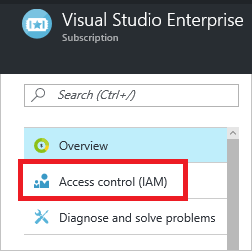

# Give applications access to Azure Stack resources by creating service principals

*Applies to: Azure Stack integrated systems and Azure Stack Development Kit*

You can give an application access to Azure Stack resources by creating a service principal that uses Azure Resource Manager. A service principal lets you delegate specific permissions using [role-based access control](azure-stack-manage-permissions.md).

As a best practice, you should use service principals for your applications. Service principals are preferable to running an app using your own credentials for the following reasons:

* You can assign permissions to the service principal that are different than your own account permissions. Typically, a service principal's permissions are restricted to exactly what the app needs to do.
* You do not have to change the app's credentials if your role or responsibilities change.
* You can use a certificate to automate authentication when running an unattended script.

## Example scenario

You have a configuration management app that needs to inventory Azure resources using Azure Resource Manager. You can create a service principal and assign it to the Reader role. This role gives the app read-only access to Azure resources.

## Getting started

Use the steps in this article as a guide to:

* Create a service principal for your app.
* Register your app and create an authentication key.
* Assign your app to a role.

The way you configured Active Directory for Azure Stack determines how you create a service principal. Pick one of the following options:

* Create a service principal for [Azure Active Directory (Azure AD)](azure-stack-create-service-principals.md#create-service-principal-for-azure-ad).
* Create a service principal for [Active Directory Federation Services (AD FS)](azure-stack-create-service-principals.md#create-service-principal-for-ad-fs).

The steps for assigning a service principal to a role the same for Azure AD and AD FS. After you create the service principal, you can [delegate permissions](azure-stack-create-service-principals.md#assign-role-to-service-principal) by assigning it to a role.

## Create service principal for Azure AD

If your Azure Stack uses Azure AD as the identity store, you can create a service principal using the same steps as in Azure, using the Azure portal.

>[!NOTE]
Check to see that you have the [required Azure AD permissions](../../active-directory/develop/howto-create-service-principal-portal.md#required-permissions) before you start creating a service principal.

### Create service principal

To create a service principal for your application:

1. Sign in to your Azure Account through the [Azure portal](https://portal.azure.com).
2. Select **Azure Active Directory** > **App registrations** > **Add**.
3. Provide a name and URL for the application. Select either **Web app / API** or **Native** for the type of application you want to create. After setting the values, select **Create**.

### Get credentials

When logging in programmatically, use the ID for your application and an authentication key. To get these values:

1. From **App registrations** in Active Directory, select your application.

2. Copy the **Application ID** and store it in your application code. The applications in the [sample applications](#sample-applications) use **client id** when referring to the **Application ID**.

     
3. To generate an authentication key, select **Keys**.

4. Provide a description of the key, and a duration for the key. When done, select **Save**.

>[!IMPORTANT]
After you save the key, the key **VALUE** is displayed. Write down this value because you can't retrieve the key later. Store the key value where your application can retrieve it.

The final step is [assigning your application a role](azure-stack-create-service-principals.md#assign-role-to-service-principal).

## Create service principal for AD FS

If you deployed Azure Stack using AD FS as the identity store, you can use PowerShell for the following tasks:

* Create a service principal.
* Assign service principal to a role.
* Sign in using the service principal's identity.

For details on how to create the service principal, see [Create service principal for AD FS](../azure-stack-create-service-principals.md#manage-service-principal-for-AD-FS).

## Assign the service principal to a role

To access resources in your subscription, you must assign the application to a role. Decide which role represents the right permissions for the application. To learn about the available roles, see [RBAC: Built in Roles](../../role-based-access-control/built-in-roles.md).

>[!NOTE]
You can set a role's scope at the level of a subscription, a resource group, or a resource. Permissions are inherited to lower levels of scope. For example, an app with the Reader role for a resource group means that the app can read any of the resources in the resource group.

Use the following steps as a guide for assigning a role to a service principal.

1. In the Azure Stack portal, navigate to the level of scope you want to assign the application to. For example, to assign a role at the subscription scope, select **Subscriptions**.

2. Select the subscription to assign the application to. In this example, the subscription is Visual Studio Enterprise.

     

3. Select **Access Control (IAM)** for the subscription.

     

4. Select **Add**.

5. Select the role you wish to assign to the application.

6. Search for your application, and select it.

7. Select **OK** to finish assigning the role. You can see your application in the list of users assigned to a role for that scope.

Now that you've created a service principal and assigned a role, your application can access Azure Stack resources.

## Next steps

[Manage user permissions](azure-stack-manage-permissions.md)
