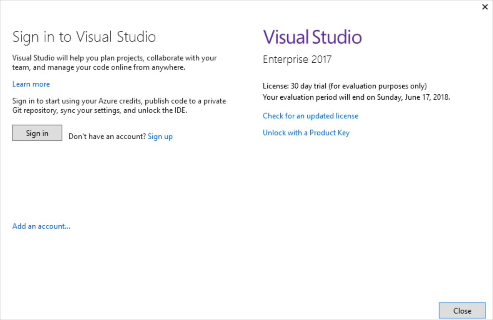
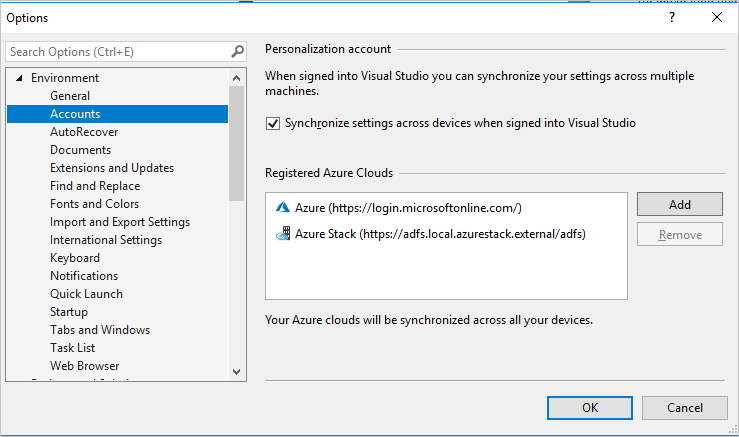

# Install Visual Studio and connect to Azure Stack

*Applies to: Azure Stack integrated systems and Azure Stack Development Kit*

Use Visual Studio to author and deploy Azure Resource Manager [templates](azure-stack-arm-templates.md) in Azure Stack. You can use the steps described in this article to install Visual Studio either from [Azure Stack Development Kit](azure-stack-connect-azure-stack.md#connect-to-azure-stack-with-remote-desktop), or from a Windows-based external client if you are connected through [VPN](azure-stack-connect-azure-stack.md#connect-to-azure-stack-with-vpn). These steps in this article are for a new installation of Visual Studio 2015 Community Edition. Read more about [coexistence](https://msdn.microsoft.com/library/ms246609.aspx) with other Visual Studio versions.

## Install Visual Studio

1. Download and run the [Web Platform Installer](https://www.microsoft.com/web/downloads/platform.aspx).
2. Search for **Visual Studio Community 2015 with Microsoft Azure SDK - 2.9.6**, select **Add**, and then select **Install**.

    

3. Uninstall the **Microsoft Azure PowerShell** that's installed as part of the Azure SDK.

    

4. [Install PowerShell for Azure Stack](azure-stack-powershell-install.md)

5. Restart the operating system after the installation completes.

## Connect to Azure Stack

1. Launch Visual Studio.

2. From the **View** menu, select **Cloud Explorer**.

3. In the new pane, select **Add Account** and sign in with your Azure Active Directory credentials.
    

Once logged in, you can [deploy templates](azure-stack-deploy-template-visual-studio.md) or browse available resource types and resource groups to create your own templates.

## Next Steps

* [Develop templates for Azure Stack](azure-stack-develop-templates.md)
