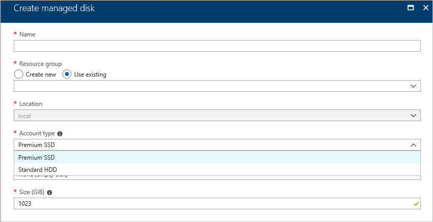
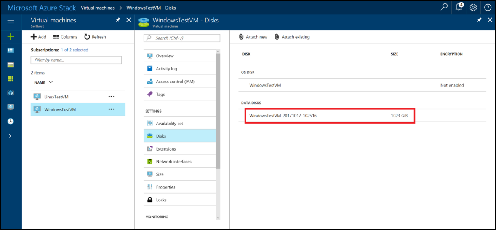
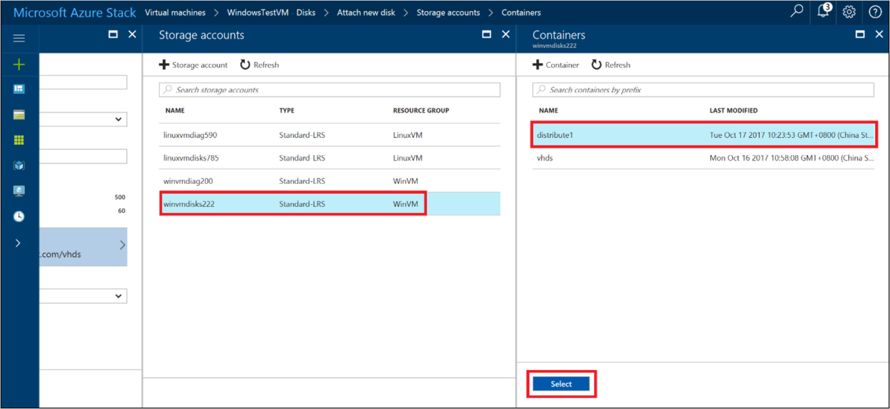
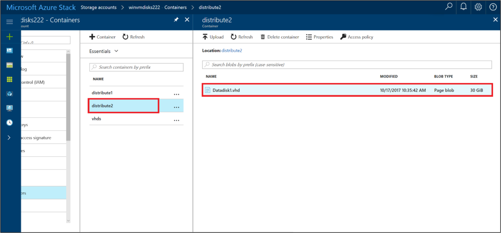
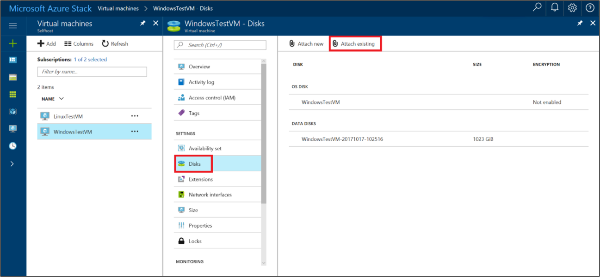
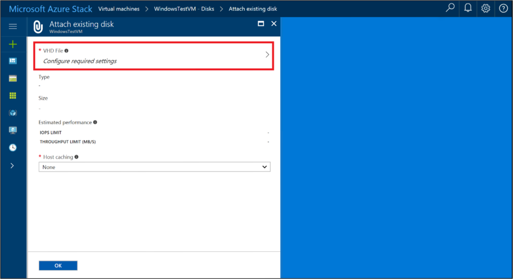
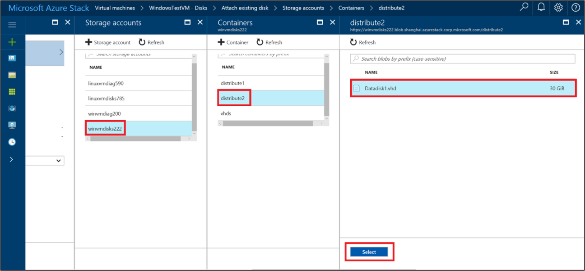
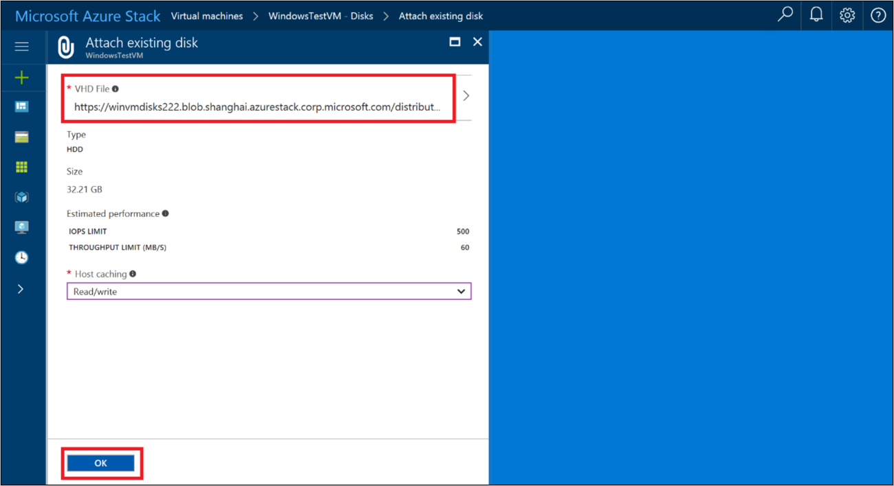
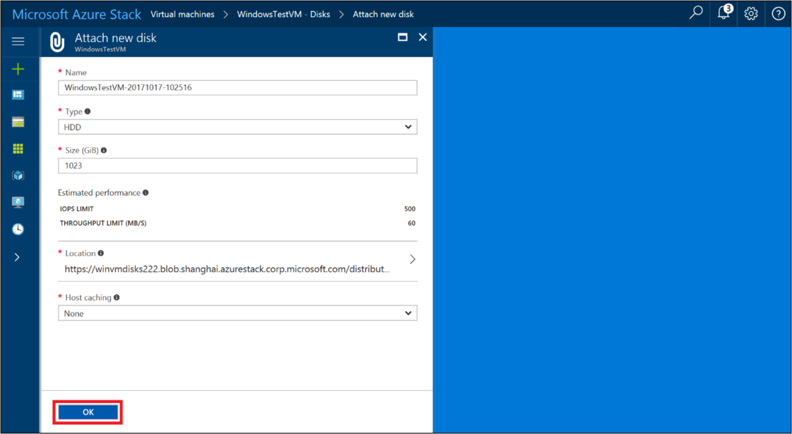

# Create virtual machine disk storage in Azure Stack

*Applies to: Azure Stack integrated systems and Azure Stack Development Kit*

This article describes how to create virtual machine disk storage by using the Azure Stack portal or by using PowerShell.

## Overview

Beginning with version 1808, Azure Stack supports the use of managed disks and unmanaged disks on virtual machines, as both an operating system (OS) and a data disk. Before version 1808, only unmanaged disks are supported. 

**[Managed disks](/azure/virtual-machines/windows/managed-disks-overview)** simplify disk management for Azure IaaS VMs by managing the storage accounts associated with the VM disks. You only have to specify the size of disk you need, and Azure Stack creates and manages the disk for you.

Unmanaged disks, require that you create a storage account to store the disks. The disks you create are referred to as VM disks and are stored in containers in the storage account.

### Best practice guidelines

To improve performance and reduce the overall costs, we recommend you place each VM disk in a separate container. A container should hold either an OS disk or a data disk, but not both at the same time. (However, there's nothing to prevent you from putting both kinds of disk in the same container.)

If you add one or more data disks to a VM, use additional containers as a location to store these disks. The OS disk for additional VMs should also be in their own containers.

When you create VMs, you can reuse the same storage account for each new virtual machine. Only the containers you create should be unique.

### Adding new disks

The following table summarizes how to add disks by using the portal and by using PowerShell.

| Method | Options
|-|-|
|User portal|- Add new data disks to an existing VM. New disks are created by Azure Stack. </br> </br>- Add an existing disk (.vhd) file to a  previously created VM. To do this, you must prepare the .vhd  and then upload the file to Azure Stack. |
|[PowerShell](#use-powershell-to-add-multiple-unmanaged-disks-to-a-vm) | - Create a new VM with an OS disk, and at the same time add one or more data disks to that VM. |

## Use the portal to add disks to a VM

By default, when you use the portal to create a VM for most marketplace items, only the OS disk is created.

After you create a VM, you can use the portal to:
* Create a new data disk and attach it to the VM.
* Upload an existing data disk and attach it to the VM.

Each unmanaged disk you add should be put in a separate container.

>[!NOTE]  
>Disks created and managed by Azure are called [managed disks](https://docs.microsoft.com/azure/virtual-machines/windows/managed-disks-overview).

### Use the portal to create and attach a new data disk

1. In the portal, choose **All services** > **Virtual machines**.    
   

2. Select a virtual machine that has previously been created.   
   

3. For the virtual machine, select **Disks** > **Add data disk**.       
       

4. For the Data disk:
   -  Enter the **LUN**. The LUN must be a valid number.
   -  Select **Create disk**.
   

5. In the create managed disk blade:
   - Enter the **Name** of the disk.
   - Select an existing or create a new **Resource group**.
   - Select the **Location**. By default, the location is set to the same container that holds the OS disk.
   - Select the **Account type**. 
      

      **Premium SSD**  
      Premium disks (SSD) are backed by solid-state drives and offer consistent, low-latency performance. They provide the best balance between price and performance, and are ideal for I/O-intensive applications and production workloads.
       
      **Standard HDD**  
      Standard disks (HDD) are backed by magnetic drives and are preferable for applications where data is accessed infrequently. Zone- redundant disks are backed by Zone redundant storage (ZRS) that replicates your data across  multiple zones and are available even if a single zone is down. 

   - Select the **Source type**.

     Create a disk from a snapshot of another disk, a blob in a storage account, or create an empty disk.

      **Snapshot**  
      Select a snapshot, if it is available. The snapshot must be in available in the VM's subscription and location.

      **Storage blob**  
     - Add the URI of the Storage blob that contains the disk image.  
     - Select **Browse** to open the Storage accounts blade. For instructions see [Add a data disk from a storage account](#add-a-data-disk-from-a-storage-account).
     - Select the OS type of the image, either **Windows**, **Linux**, or **None (data disk)**.

       **None (empty disk)**

   - Select the **Size (GiB)**.

     Standard disk costs increase based on the size of the disk. Premium disk costs and performance  increase based on the size of the disk. For more information, see [Managed Disks pricing](https://go.microsoft.com/fwlink/?linkid=843142).

   - Select **Create**. Azure Stack creates and validates the managed disk.

5. After Azure Stack creates the disk and attaches it to the virtual machine, the new disk is listed in the virtual machine's disk settings under **DATA DISKS**.   

   

### Add a data disk from a storage account

For more information on working with Storage accounts in Azure Stack, see [Introduction to Azure Stack storage](azure-stack-storage-overview.md).

1. Select the **Storage account** to use.
2. Select the **Container** where you want to put the data disk. From the **Containers** blade, you can create a new container if you want. You can then change the location for the new disk to its own container. When you use a separate container for each disk, you distribute the placement of the data disk that can improve performance.
3. Choose **Select** to save the selection.

    

## Attach an existing data disk to a VM

1.  [Prepare a .vhd file](https://docs.microsoft.com/azure/virtual-machines/windows/classic/createupload-vhd) for use as data disk for a VM. Upload that .vhd file to a storage account that you use with the VM that you want to attach the .vhd file to.

    Plan to use a different container to hold the .vhd file than the container that holds the OS disk.   
    

2.  After the .vhd file is uploaded, you are ready to attach the VHD to a VM. In the menu on the left, select  **Virtual machines**.  
 

3.  Choose the virtual machine from the list.

    

4.  On the page for the virtual machine, select **Disks** > **Attach existing**.   

    

5.  In the **Attach existing disk** page, select **VHD File**. The **Storage accounts** page opens.    

    

6.  Under **Storage accounts**, select the account to use, and then choose a container that holds the .vhd file you previously uploaded. Select the .vhd file, and then choose **Select** to save the selection.    

    

7.  Under **Attach existing disk**, the file you selected is listed under **VHD File**. Update the **Host caching** setting of the disk, and then select **OK** to save the new disk configuration for the VM.    

    

8.  After Azure Stack creates the disk and attaches it to the virtual machine, the new disk is listed in the virtual machine's disk settings under **Data Disks**.   

    

## Use PowerShell to add multiple unmanaged disks to a VM

You can use PowerShell to provision a VM and add a new data disk or attach a pre-existing **.vhd** file as a data disk.

The **Add-AzureRmVMDataDisk** cmdlet adds a data disk to a virtual machine. You can add a data disk when you create a virtual machine, or you can add a data disk to an existing virtual machine. Specify the **VhdUri** parameter to distribute the disks to different containers.

### Add data disks to a new virtual machine
The following examples use PowerShell commands to create a VM with three data disks, each placed in a different container.

The first command creates a virtual machine object, and then stores it in the *$VirtualMachine* variable. The command assigns a name and size to the virtual machine.

```powershell
$VirtualMachine = New-AzureRmVMConfig -VMName "VirtualMachine" `
                                    -VMSize "Standard_A2"
```

The next three commands assign paths of three data disks to the *$DataDiskVhdUri01*, *$DataDiskVhdUri02*, and *$DataDiskVhdUri03* variables. Define a different path name in the URL to distribute the disks to different containers.

```powershell
$DataDiskVhdUri01 = "https://contoso.blob.local.azurestack.external/test1/data1.vhd"
```

```powershell
$DataDiskVhdUri02 = "https://contoso.blob.local.azurestack.external/test2/data2.vhd"
```

```powershell
$DataDiskVhdUri03 = "https://contoso.blob.local.azurestack.external/test3/data3.vhd"
```

The final three commands add data disks to the virtual machine stored in *$VirtualMachine*. Each command specifies the name, location, and additional properties of the disk. The URI of each disk is stored in *$DataDiskVhdUri01*, *$DataDiskVhdUri02*, and *$DataDiskVhdUri03*.

```powershell
$VirtualMachine = Add-AzureRmVMDataDisk -VM $VirtualMachine -Name 'DataDisk1' `
                -Caching 'ReadOnly' -DiskSizeInGB 10 -Lun 0 `
                -VhdUri $DataDiskVhdUri01 -CreateOption Empty
```

```powershell
$VirtualMachine = Add-AzureRmVMDataDisk -VM $VirtualMachine -Name 'DataDisk2' `
                -Caching 'ReadOnly' -DiskSizeInGB 11 -Lun 1 `
                -VhdUri $DataDiskVhdUri02 -CreateOption Empty
```

```powershell
$VirtualMachine = Add-AzureRmVMDataDisk -VM $VirtualMachine -Name 'DataDisk3' `
                -Caching 'ReadOnly' -DiskSizeInGB 12 -Lun 2 `
                -VhdUri $DataDiskVhdUri03 -CreateOption Empty
```

Use the following PowerShell commands to add the OS disk and network configuration to the VM, and then start the new VM.

```powershell
#set variables
$rgName = "myResourceGroup"
$location = "local"
#Set OS Disk
$osDiskUri = "https://contoso.blob.local.azurestack.external/vhds/osDisk.vhd"
$osDiskName = "osDisk"

$VirtualMachine = Set-AzureRmVMOSDisk -VM $VirtualMachine -Name $osDiskName -VhdUri $osDiskUri `
    -CreateOption FromImage -Windows

# Create a subnet configuration
$subnetName = "mySubNet"
$singleSubnet = New-AzureRmVirtualNetworkSubnetConfig -Name $subnetName -AddressPrefix 10.0.0.0/24

# Create a vnet configuration
$vnetName = "myVnetName"
$vnet = New-AzureRmVirtualNetwork -Name $vnetName -ResourceGroupName $rgName -Location $location `
    -AddressPrefix 10.0.0.0/16 -Subnet $singleSubnet

# Create a public IP
$ipName = "myIP"
$pip = New-AzureRmPublicIpAddress -Name $ipName -ResourceGroupName $rgName -Location $location `
    -AllocationMethod Dynamic

# Create a network security group configuration
$nsgName = "myNsg"
$rdpRule = New-AzureRmNetworkSecurityRuleConfig -Name myRdpRule -Description "Allow RDP" `
    -Access Allow -Protocol Tcp -Direction Inbound -Priority 110 `
    -SourceAddressPrefix Internet -SourcePortRange * `
    -DestinationAddressPrefix * -DestinationPortRange 3389
$nsg = New-AzureRmNetworkSecurityGroup -ResourceGroupName $rgName -Location $location `
    -Name $nsgName -SecurityRules $rdpRule

# Create a NIC configuration
$nicName = "myNicName"
$nic = New-AzureRmNetworkInterface -Name $nicName -ResourceGroupName $rgName `
-Location $location -SubnetId $vnet.Subnets[0].Id -NetworkSecurityGroupId $nsg.Id -PublicIpAddressId $pip.Id

#Create the new VM
$VirtualMachine = Set-AzureRmVMOperatingSystem -VM $VirtualMachine -Windows -ComputerName VirtualMachine | `
    Set-AzureRmVMSourceImage -PublisherName MicrosoftWindowsServer -Offer WindowsServer `
    -Skus 2016-Datacenter -Version latest | Add-AzureRmVMNetworkInterface -Id $nic.Id
New-AzureRmVM -ResourceGroupName $rgName -Location $location -VM $VirtualMachine
```

### Add data disks to an existing virtual machine

The following examples use PowerShell commands to add three data disks to an existing VM.
  The first command gets the virtual machine named VirtualMachine by using the **Get-AzureRmVM** cmdlet. The command stores the virtual machine in the *$VirtualMachine* variable.

```powershell
$VirtualMachine = Get-AzureRmVM -ResourceGroupName "myResourceGroup" `
                                -Name "VirtualMachine"
```
The next three commands assign paths of three data disks to the $DataDiskVhdUri01, $DataDiskVhdUri02, and $DataDiskVhdUri03 variables.  The different path names in the vhduri indicate different containers for the disk placement.
```powershell
$DataDiskVhdUri01 = "https://contoso.blob.local.azurestack.external/test1/data1.vhd"
```
```powershell
$DataDiskVhdUri02 = "https://contoso.blob.local.azurestack.external/test2/data2.vhd"
```
```powershell
$DataDiskVhdUri03 = "https://contoso.blob.local.azurestack.external/test3/data3.vhd"
```


The next three commands add the data disks to the virtual machine stored in the *$VirtualMachine* variable. Each command specifies the name, location, and additional properties of the disk. The URI of each disk is stored in *$DataDiskVhdUri01*, *$DataDiskVhdUri02*, and *$DataDiskVhdUri03*.

```powershell
Add-AzureRmVMDataDisk -VM $VirtualMachine -Name "disk1" `
                      -VhdUri $DataDiskVhdUri01 -LUN 0 `
                      -Caching ReadOnly -DiskSizeinGB 10 -CreateOption Empty
```

```powershell
Add-AzureRmVMDataDisk -VM $VirtualMachine -Name "disk2" `
                      -VhdUri $DataDiskVhdUri02 -LUN 1 `
                      -Caching ReadOnly -DiskSizeinGB 11 -CreateOption Empty
```

```powershell
Add-AzureRmVMDataDisk -VM $VirtualMachine -Name "disk3" `
                      -VhdUri $DataDiskVhdUri03 -LUN 2 `
                      -Caching ReadOnly -DiskSizeinGB 12 -CreateOption Empty
```

The final command updates the state of the virtual machine stored in *$VirtualMachine* in -*ResourceGroupName*.

```powershell
Update-AzureRmVM -ResourceGroupName "myResourceGroup" -VM $VirtualMachine
```

## Next steps

To learn more about Azure Stack virtual machines, see [Considerations for Virtual Machines in Azure Stack](https://docs.microsoft.com/azure/azure-stack/user/azure-stack-vm-considerations).
