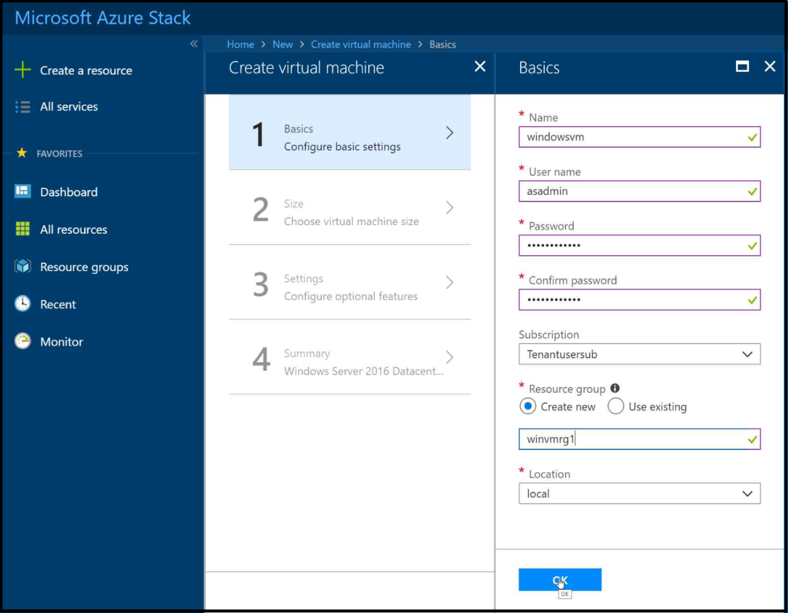
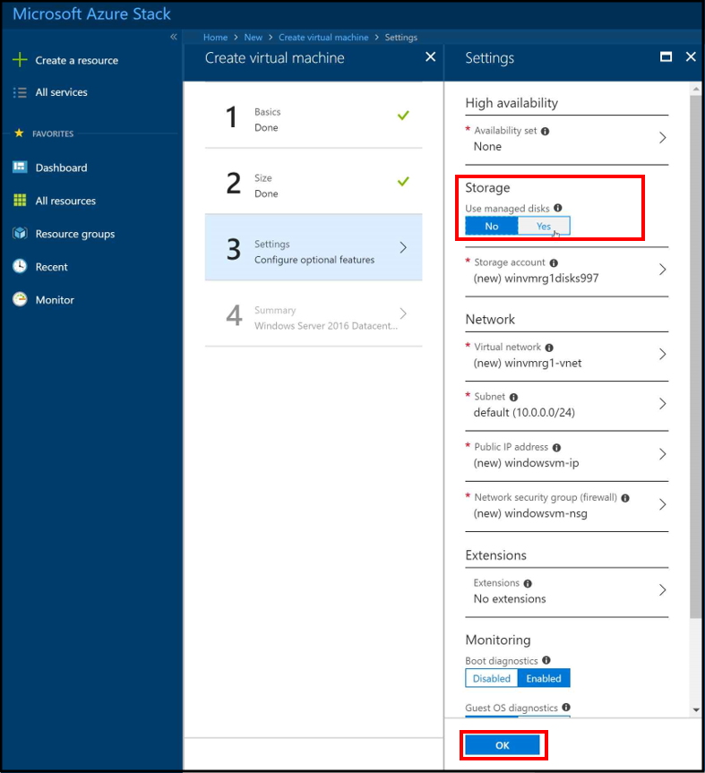
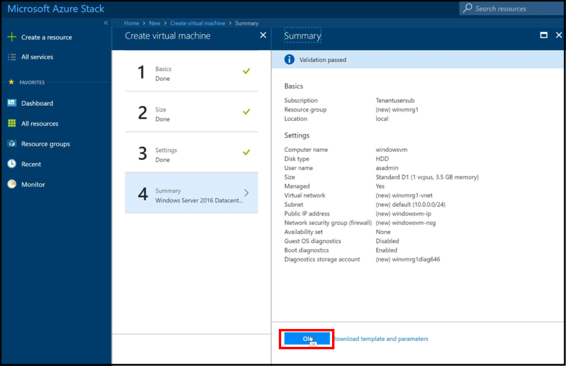
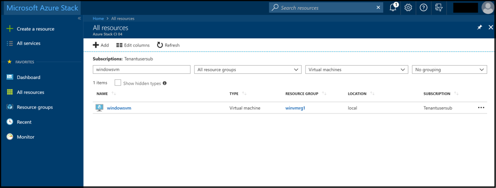

# Quickstart: create a Windows server virtual machine with the Azure Stack portal

*Applies to: Azure Stack integrated systems and Azure Stack Development Kit*

You can create a Windows Server 2016 virtual machine by using the Azure Stack portal. Follow the steps in this article to create and use a virtual machine.

> [!NOTE]  
> The screen images in this article are updated to match the user interface that is introduced with Azure Stack version 1808. 1808 adds support for using *managed disks* in addition to unmanaged disks. If you use an earlier version, some images like disk selection, will be different than what is displayed in this article.  

## Sign in to the Azure Stack portal

Sign in to the Azure Stack portal. The address of the Azure Stack portal depends on which Azure Stack product you're connecting to:

* For the Azure Stack Development Kit (ASDK) go to: https://portal.local.azurestack.external.
* For an Azure Stack integrated system, go to the URL that your Azure Stack operator provided.

## Create a virtual machine

1. Click **+ Create a resource** > **Compute** > **Windows Server 2016 Datacenter – Pay-as-you-use** > **Create**. If you don't see **Windows Server 2016 Datacenter – Pay-as-you-use** entry, contact your Azure Stack operator. Ask that they add it to the marketplace as explained in the [Add the Windows Server 2016 VM image to the Azure Stack marketplace](../operator/azure-stack-create-and-publish-marketplace-item.md) article.

    
2. Under **Basics**, type a **Name**, **User name**, and **Password**. Choose a **Subscription**. Create a **Resource group**, or select an existing one, select a **Location**, and then click **OK**.

    
3. Under **Size** select **D1 Standard**, and then click on **Select**.  
    

4. On the **Settings** page, make any desired changes to the defaults.
   - Beginning with Azure Stack version 1808, you can configure **Storage** where you can choose to use *managed disks*. Prior to version 1808 only unmanaged disks can be used.  
     
   When your configurations are ready, select **OK** to continue.

5. Under **Summary**, click **OK** to create the virtual machine.
    

6. To see your new virtual machine, click **All resources**, search for the virtual machine name, and then click its name in the search results.
    

## Clean up resources

When you're finished using the virtual machine, delete the virtual machine and its resources. To do so, select the resource group on the virtual machine page and click **Delete**.

## Next steps

In this quick start, you deployed a basic Windows Server virtual machine. To learn more about Azure Stack virtual machines, continue to [Considerations for Virtual Machines in Azure Stack](azure-stack-vm-considerations.md).
