# Tutorial: deploy a hybrid cloud solution with Azure and Azure Stack

*Applies to: Azure Stack integrated systems and Azure Stack Development Kit*

This tutorial shows you how to deploy a hybrid cloud solution that uses the Azure public cloud and the Azure Stack private cloud.

By using a hybrid cloud solution, you can combine the compliance benefits of a private cloud with the scalability of the public cloud. Additionally, your developers can take advantage of the Microsoft developer ecosystem, and apply their skills to the cloud and on-premises environments.

## Overview and assumptions

You can follow this tutorial to set up a workflow that lets developers deploy an identical web application to a public cloud and a private cloud. This application will be able to access a non-Internet routable network hosted on the private cloud. These web applications are monitored and when there’s a spike in traffic, a program modifies the DNS records to redirect traffic to the public cloud. When traffic drops to the level before the spike, traffic is routed back to the private cloud.

This tutorial covers the following tasks:

> [!div class="checklist"]
> - Deploy a hybrid-connected SQL Server database server.
> - Connect a web app in global Azure to a hybrid network.
> - Configure DNS for cross-cloud scaling.
> - Configure SSL certificates for cross-cloud scaling.
> - Configure and deploy the web application.
> -  Create a Traffic Manager profile and configure it for cross-cloud scaling.
> - Set up Application Insights monitoring and alerting for increased traffic.
> - Configure automatic traffic switching between global Azure and Azure Stack.

### Assumptions

This tutorial assumes that you have a basic knowledge of global Azure and Azure Stack. If you want to learn more before starting the tutorial, review these articles:

 - [Introduction to Azure](https://azure.microsoft.com/overview/what-is-azure/)
 - [Azure Stack Key Concepts](https://docs.microsoft.com/azure/azure-stack/azure-stack-key-features)

This tutorial also assumes that you have an Azure subscription. If you don't have a subscription, you can [create a free account](https://azure.microsoft.com/free/) before you begin.

## Prerequisites

Before you start this tutorial, make sure you can meet the following requirements:

- An Azure Stack Development Kit (ASDK) or a subscription on an Azure Stack Integrated System. To deploy an Azure Stack Development Kit, follow the instructions in [Deploy the ASDK using the installer](../asdk/asdk-deploy.md).
- Your Azure Stack installation should have the following installed:
  - The Azure App Service. Work with your Azure Stack Operator to deploy and configure the Azure App Service on your environment. This tutorial requires the  App Service have at least one (1) available dedicated worker role.
  - A Windows Server 2016 image
  - A Windows Server 2016 with a Microsoft SQL Server image
  - The appropriate plans and offers
 - A domain name for your web application. If you don’t have a domain name you can buy one from a domain provider such as GoDaddy, Bluehost, and InMotion.
- An SSL certificate for your domain from a trusted certificate authority such as LetsEncrypt.
- A web application that communicates with a SQL Server database, and supports Application Insights. You can download the [dotnetcore-sqldb-tutorial](https://github.com/Azure-Samples/dotnetcore-sqldb-tutorial) sample app from GitHub.
- A hybrid network between an Azure virtual network and Azure Stack virtual network. For detailed instructions, see [Configure hybrid cloud connectivity with Azure and Azure Stack](azure-stack-solution-hybrid-connectivity.md).

- A hybrid continuous integration/continuous deployment (CI/CD) pipeline with a private build agent on Azure Stack. For detailed instructions, see [Configure hybrid cloud identity with Azure and Azure Stack applications](azure-stack-solution-hybrid-identity.md)

## Deploy a hybrid-connected SQL Server database server

1. Sign to the Azure Stack User portal.

2. On the **Dashboard**, select **Marketplace**.

    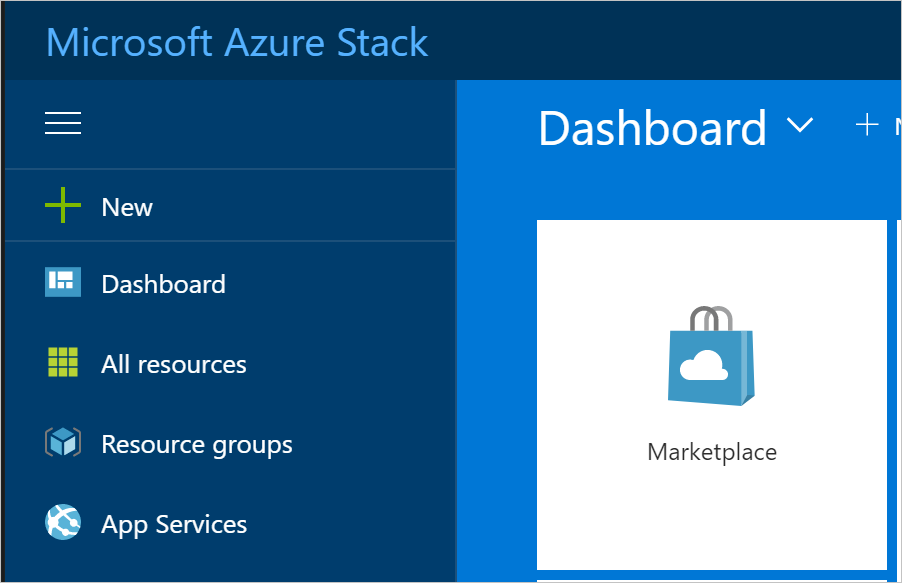

3. In **Marketplace**, select **Compute**, and then choose **More**. Under **More**, select the **Free SQL Server License: SQL Server 2017 Developer on Windows Server** image.

    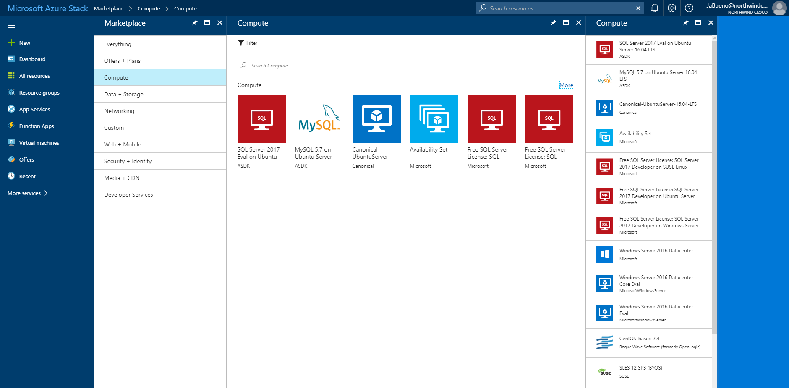

4. On **Free SQL Server License: SQL Server 2017 Developer on Windows Server** select **Create**.

5. On **Basics>Configure basic settings**, provide a **Name** for the virtual machine (VM), a **User name** for the SQL Server SA, and a **Password** for the SA.  From the **Subscription** drop-down list, select the subscription that you are deploying to. For **Resource group**, use **Choose existing** and put the VM in the same resource group as your Azure Stack web app.

    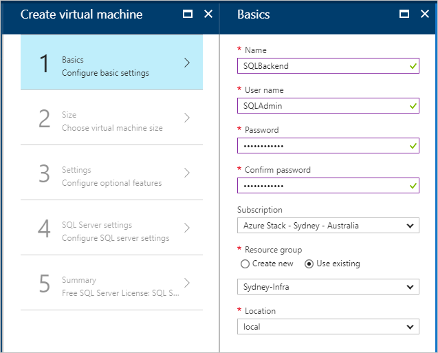

6. Under **Size**, pick a size for your VM. For this tutorial, we recommend A2_Standard or a DS2_V2_Standard.

7. Under **Settings>Configure optional features**, configure the following settings:

    - **Storage account**. Create a new account if you need one.
    - **Virtual network**

      > [!Important]  
      > Make sure your SQL Server VM is deployed on the same  virtual network as the VPN gateways.

    - **Public IP address**. You can use the default settings.
    - **Network security group** (NSG). Create a new NSG.
    - **Extensions and Monitoring**. Keep the default settings.
    - **Diagnostics storage account**. Create a new account if you need one.
    - Select **OK** to save your configuration.

    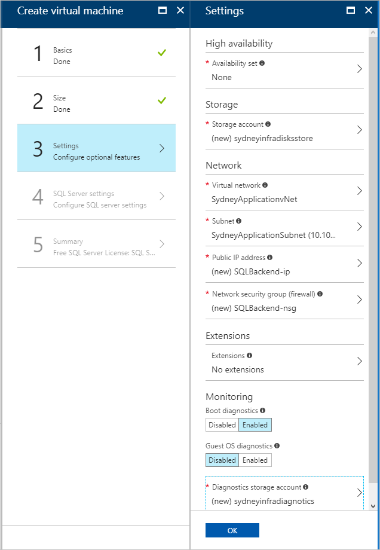

1. Under **SQL Server settings**, configure the following settings:
   - For **SQL connectivity**, select to **Public (Internet)**.
   - For **Port**, keep the default, **1433**.
   - For **SQL authentication**, select **Enable**.

     > [!Note]  
     > When you enable SQL authentication, it should auto-populate with the "SQLAdmin" information that you configured in **Basics**.

   - For the rest of the settings, keep the defaults. Select **OK**.

    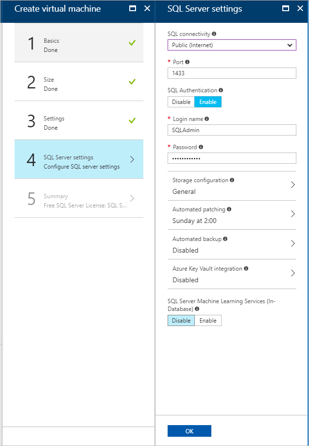

9. On **Summary**, review the virtual machine configuration, and then select **OK** to start the deployment.

    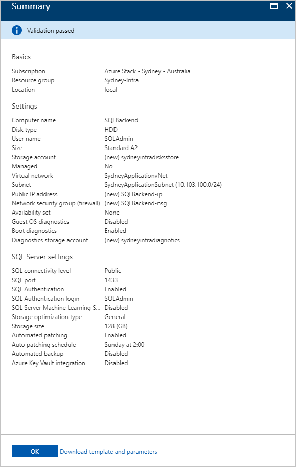

10. It will take some time to create the new VM. You can view the STATUS of your VMs in **Virtual machines**.

    

## Create web apps in Azure and Azure Stack

The Azure App Service simplifies running and managing a web application. Because Azure Stack is consistent with Azure,  the App Service can run in both environments. You’ll use the App Service to host your application.

### Create web apps

1. Create a web app in Azure by following the instructions in [Manage an App Service plan in Azure](https://docs.microsoft.com/azure/app-service/app-service-plan-manage#create-an-app-service-plan). Make sure you put the web app in the same subscription and resource group as your hybrid network.

2. Repeat the previous step (1) in Azure Stack.

### Add Route for Azure Stack

The App Service on Azure Stack must be routable from the public Internet to let users access your application. If your Azure Stack is accessible from the Internet, make a note of the public-facing IP address or URL for the Azure Stack web app.

If you're using an ASDK, you can [configure a static NAT mapping](https://docs.microsoft.com/azure/azure-stack/azure-stack-create-vpn-connection-one-node#configure-the-nat-virtual-machine-on-each-azure-stack-development-kit-for-gateway-traversal) to expose App Service outside the virtual environment.

### Connect a web app in Azure to a hybrid network

To provide connectivity between the web front-end in Azure and the SQL Server database in Azure Stack, the web app be connected to the hybrid network between Azure and Azure Stack. To enable connectivity, you'll have to:

- Configure point-to-site connectivity
- Configure the web app
- Modify the local network gateway in Azure Stack.

### Configure the Azure virtual network for point-to-site connectivity

The virtual network gateway in the Azure side of the hybrid network must allow point-to-site connections to integrate with Azure App Service.

1. In Azure, navigate to the virtual network gateway page. Under **Settings**, select **Point-to-site configuration**.

    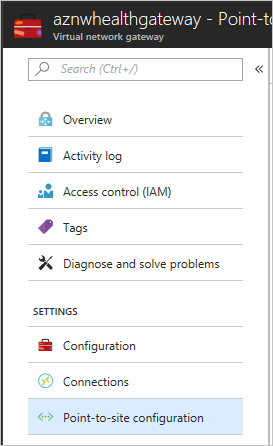

2. Select **Configure now** configure point-to-site.

    

3. On the **Point-to-site** configuration page, enter the private IP address range that you want to use in **Address pool**.

   > [!Note]  
   > Make sure that the range you specify doesn't overlap with any of the address ranges already used by subnets in the global Azure or Azure Stack components of the hybrid network.

   Under **Tunnel Type**, uncheck the **IKEv2 VPN**. Select **Save** to finish configuring point-to-site.

   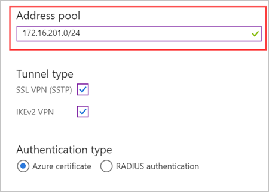

### Integrate the Azure App Service application with the hybrid network

1. To connect the application to the Azure VNet, follow the instructions in [Enabling VNet Integration](https://docs.microsoft.com/azure/app-service/web-sites-integrate-with-vnet#enabling-vnet-integration).

2. Navigate to **Settings** for the App Service plan hosting the web application. In **Settings**, select **Networking**.

    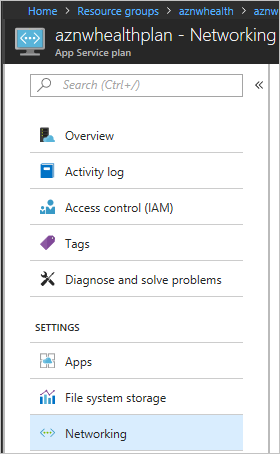

3. In **VNET Integration**, select **Click here to manage**.

    

4. Select the VNET that you want to configure. Under **IP ADDRESSES ROUTED TO VNET**, enter the IP address range for the Azure VNet, the Azure Stack VNet, and the point-to-site address spaces. Select **Save** to validate and save these settings.

    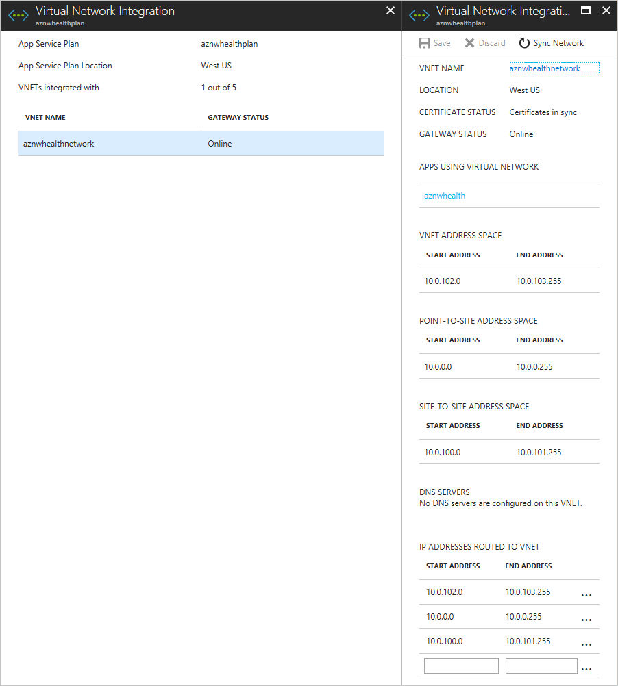

To learn more about how App Service integrates with Azure VNets, see [Integrate your app with an Azure Virtual Network](https://docs.microsoft.com/azure/app-service/web-sites-integrate-with-vnet).

### Configure the Azure Stack virtual network

The local network gateway in the Azure Stack virtual network needs to be configured to route traffic from the App Service point-to-site address range.

1. In Azure Stack, navigate to **Local network gateway**. Under **Settings**, select **Configuration**.

    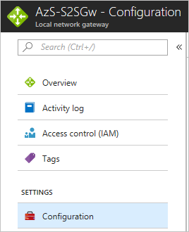

2. In **Address space**, enter the point-to-site address range for the virtual network gateway in Azure.l Select **Save** to validate and save this configuration.

    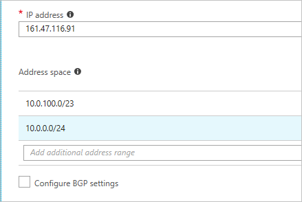

## Configure DNS for cross-cloud scaling

By properly configuring DNS for cross-cloud applications, users can access the global Azure and Azure Stack instances of your web app. The DNS configuration for this tutorial also lets Azure Traffic Manager route traffic when the load increases or decreases.

This tutorial uses Azure DNS to manage the DNS. (App Service domains won't work.)

### Create subdomains

Because Traffic Manager relies on DNS CNAMEs, a subdomain is needed to properly route traffic to endpoints. For more information about DNS records and domain mapping, see [map domains with Traffic Manager](https://docs.microsoft.com/en-us/azure/app-service/web-sites-traffic-manager-custom-domain-name)

For the Azure endpoint you'll create a subdomain that users can use to access your web app. For this tutorial, can use **app.northwind.com**, but you should customize this value based on your own domain.

You'll also need to create a subdomain with an A record for the Azure Stack endpoint. You can use **azurestack.northwind.com**.

### Configure a custom domain in Azure

1. Add the **app.northwind.com** hostname to the Azure web app by [mapping a CNAME to Azure App Service](https://docs.microsoft.com/Azure/app-service/app-service-web-tutorial-custom-domain#map-a-cname-record).

### Configure custom domains in Azure Stack

1. Add the **azurestack.northwind.com** hostname to the Azure Stack web app by [mapping an A record to Azure App Service](https://docs.microsoft.com/Azure/app-service/app-service-web-tutorial-custom-domain#map-an-a-record). Use the Internet-routable IP address for the App Service application.

2. Add the **app.northwind.com** hostname to the Azure Stack web app by [mapping a CNAME to Azure App Service](https://docs.microsoft.com/Azure/app-service/app-service-web-tutorial-custom-domain#map-a-cname-record). Use the hostname you configured in the previous step (1) as the target for the CNAME.

## Configure SSL certificates for cross-cloud scaling

You need to ensure that sensitive data collected by your web application is secure in transit to, and at rest on the SQL database.

You'll configure your Azure and Azure Stack web applications to use SSL certificates for all incoming traffic.

### Add SSL to Azure and Azure Stack

To add SSL to Azure:

1. Make sure that the SSL certificate you obtain is valid for the subdomain you created. (It's okay to use wildcard certificates.)

2. In Azure, follow the instructions in the **Prepare your web app** and **Bind your SSL certificate** sections of the [Bind an existing custom SSL certificate to Azure Web Apps](https://docs.microsoft.com/Azure/app-service/app-service-web-tutorial-custom-ssl) articles. Select **SNI-based SSL** as the **SSL Type**.

3. Redirect all traffic to the HTTPS port. Follow the instructions in the   **Enforce HTTPS** section of the [Bind an existing custom SSL certificate to Azure Web Apps](https://docs.microsoft.com/Azure/app-service/app-service-web-tutorial-custom-ssl) article.

To add SSL to Azure Stack:

- Repeat steps 1-3 that you used for Azure.

## Configure and deploy the web application

You'll configure the application code to report telemetry to the correct Application Insights instance, and configure the web applications with the right connection strings. To learn more about Application Insights, see [What is Application Insights?](https://docs.microsoft.com/en-us/azure/application-insights/app-insights-overview)

### Add Application Insights

1. Open your web application in Microsoft Visual Studio.

2. [Add Application Insights](https://docs.microsoft.com/azure/application-insights/app-insights-asp-net-core#add-application-insights-telemetry) to your project to transmit the telemetry that Application Insights uses to create alerts when web traffic increases or decreases.

### Configure dynamic connection strings

Each instance of the web application will use a different method to connect to the SQL database. The application in Azure uses the private IP address of the SQL Server virtual machine (VM), and the application in Azure Stack uses the public IP address of the SQL Server VM.

> [!Note]  
> On an Azure Stack Integrated System, the public IP address should not be Internet-routable. On an Azure Stack Development Kit (ASDK), the public IP address isn't routable outside the ASDK.

You can use App Service environment variables to pass a different connection string to each instance of the application.

1. Open the application in Visual Studio.

2. Open Startup.cs and find the following code block:

    ```C#
    services.AddDbContext<MyDatabaseContext>(options =>
        options.UseSqlite("Data Source=localdatabase.db"));
    ```

3. Replace the previous code block with the following code, which uses a connection string defined in the appsettings.json file:

    ```C#
    services.AddDbContext<MyDatabaseContext>(options =>
        options.UseSqlServer(Configuration.GetConnectionString("MyDbConnection")));
     // Automatically perform database migration
     services.BuildServiceProvider().GetService<MyDatabaseContext>().Database.Migrate();
    ```

### Configure App Service application settings

1. Create connection strings for Azure and Azure Stack. The strings should be the same, except for the IP addresses that are used.

2. In Azure and Azure Stack, add the appropriate connection string [as an application setting](https://docs.microsoft.com/azure/app-service/web-sites-configure) in the web application, using `SQLCONNSTR\_` as a prefix in the name.

3. **Save** the web app settings and restart the application.

## Enable automatic scaling in global Azure

When you create your web app in an App Service environment it starts with one instance. You can automatically scale out to add instances to provide more compute resources for your app. Similarly, you can automatically scale in and reduce the number of instances your app needs.

> [!Note]  
> You need to have an App Service Plan to configure scale out and scale in. If you don't have a plan, create one before starting the next steps.

### Enable automatic scale out

1. In Azure, find the App Service plan for the sites you want to scale out, and then select **Scale-out (App Service plan)**.

    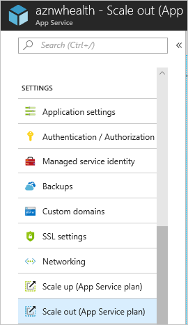

2. Select **Enable autoscale**.

    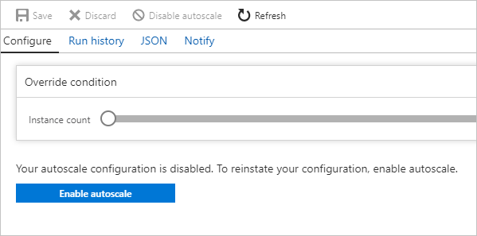

3. Enter a name for **Autoscale Setting Name**. For the **Default** auto scale rule, select **Scale based on a metric**. Set the **Instance limits** to **Minimum: 1**, **Maximum: 10**, and **Default: 1**.

    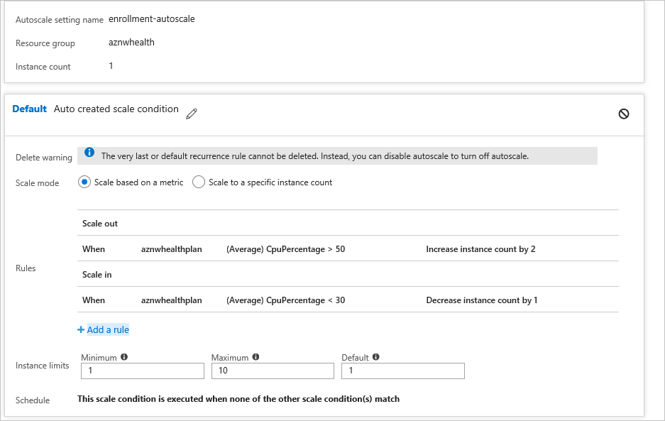

4. Select **+Add a rule**.

5. In **Metric Source**, select **Current Resource**. Use the following Criteria and Actions for the rule.

**Criteria**

1. Under **Time Aggregation,** select **Average**.

2. Under **Metric Name**, select **CPU Percentage**.

3. Under **Operator**, select **Greater than**.

   - Set the **Threshold** to **50**.
   - Set the **Duration** to **10**.

**Action**

1. Under **Operation**, select **Increase Count by**.

2. Set the **Instance Count** to **2**.

3. Set the **Cool down** to **5**.

4. Select **Add**.

5. Select the **+ Add a rule**.

6. In **Metric Source**, select **Current Resource.**

   > [!Note]  
   > The current resource will contain your App Service plan's name/GUID, and the **Resource Type** and **Resource** drop-down lists will be grayed out.

### Enable automatic scale in

When traffic decreases, the Azure web application can automatically reduce the number of active instances to reduce costs. This action is less aggressive than scale out in order to minimize the impact on application users.

1. Navigate to the **Default** scale out condition, select **+ Add a rule**. Use the following Criteria and Actions for the rule.

**Criteria**

1. Under **Time Aggregation,** select **Average**.

2. Under **Metric Name**, select **CPU Percentage**.

3. Under **Operator**, select **Less than**.

   - Set the **Threshold** to **30**.
   - Set the **Duration** to **10**.

**Action**

1. Under **Operation**, select **Decrease Count by**.

   - Set the **Instance Count** to **1**.
   - Set the **Cool down** to **5**.

2. Select **Add**.

## Create a Traffic Manager profile and configure cross-cloud scaling

You'll create a Traffic Manager profile in Azure and then configure endpoints to enable cross-cloud scaling.

### Create Traffic Manager profile

1. Select **Create a resource**
2. Select **Networking**
3. Select **Traffic Manager profile** and configure the following:

   - In **Name**, enter a name for your profile. This name **must** be unique in the trafficmanager.net zone and is used to create a new DNS name (for example, northwindstore.trafficmanager.net).
   - For **Routing method**, select the **Weighted**.
   - For **Subscription**, select the subscription you want to create  this profile in.
   - In **Resource Group**, create a new resource group for this profile.
   - In **Resource group location**, select the location of the resource group. This setting refers to the location of the resource group and has no impact on the Traffic Manager profile that will be deployed globally.

4. Select **Create**.

    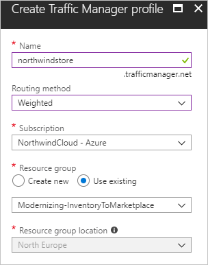

 When the global deployment of your Traffic Manager profile is complete, it is shown in the list of resources for the resource group you created it under.

### Add Traffic Manager endpoints

1. Search for the Traffic Manager profile you created. (If you navigated to the resource group for the profile, select the profile.)

2. In **Traffic Manager profile**, under **SETTINGS**, select **Endpoints**.

3. Select **Add**.

4. In **Add endpoint**, use the following settings for Azure Stack:

   - For **Type**, select **External endpoint**.
   - Enter a **Name** for this endpoint.
   - For **Fully-qualified domain name (FQDN) or IP** enter the external URL for your Azure Stack web app.
   - For **Weight**, keep the default, **1**. This weight results in all traffic going to this endpoint if it is healthy.
   - Leave **Add as disabled** unchecked.

5. Select **OK** to save the Azure Stack endpoint.

You'll configure the Azure endpoint next.

1. On **Traffic Manager profile**, select **Endpoints**.
2. Select **+Add**.
3. On **Add endpoint**, use the following settings for Azure:

   - For **Type**, select **Azure endpoint**.
   - Enter a **Name** for this endpoint.
   - For **Target resource type**, select **App Service**.
   - For **Target resource**, select **Choose an app service** to see a list of Web Apps in the same subscription.
   - In **Resource**, pick the App service that you want to add as the first endpoint.
   - For **Weight**, select **2**. This results in all traffic going to this endpoint if the primary endpoint is unhealthy, or you have a rule/alert that re-directs traffic when triggered.
   - Leave **Add as disabled** unchecked.

4. Select **OK** to save the Azure endpoint.

After both endpoints are configured, they're listed in **Traffic Manager profile** when you select **Endpoints**. The example in the following screen capture shows two endpoints, with status and configuration information for each one.


## Set up Application Insights monitoring and alerting

Azure Application Insights lets you to monitor your application and send alerts based on conditions you configure. Some examples are: the application is unavailable, is experiencing failures, or is showing performance issues.

You'll use Application Insights metrics to create alerts. When these alerts trigger, your Web Applications instance will automatically switch from Azure Stack to Azure to scale out, and then back to Azure stack to scale in.

### Create an alert from metrics

Navigate to the resource group for this tutorial, and then select the Application Insights instance to open **Application Insights**.

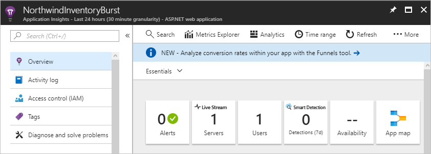

You'll use this view to create a scale out alert and a scale in alert.

### Create the scale out alert

1. Under **CONFIGURE**, select **Alerts (classic)**.
2. Select **Add metric alert (classic)**.
3. In **Add rule**, configure the following:

   - For **Name**, enter **Burst into Azure Cloud**.
   - A **Description** is optional.
   - Under **Source**, **Alert on**, select **Metrics**.
   - Under **Criteria**, select your Subscription, the Resource group for your Traffic Manager profile, and the name of Traffic Manager profile for Resource.

4. For **Metric**, select **Request Rate**.
5. For **Condition**, select **Greater than**.
6. For **Threshold**, enter **2**.
7. For **Period**, select **Over the last 5 minutes**.
8. Under **Notify via**:
   - Check the checkbox for **Email owners, contributors, and readers**.
   - Enter your email address for **Additional administrator email(s)**.

9. On the menu bar, select **Save**.

### Create the scale in alert

1. Under **CONFIGURE**, select **Alerts (classic)**.
2. Select **Add metric alert (classic)**.
3. In **Add rule**, configure the following:

   - For **Name**, enter **Scale back into Azure Stack**.
   - A **Description** is optional.
   - Under **Source**, **Alert on**, select **Metrics**.
   - Under **Criteria**, select your Subscription, the Resource group for your Traffic Manager profile, and the name of Traffic Manager profile for Resource.

4. For **Metric**, select **Request Rate**.
5. For **Condition**, select **Less than**.
6. For **Threshold**, enter **2**.
7. For **Period**, select **Over the last 5 minutes**.
8. Under **Notify via**:
   - Check the checkbox for **Email owners, contributors, and readers**.
   - Enter your email address for **Additional administrator email(s)**.

9. On the menu bar, select **Save**.

The following screen capture shows the alerts for scale out and scale in.

   

## Redirect traffic between Azure and Azure Stack

You can configure manual or automatic switching of your Web app traffic switching between Azure and Azure Stack.

### Configure manual switching between Azure and Azure Stack

When your Web site reaches the thresholds that you configure, you'll receive an alert. Use the following steps to manually redirect traffic to Azure.

1. In the Azure portal, select your Traffic Manager profile.

    

2. Select **Endpoints**.
3. Select the **Azure endpoint**.
4. Under **Status** , select **Enabled**, and then select **Save**.

    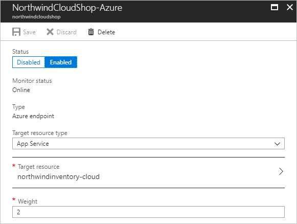

5. On **Endpoints** for the Traffic Manager profile, select **External endpoint**.
6. Under **Status** , select **Disabled**, and then select **Save**.

    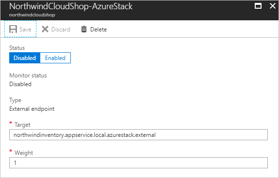

After the endpoints are configured, application traffic goes to your Azure scale-out web app instead of the Azure Stack web app.

 

To reverse the flow back to Azure Stack, use the previous steps to:

- Enable the Azure Stack endpoint
- Disable the Azure endpoint

### Configure automatic switching between Azure and Azure Stack

You can also use Application Insights monitoring if your application runs in a [serverless](https://azure.microsoft.com/overview/serverless-computing/) environment provided by Azure Functions.

In this scenario, you can configure Application Insights to use a webhook that calls a Function app. This app automatically enables or disables an endpoint in response to an alert.

Use the following steps as a guide to configure automatic traffic switching.

1. Create an Azure Function app.
2. Create an HTTP-triggered function.
3. Import the Azure SDKs for Resource Manager, Web Apps, and Traffic Manager.
4. Develop code to:

   - Authenticate to your Azure subscription.
   - Use a parameter that toggles the Traffic Manager endpoints to direct traffic to Azure or Azure Stack.

5. Save your code and add the Function app's URL with the appropriate parameters to the **Webhook** section of the Application Insights alert rule settings.
6. Traffic is automatically redirected when an Application Insights alert fires.

## Next steps

- To learn more about Azure Cloud Patterns, see [Cloud Design Patterns](https://docs.microsoft.com/azure/architecture/patterns).
