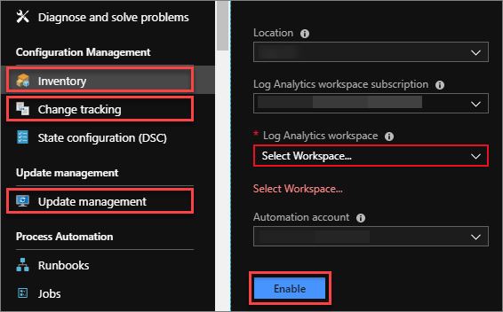
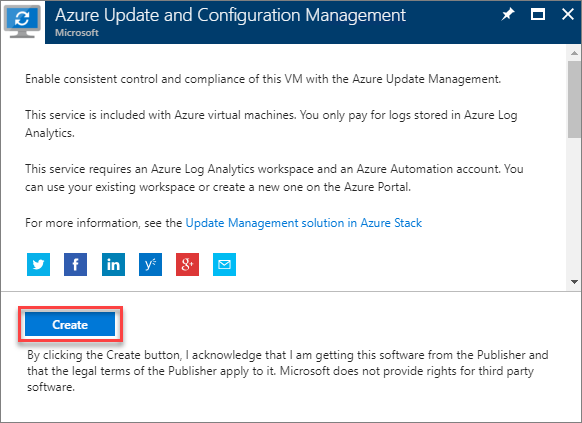
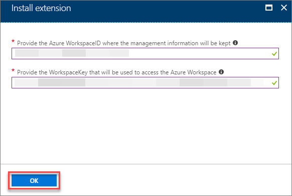
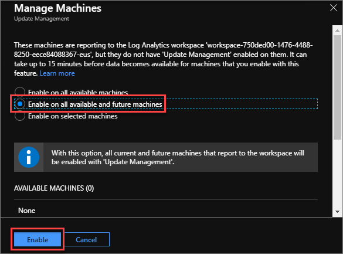
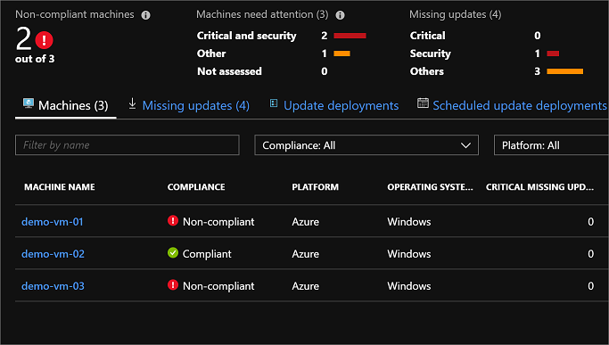

# Azure Stack VM update and management
You can use the following Azure Automation solution features to manage Windows VMs that are deployed using Azure Stack:

- **[Update Management](https://docs.microsoft.com/azure/automation/automation-update-management)**. With the Update Management solution, you can quickly assess the status of available updates on all agent computers and manage the process of installing required updates for these Windows VMs.

- **[Change Tracking](https://docs.microsoft.com/azure/automation/automation-change-tracking)**. Changes to installed software, Windows services, Windows registry, and files on the monitored servers are sent to the Log Analytics service in the cloud for processing. Logic is applied to the received data and the cloud service records the data. By using the information on the Change Tracking dashboard, you can easily see the changes that were made in your server infrastructure.

- **[Inventory](https://docs.microsoft.com/azure/automation/automation-vm-inventory)**. The Inventory tracking for an Azure Stack Windows virtual machine provides a browser-based user interface for setting up and configuring inventory collection. 

> [!IMPORTANT]
> These solutions are the same as the ones used to manage Azure VMs. Both Azure and Azure Stack Windows VMs are managed in the same way, from the same interface, using the same tools. The Azure Stack VMs are also priced the same as Azure VMs so when using the Update Management, Change Tracking, and Inventory solutions, you will not incur additional costs from Azure VMs.

## Prerequisites
Several prerequisites must be met before using these features to update and manage Azure Stack Windows VMs. These include steps that must be taken in the Azure portal as well as the Azure Stack administration portal.

### In the Azure portal
To use the Inventory, Change Tracking, and Update Management Azure automation features for Azure Stack Windows VMs, you first need to enable these solutions in Azure.

> [!TIP]
> If you already have these features enabled for Azure VMs, you can use your pre-existing LogAnalytics Workspace credentials. If you already have a LogAnalytics WorkspaceID and Primary Key that you want to use, skip ahead to [the next section](.\vm-update-management.md#in-the-azure-stack-administration-portal). Otherwise, continue in this section to create a new LogAnalytics Workspace and automation account.

The first step in enabling these solutions is to [create a LogAnalytics Workspace](https://docs.microsoft.com/azure/log-analytics/log-analytics-quick-create-workspace) in your Azure subscription. A Log Analytics workspace is a unique Log Analytics environment with its own data repository, data sources, and solutions. After you have created a workspace, note the WorkspaceID and Key. To view this information, go to the workspace blade, click on **Advanced settings**, and review the **Workspace ID** and **Primary Key** values. 

Next, you must [create an Automation Account](https://docs.microsoft.com/azure/automation/automation-create-standalone-account). An Automation Account is a container for your Azure Automation resources. It provides a way to separate your environments or further organize your Automation workflows and resources. Once the automation account is created, you need to enable the Inventory, Change tracking, and Update management features. To do this, follow these steps to enable each feature:

1. In the Azure portal, go to the Automation Account that you want to use.

2. Select the solution to enable (either **Inventory**, **Change tracking**, or **Update management**).

3. Use the **Select Workspace...** drop-down list to select the Log Analytics Workspace to use.

4. Verify that all remaining information is correct, and then click **Enable** to enable the solution.

5. Repeat steps 2-4 to enable all three solutions. 

   

### In the Azure Stack Administration Portal
After enabling the Azure Automation solutions in the Azure portal, you next need to sign in to the Azure Stack administration portal as a cloud administrator and download the **Azure Update and Configuration Management** extension Azure Stack marketplace item. 

    

## Enable Update Management for Azure Stack virtual machines
Follow these steps to enable update management for Azure Stack Windows VMs.

1. Log into the Azure Stack user portal.

2. In the Azure Stack user-portal, go to the Extensions blade of the Windows virtual machines for which you want to enable these solutions, click **+ Add**, select the **Azure Update and Configuration Management** extension, and click **Create**:

   

3. Provide the previously created WorkspaceID and Primary Key to link the agent with the LogAnalytics workspace and click **OK** to deploy the extension.

    

4. As described in the [automation update management documentation](https://docs.microsoft.com/azure/automation/automation-update-management), you need to enable the Update Management solution for each VM that you want to manage. To enable the solution for all VMs reporting to the workspace, select **Update management**, click **Manage machines**, and then select the **Enable on all available and future machines** option.

    

   > [!TIP]
   > Repeat this step to enable each solution for the Azure Stack Windows VMs that report to the workspace. 
  
After the Azure Update and Configuration Management extension is enabled, a scan is performed twice per day for each managed Windows VM. The Windows API is called every 15 minutes to query for the last update time to determine whether the status has changed. If the status has changed, a compliance scan is initiated.

After the VMs are scanned, they will appear in the Azure Automation account in the Update Management solution: 

    

> [!IMPORTANT]
> It can take between 30 minutes and 6 hours for the dashboard to display updated data from managed computers.

The Azure Stack Windows VMs can now be included in scheduled update deployments together with Azure VMs.

## Enable Update Management using a Resource Manager template
If you have a large number of Azure Stack Windows VMs, you can use [this Azure Resource Manager template](https://github.com/Azure/AzureStack-QuickStart-Templates/tree/master/MicrosoftMonitoringAgent-ext-win) to more easily deploy the solution on Windows VMs. The template deploys the Microsoft Monitoring Agent extension to an existing Windows VM and adds it to an existing Azure LogAnalytics workspace.
 
## Next steps
[Optimize SQL Server performance](azure-stack-sql-server-vm-considerations.md)
